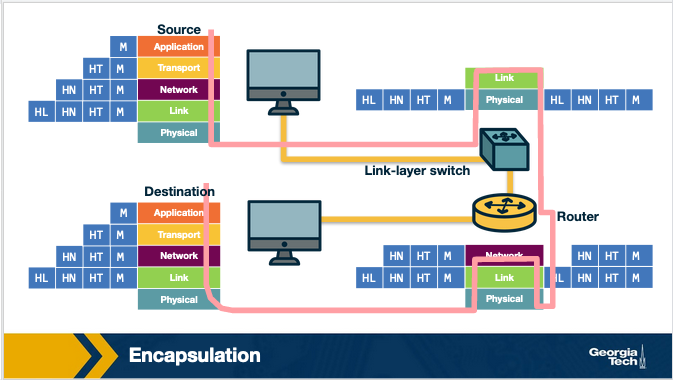
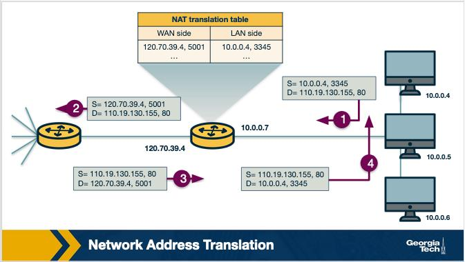
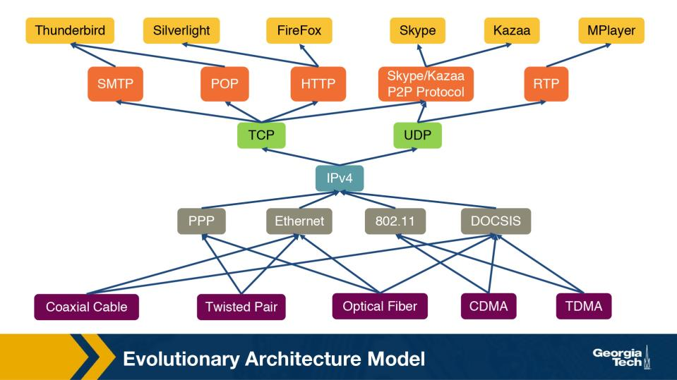
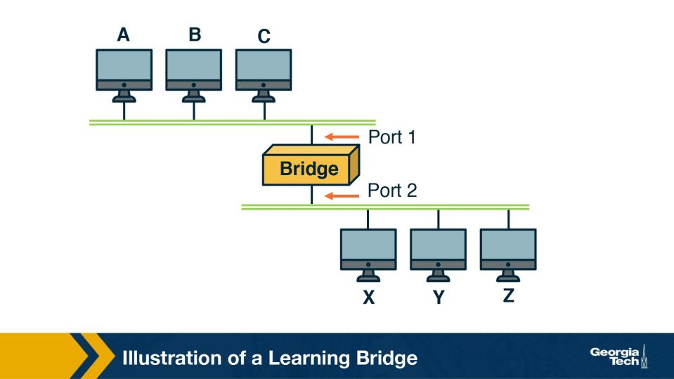
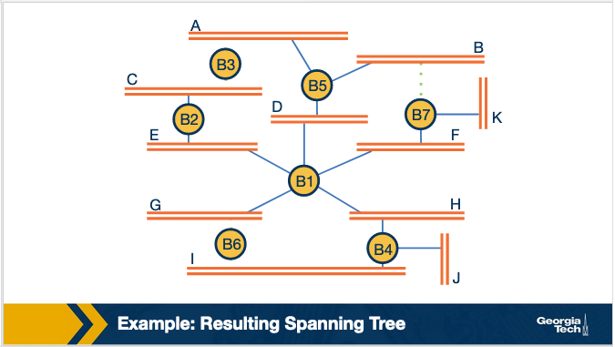

Module 1 — Question Pool 

OMSCS 6250 Computer Networks 
Lesson 1: Introduction, History, and Internet Architecture 

History & Motivation 
Q1.  [TF] 

The modern Internet has its origins in ARPANET, a research network developed in the late 1960s in the 
United States. 

• 
True 
• 
False 

  Correct answer: True 

  Why: ARPANET, US, late 1960s. The Internet's predecessor was funded by the US Department of Defense's ARPA and connected 
research universities; commercial growth followed once NSFNET was retired in the 1990s. 

Layering & Architecture 
Q2.  [MCQ] 

Layered architectures separate responsibilities across the protocol stack. Which of the following is a key 
benefit that layering gives the Internet? 

• 
A.  It lets different technologies and protocols evolve independently, as long as each layer keeps the 
same interface to the layer above. 
• 
B.  It guarantees that every packet is delivered in the original order it was sent, with no possibility of 
loss along the path. 
• 
C.  It removes the need for any headers in the data units that are transmitted between hosts on the 
Internet. 
• 
D.  It eliminates the need for routers at the network layer entirely, even in very large interconnected 
networks. 

  Correct answer: A 

  Why: Stable interfaces => layers evolve independently. As long as each layer keeps its contract with the layer above, the 
implementation below can change (e.g., Ethernet -> fiber -> Wi-Fi) without rewriting higher layers. 

Q3.  [TF] 

<!-- page break -->

In a layered architecture, each layer relies on the service provided by the layer directly above it. 

• 
True 
• 
False 

  Correct answer: False 

  Why: Each layer uses the layer BELOW, not above. Layering imposes a strict bottom-up service relationship: a layer offers services 
to the one directly above and consumes services from the one directly below. 

Q4.  [MCQ] 

Layering provides modularity, but also introduces trade-offs. Which of the following is the BEST example 
of duplicated functionality between layers in the Internet protocol stack? 

• 
A.  Wi-Fi performs link-layer error correction on lost or corrupted frames, while TCP separately 
performs end-to-end retransmission of lost segments at the transport layer. 
• 
B.  A router decrements the TTL in the IP header, while the data link layer simultaneously decrements 
its own per-frame hop counter at every Ethernet switch along the way. 
• 
C.  The application layer transmits voltages directly on the wire in modern stacks, fully replacing the 
physical layer for nearly all routine traffic. 
• 
D.  NAT boxes encrypt packets at the network layer to duplicate TLS encryption at the application 
layer, for added defense in depth. 

  Correct answer: A 

  Why: Wi-Fi ARQ at L2 + TCP retransmission at L4 -> same job, two layers. Functionality can legitimately repeat in different layers 
because each addresses a different scope: link-local recovery vs end-to-end delivery. 

Q5.  [TF] 

Two ISPs may use very different link technologies — one fiber, one cellular — yet still interoperate at the 
IP layer without either ISP changing its physical layer. This is a direct consequence of the layered design: 
the lower layers can vary independently, as long as they still expose IP's expected service to the layer 
above. 

• 
True 
• 
False 

  Correct answer: True 

  Why: IP waist hides physical/link differences. The narrow IP layer is the only common contract — everything below (copper, fiber, 
Wi-Fi) and above (TCP, UDP, apps) plugs into IP, so the network supports many media and many apps simultaneously. 

<!-- page break -->

Per-Layer Roles 
Q6.  [MCQ] 

The Internet's Application layer absorbs three OSI layers into one. In practice, what does this mean for 
application developers? 

• 
A.  Application developers must implement TCP and IP themselves on top of raw sockets in user 
space. 
• 
B.  Each application is required to write its own physical-layer driver and frame format from scratch. 
• 
C.  Tasks like data formatting, encryption, and session management end up handled inside the 
application itself. 
• 
D.  The application layer can only send data outward and never receive incoming data from other 
hosts. 

  Correct answer: C 

  Why: App handles formatting, encryption, sessions itself. Because the Internet stack merges OSI's Application, Presentation, and 
Session layers, libraries inside the application — not a separate layer — take care of TLS, JSON formatting, and session state. 

Q7.  [TF] 

The interface between the application layer and the transport layer in the Internet protocol stack is the 
MAC address table. 

• 
True 
• 
False 

  Correct answer: False 

  Why: Socket interface, not MAC table. The boundary between the app and transport layers on Internet hosts is the socket API (e.g., 
POSIX sockets); MAC tables live inside L2 switches, not at the host's app/transport boundary. 

Q8.  [MCQ] 

A process on one host needs to communicate with a process on another host. Which Internet protocol-
stack layer is responsible for delivering data between these processes, end-to-end? 

• 
A.  Physical layer 
• 
B.  Data link layer 
• 
C.  Network layer 
• 
D.  Transport layer 

  Correct answer: D 

  Why: Transport = process-to-process. The network layer gets packets host-to-host; transport adds port numbers so that the right 
process on each end (a browser vs an SSH daemon) receives its bytes. 

<!-- page break -->

Q9.  [MCQ] 

TCP and UDP are the two most common Internet transport protocols. Which statement best contrasts 
them? 

• 
A.  TCP provides reliable, in-order delivery and congestion control; UDP provides a simpler best-effort 
service without these guarantees. 
• 
B.  TCP is connectionless and offers no reliability; UDP is connection-oriented with strong delivery 
guarantees built into the protocol. 
• 
C.  Both TCP and UDP provide identical guarantees of delivery and ordering; they differ only in header 
size and option formatting. 
• 
D.  UDP provides reliable, ordered delivery with congestion control, while TCP is a best-effort 
connectionless service. 

  Correct answer: A 

  Why: TCP: reliable, ordered, congestion-controlled. UDP: best-effort, no guarantees. Apps choose based on need: TCP for streams 
that must arrive intact (HTTP, SSH); UDP when speed or per-packet control matters (DNS, real-time media). 

Q10.  [TF] 

The Internet network layer produces a packet called a datagram and is responsible for routing packets 
across multiple networks based on IP addresses. 

• 
True 
• 
False 

  Correct answer: True 

  Why: Datagram, IP-based routing. The network layer chops data into datagrams and forwards each one hop-by-hop using its 
destination IP address; there is no fixed end-to-end path established beforehand. 

Q11.  [MCQ] 

What is the role of the data link layer in the Internet protocol stack? 

• 
A.  Provides end-to-end reliability between application processes running on different hosts. 
• 
B.  Transfers frames across a single physical link between two adjacent nodes. 
• 
C.  Routes packets between distant networks using IP addresses as the addressing scheme. 
• 
D.  Encrypts application-layer messages before they are transmitted over the network. 

  Correct answer: B 

  Why: Data link = frame across ONE hop. L2 moves frames between directly connected nodes (host <-> switch, router <-> router on 
the same link); spanning multiple links is the network layer's job. 

Q12.  [TF] 

<!-- page break -->

The physical layer is responsible for routing packets across the Internet based on IP addresses. 

• 
True 
• 
False 

  Correct answer: False 

  Why: Routing = network layer, not physical. The physical layer just pushes bits onto the medium; choosing where the next hop is 
happens at L3 based on IP addresses and routing tables. 

Encapsulation 
Q13.  [TF] 

Figure: Layered encapsulation across the protocol stack (Module 1) 

Encapsulation works as follows: when data moves down the stack at the sender, each layer adds its own 
header. When data moves up at the receiver, each layer removes the header added by the corresponding 
layer at the sender. 

• 
True 
• 
False 

  Correct answer: True 

  Why: Sender adds headers going down; receiver strips them going up. Each layer wraps its peer's view with its own header on 
transmit, and the receiver's matching layer removes that header before passing the payload upward. 

Q14.  [MCQ] 

As an application message moves down the Internet protocol stack and is encapsulated layer by layer, the 
data unit acquires a different name at each layer. What is the correct name at the network layer? 

<!-- page break -->

• 
A.  Segment 
• 
B.  Frame 
• 
C.  Datagram 
• 
D.  Bit stream 

  Correct answer: C 

  Why: Network-layer PDU = datagram (segment = transport). Naming changes by layer: bits/frame (L1/L2), datagram or packet 
(L3), segment (TCP) or datagram (UDP) at L4, message at the app layer. 

Q15.  [MCQ] 

Intermediate devices on the Internet implement only the layers they need for forwarding. Which set of 
layers does a router implement? 

• 
A.  Application, transport, and network only. 
• 
B.  Physical and data link only, just like a Layer-2 switch. 
• 
C.  All five layers, exactly like an end host that creates application data. 
• 
D.  Physical, data link, and network. 

  Correct answer: D 

  Why: Router = physical + data-link + network. A router must receive bits (L1), parse frames on each link (L2), and make IP 
forwarding decisions (L3); it does not interpret transport or application payloads. 

End-to-End Principle 
Q16.  [MCQ] 

The end-to-end principle (Saltzer, Reed, Clark) is a foundational design idea for the Internet. Which 
statement most accurately captures its core claim? 

• 
A.  Some functions can only be implemented completely and correctly with help from the application 
at the endpoints; the core should stay simple. 
• 
B.  Every layer of the protocol stack must independently re-implement reliability so that applications 
never see any kind of error anywhere in the stack. 
• 
C.  The network core should perform deep packet inspection on every flow in order to provide 
universal optimization tailored to each application's needs. 
• 
D.  Encryption must happen exclusively at the network layer rather than at the application layer, to 
enforce a uniform security model across the Internet. 

  Correct answer: A 

  Why: Saltzer–Reed–Clark end-to-end argument: keep smarts at the endpoints; core stays simple. Any function that needs end-to-end 
semantics (reliability, encryption, integrity) belongs at the hosts, because the network alone cannot guarantee it correctly. 

<!-- page break -->

Q17.  [TF] 

The end-to-end principle requires that the network core enforce a single, uniform behavior for all 
applications, regardless of their needs. 

• 
True 
• 
False 

  Correct answer: False 

  Why: A simple core lets each app choose its own service. Keeping IP minimal means new applications (video, gaming, blockchain) 
can build whatever transport semantics they need on top — without changing the network. 

Violations of E2E — NAT & Firewalls 
Q18.  [MCQ] 

Figure: NAT address/port translation (Module 1) 

A NAT-enabled home router translates between a private home network and the public Internet. When a 
device inside the home network sends a packet outward, which fields in the packet does the NAT typically 
rewrite? 

• 
A.  Only the destination IP address of the outgoing packet. 
• 
B.  The source IP address (private  ->  public), and often the source port as well. 
• 
C.  Only the TCP sequence number inside the segment header. 
• 
D.  Only the application-layer payload bytes of the packet. 

  Correct answer: B 

  Why: Source IP (and usually source port) is what a NAT rewrites. NAT lets many private hosts share one public IP by remapping 
outgoing source addresses (and ports) and reversing the mapping on return traffic. 

<!-- page break -->

Q19.  [TF] 

A host inside a private NATed network is typically not globally addressable from the public Internet. An 
outside host usually cannot initiate a connection to it unless the NAT has a mapping or special 
configuration in place. 

• 
True 
• 
False 

  Correct answer: True 

  Why: Private hosts behind NAT are not globally addressable from outside. Unsolicited inbound traffic has no NAT state to match, so 
it gets dropped — which breaks P2P apps and complicates running servers from home. 

Q20.  [MCQ] 

Both firewalls and NAT boxes are considered violations of the end-to-end principle. What is the shared 
reason? 

• 
A.  Both perform encryption on every packet they handle, which the end-to-end principle explicitly 
prohibits across the stack. 
• 
B.  Both run as part of the application on each endpoint, contradicting the strict separation of layers in 
the network model. 
• 
C.  Both sit between the endpoints and actively interfere with the communication — filtering traffic or 
rewriting addresses — rather than just forwarding. 
• 
D.  Both run as background services on the host operating system rather than as elements of the 
network itself, breaking layering. 

  Correct answer: C 

  Why: Both NAT and firewalls are middleboxes that interfere between endpoints. They violate the end-to-end model by 
inspecting/altering traffic in the network core; that complicates protocol evolution but is widely deployed for security and address 
conservation. 

Hourglass & Ossification 
Q21.  [TF] 

The Internet protocol stack is often described as a 'pyramid' shape, with many protocols at the top 
application layer and very few at the bottom physical layer. 

• 
True 
• 
False 

  Correct answer: False 

  Why: Hourglass shape: a narrow IP waist with wide layers above and below — not a pyramid. Many physical media (Wi-Fi, fiber, 
cellular) and many applications (web, video, IoT) plug in, but only ONE network-layer protocol (IP) joins them. 

<!-- page break -->

Q22.  [MCQ] 

The hourglass shape of the Internet protocol stack helps explain a common pattern in Internet evolution. 
Which statement best captures that pattern? 

• 
A.  The IP waist is constantly being redesigned by the IETF every few years to match new application 
requirements. 
• 
B.  New link-layer technologies are forbidden so that the hourglass shape of the protocol stack can be 
preserved indefinitely. 
• 
C.  Innovation happens at roughly the same pace at every layer of the protocol stack, regardless of 
position. 
• 
D.  Innovation happens often at the lower layers (e.g., Wi-Fi, fiber) and at the application layer, but the 
IP/TCP/UDP core changes much more slowly. 

  Correct answer: D 

  Why: Innovation happens at the edges; the IP/TCP/UDP core stays stable. New apps and link technologies come and go quickly, but 
the network-layer protocol barely changes — the price for global interoperability. 

Q23.  [TF] 

Protocol ossification means that an emerging technology at the application layer cannot become widely 
deployed, because IP locks down the architecture above it. 

• 
True 
• 
False 

  Correct answer: False 

  Why: Ossification = the core gets hard to replace, yet apps still innovate. So much depends on the current IP/TCP layer that 
replacing or changing it is nearly impossible (e.g., IPv6 took decades) — while app-layer experimentation remains fast and free. 

<!-- page break -->

Evolutionary Architecture Model (EvoArch) 
Q24.  [MCQ] 

Figure: EvoArch — layered protocol dependency graph (Module 1) 

EvoArch models a protocol stack as a layered graph: nodes are protocols, edges are dependencies. Which 
of the following correctly defines 'substrates' and 'products'? 

• 
A.  A protocol's substrates are protocols at the layer below it that it depends on; its products are 
higher-layer protocols and applications that depend on it. 
• 
B.  A protocol's substrates are the higher-layer protocols that consume it; its products are the 
protocols at the layer below that it depends on. 
• 
C.  Substrates and products both refer to the same concept of horizontal competitors operating at the 
same layer of the stack. 
• 
D.  Substrates are simply the physical transmission media a protocol can be sent over, such as copper, 
fiber, or radio. 

  Correct answer: A 

  Why: Substrate = the layer below; product = the layer above. In EvoArch a layer's substrates support it, and its products are the 
things built on top; thinking in substrates/products clarifies why some layers persist. 

<!-- page break -->

Q25.  [TF] 

In EvoArch, a protocol's evolutionary value is computed by summing the values of its substrates beneath 
it. Under this definition, TCP would have the same evolutionary value as any other transport protocol that 
runs on IPv4. 

• 
True 
• 
False 

  Correct answer: False 

  Why: Evolutionary value depends on the PRODUCTS above, not the substrates below. A layer becomes entrenched because many 
useful applications/protocols already depend on it (e.g., IP), not because it has many possible substrates. 

Q26.  [MCQ] 

EvoArch models competition between protocols at the same layer. Under this model, when do two 
protocols compete? 

• 
A.  When they were standardized by the same organization in the same decade. 
• 
B.  When they share enough of the same products — the same higher-layer protocols or applications 
that could use them. 
• 
C.  When they run over the exact same physical medium and use the same MAC framing rules. 
• 
D.  When their packet header lengths happen to be equal at the time of standardization. 

  Correct answer: B 

  Why: Layers compete when they share enough of the same products. Two protocols serving the same audience compete; the one 
with deeper product support tends to win and the other declines (e.g., IPX vs IP). 

Q27.  [MCQ] 

Suppose a research group designs NextTransport, a new transport protocol that is provably faster and 
more efficient than TCP under every measured workload. Based on EvoArch's reasoning, why might 
NextTransport still fail to gain wide adoption on the Internet? 

• 
A.  Because the IETF only standardizes one new transport protocol per decade, and that decade's 
standardization slot is already taken by another effort. 
• 
B.  Because applications and services already depend on TCP. This gives TCP a much higher 
evolutionary value, and that incumbency advantage protects TCP even against technically superior 
alternatives. 
• 
C.  Because new transport protocols are not allowed to run over IPv4 without explicit permission 
from each network operator along the path. 
• 
D.  Because NextTransport's header is incompatible with IP routing and cannot be forwarded by 
Internet routers regardless of its underlying performance. 

<!-- page break -->

  Correct answer: B 

  Why: Incumbents are protected by their high evolutionary value. Once a protocol has many products above it, replacing it requires 
migrating all of them — which is why TCP/IP, HTTP, and DNS are extremely hard to displace. 

Q28.  [MCQ] 

EvoArch uses a 'layer generality' parameter to model how protocols at different layers spread or 
specialize. Which statement most accurately describes what this parameter captures? 

• 
A.  It is measured at runtime from observed traffic volume, with lower-layer protocols automatically 
receiving higher values when they carry more bytes. 
• 
B.  It is a network-management policy that the IETF enforces on a quarterly basis to keep the protocol 
ecosystem in balance over time. 
• 
C.  It is a model input parameter capturing how 'general' a layer's service is — typically higher at 
lower layers (one substrate serves many products) and lower at higher layers (each protocol is more 
specialized). 
• 
D.  It is the number of physical interfaces present in any given deployed protocol stack across the 
Internet at any moment. 

  Correct answer: C 

  Why: Lower layers are more general — they support more diverse products above. IP supports a huge variety of transports and 
apps; an application protocol like HTTP supports a much smaller, more specialised set of higher-level uses. 

Learning Bridges 
Q29.  [TF] 

Figure: Learning bridge — observing source addresses (Module 1) 

<!-- page break -->

A learning bridge is a Layer-2 device that builds its forwarding table by inspecting the source MAC 
address of each arriving frame, along with the port on which the frame arrived. 

• 
True 
• 
False 

  Correct answer: True 

  Why: Bridge learns from the source MAC and the port the frame arrived on. As frames pass through, the bridge records 'MAC X is 
reachable via port P' so it can later forward unicast frames to X only on port P, not flood them. 

Q30.  [MCQ] 

A learning bridge maintains a forwarding table that maps MAC addresses to ports. When a frame arrives 
whose destination MAC is already in the table, what does the bridge do? 

• 
A.  It discards the frame, because the destination is already known to exist elsewhere in the network. 
• 
B.  It broadcasts the frame on every port, just to be safe in case the table entry is stale. 
• 
C.  It forwards the frame only on the port that leads toward the destination. 
• 
D.  It sends an ICMP echo request to the destination first to verify the host is still reachable. 

  Correct answer: C 

  Why: Known destination -> forward only on the learned port. Once a destination MAC is in the table, the bridge stops flooding and 
sends the frame out only on the correct port, saving bandwidth on the other segments. 

Q31.  [MCQ] 

Imagine a hypothetical learning-bridge design that, instead of FLOODING frames whose destination MAC 
is not yet in the table, simply DROPS them. What is the most important consequence of this change? 

• 
A.  The bridge would forward traffic noticeably faster, because no port duplication is needed for any 
frame on the local segment. 
• 
B.  The bridge would become a Layer-3 device instead of a Layer-2 device, requiring it to start parsing 
IP headers on every frame. 
• 
C.  The network would become more secure, because broadcast traffic would no longer leak across 
switches within the same segment. 
• 
D.  The bridge would never have an opportunity to learn the destination's location. It populates its 
forwarding table by observing reply frames from that destination — and those replies never come if 
the original frame was dropped. 

  Correct answer: D 

  Why: Drop instead of flood => no reply => no learning. Learning bridges depend on observing return traffic; if an unknown 
destination is dropped rather than flooded, the destination never replies and the bridge can never learn its location. 

<!-- page break -->

Spanning Tree 
Q32.  [TF] 

Network designers add redundant links between bridges to improve reliability. Because Layer-2 frames 
have no hop-limit field like IP's TTL, these redundant links can let a single broadcast frame loop and 
multiply indefinitely if no protection is in place. 

• 
True 
• 
False 

  Correct answer: True 

  Why: L2 frames have no TTL; loops circulate forever. Unlike IP packets, Ethernet frames have no built-in expiration — a topological 
loop in L2 lets a broadcast frame multiply and saturate the entire bridged network. 

Q33.  [MCQ] 

Figure: Spanning-tree-algorithm execution among bridges (Module 1) 

Why is the Spanning Tree Algorithm needed in a bridged network that has redundant links? 

• 
A.  To dynamically increase link capacity by aggregating multiple redundant links into a single high-
bandwidth virtual link. 
• 
B.  To compress Ethernet frame headers before they cross redundant links, reducing the per-frame 
overhead at line rate. 
• 
C.  To automatically assign IP addresses to each bridge in the topology so that the bridges can 
communicate with each other. 
• 
D.  To remove cycles from the forwarding topology so frames don't loop indefinitely, while keeping 
the physical redundancy intact. 

  Correct answer: D 

  Why: Spanning Tree removes cycles by computing a tree, while preserving the underlying physical redundancy. Redundant links stay 
physically connected (in case a primary fails), but STA logically disables them so the active topology stays loop-free.
