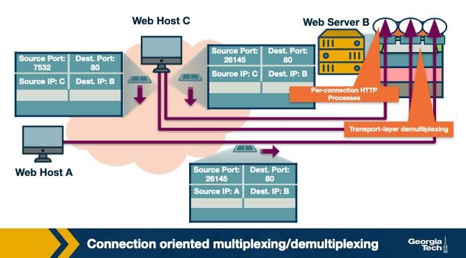
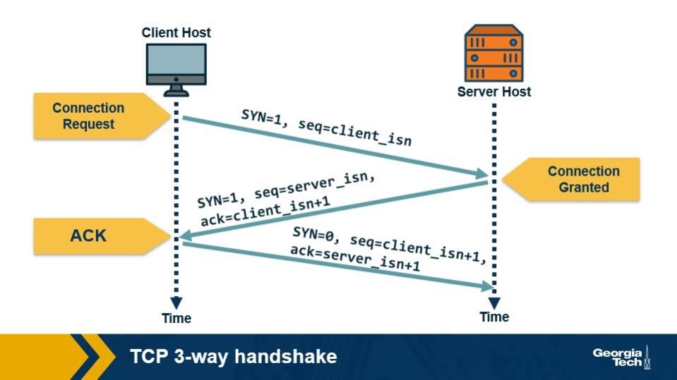
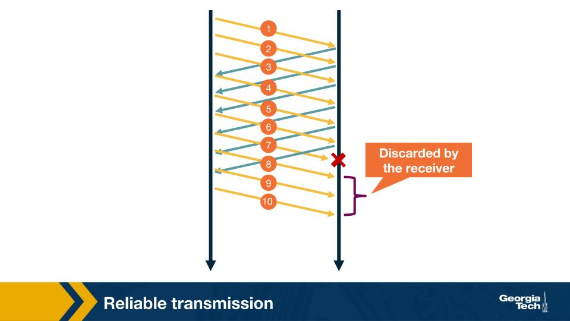
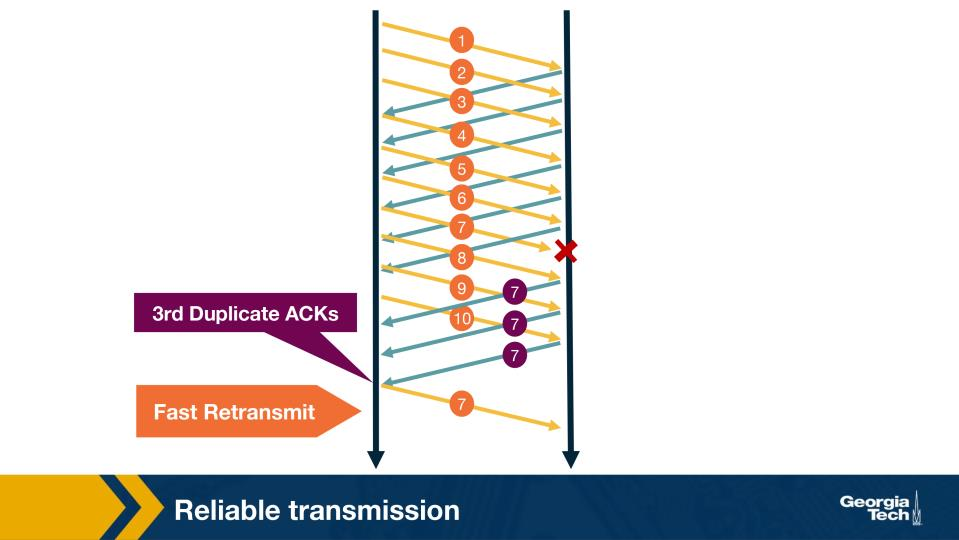
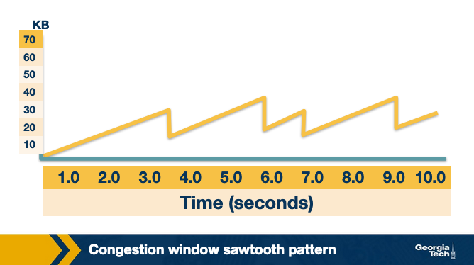
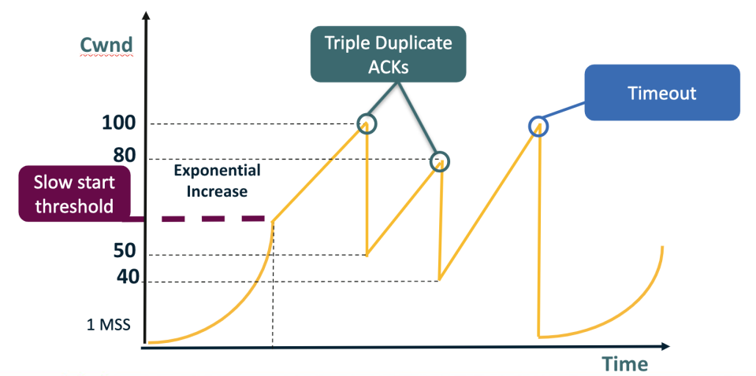
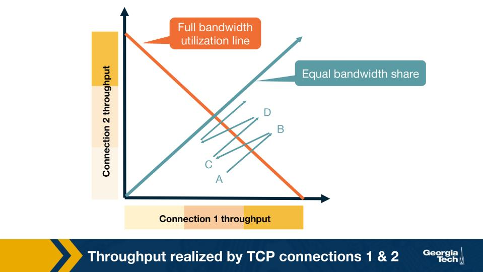
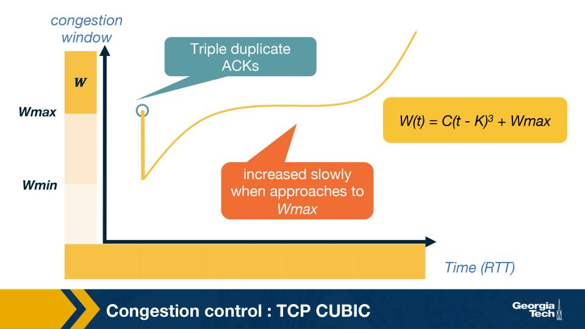

Module 2 — Question Pool 

OMSCS 6250 Computer Networks 
Lesson 2: Transport and Application Layers 

Introduction to the Transport Layer 
Q1.  [MCQ] 

Why does the Internet need a transport layer between the application and network layers? 

• 
A.  The network layer offers best-effort delivery with no guarantees; transport adds reliability and 
process-to-process delivery. 
• 
B.  The router fabric cannot accept packets unless transport-layer headers re-write IP source and 
destination addresses along the path at every intermediate hop. 
• 
C.  The network layer can only deliver fixed-size physical frames, so all segmentation, reassembly, and 
reordering of payloads must happen above it in a separate layer. 
• 
D.  Application code cannot itself construct IP packets and depends on transport to also compute IP 
routes, manage neighbor tables, and select egress interfaces. 

  Correct answer: A 

  Why: Network = best-effort host-to-host; transport = process-to-process + reliability. The transport layer adds what IP alone doesn't 
give: port numbers (so the right process gets the bytes) and, for TCP, retransmission and ordering on top of IP's lossy datagram 
service. 

Multiplexing: Why Do We Need It? 
Q2.  [TF] 

An IP address alone is sufficient to deliver an incoming packet to the correct application process on a host, 
without using port numbers. 

• 
True 
• 
False 

  Correct answer: False 

  Why: IP gets you to the host, not the process. Without port numbers in the transport header, the OS can't decide whether a packet 
belongs to your browser, your SSH client, or your mail daemon — all of them share the same IP. 

<!-- page break -->

Connection Oriented and Connectionless Multiplexing and Demultiplexing 
Q3.  [MCQ] 

A receiving host uses connectionless (UDP) demultiplexing. Which field(s) does it use to identify the 
correct socket? 

• 
A.  Only the source IP address and the source port number carried in the segment header by the 
sender of the datagram. 
• 
B.  The destination IP plus destination port (the UDP socket). 
• 
C.  The full four-tuple of source IP, source port, destination IP, and destination port — exactly as TCP 
would use to identify a unique connection-oriented socket. 
• 
D.  The TCP sequence number embedded in the segment header, taken modulo 2^32 to give an offset 
into the receiver's per-socket buffer. 

  Correct answer: B 

  Why: UDP demux key = (dest IP, dest port). UDP is connectionless and stateless: any datagram with the same destination two-tuple 
lands on the same socket, regardless of who sent it. 

Q4.  [MCQ] 

A web server listens on port 80 and serves many simultaneous TCP clients. How can it demultiplex 
incoming segments that all carry destination port 80 to the right socket? 

• 
A.  By rotating clients through a single shared listening socket in strict round-robin order, one 
segment per client per scheduler tick. 
• 
B.  By renegotiating the destination port number for each new client during the TCP three-way 
handshake, using a special option in the SYN. 
• 
C.  Using the four-tuple (source IP, source port, destination IP, destination port). 
• 
D.  By assigning every client a unique destination IP alias at the server side and binding each one to a 
separate kernel-level TCP socket. 

  Correct answer: C 

  Why: TCP demux key = 4-tuple. Even when many clients share destination (server IP, port 80), each client's connection is unique 
because (src IP, src port) differs — the kernel uses all four fields to pick the right socket. 

Q5.  [MCQ] 

<!-- page break -->

Figure: Multiple HTTP sessions to one web server (Module 2) 

In the figure, two hosts initiate HTTP sessions to the same web server B on port 80. If both clients happen 
to pick the same source port number, how does server B still keep the connections separate? 

• 
A.  It refuses one of the two connections because source ports must always be globally unique across 
the public Internet for every concurrent TCP flow worldwide. 
• 
B.  It demultiplexes by inspecting the URL inside the application-layer payload of the GET request — 
the URL is what truly identifies a unique HTTP session. 
• 
C.  It assigns each client a freshly-allocated destination port at handshake time, signalled with a TCP 
option attached to the SYNACK so that two clients never share a destination port. 
• 
D.  It uses source IP (part of the 4-tuple) to distinguish the two sockets. 

  Correct answer: D 

  Why: Source IP breaks the tie. If two clients happen to choose the same source port, the 4-tuple still differs in the source-IP 
component — so the server's TCP can distinguish the two connections. 

Q6.  [MCQ] 

A single UDP server socket is bound to (192.0.2.7, 5060). It receives a datagram from (203.0.113.4, 
41000) and shortly after another datagram from (203.0.113.9, 41000). Which statement is correct? 

• 
A.  Both datagrams are delivered to the same socket and the application can distinguish them by 
reading the sender address with recvfrom(). 
• 
B.  The host's UDP layer rejects the second datagram because two different sources cannot share the 
same source port. 
• 
C.  The host kernel creates a new socket on the fly for the second sender, transparently to the 
application. 
• 
D.  UDP demultiplexes using the four-tuple, so each unique source IP+port pair is mapped to a 
different listening socket on the server. 

  Correct answer: A 

<!-- page break -->

  Why: UDP socket is bound to dest (IP,port) only. Both senders land on the same socket; the application reads sender identity from 
recvfrom()'s return values, since UDP itself doesn't demux by source. 

Q7.  [MCQ] 

A user's laptop opens two TCP connections from the same browser to the same web server (203.0.113.10, 
443). The kernel assigns source ports 51500 and 51501. Which statement explains why the server can 
keep the two connections distinct? 

• 
A.  The destination IP differs across the two connections because the server uses anycast. 
• 
B.  TCP demultiplexing uses the full four-tuple, and the two connections differ in their source-port 
component (51500 vs 51501). 
• 
C.  TCP gives every new connection a unique destination port number negotiated during the three-
way handshake, making the destination ports the distinguishing field. 
• 
D.  The browser embeds a connection ID in the TCP options field that the server uses as a primary 
demultiplexing key in the kernel. 

  Correct answer: B 

  Why: Different source ports => different 4-tuples. The kernel assigns ephemeral ports per connection (51500 vs 51501), so even 
though everything else matches, the two flows demux to separate sockets. 

Q8.  [MCQ] 

A browser opens six parallel TCP connections to fetch images from one CDN edge. From the server's 
perspective, what makes the six connections separable at the transport layer? 

• 
A.  The browser sets a unique TLS Server Name Indication value per connection, which the kernel 
uses as an extra demultiplexing key beyond ports. 
• 
B.  UDP encapsulation underneath HTTP gives each of the six connections a different multiplexing 
channel ID at the network layer. 
• 
C.  Each of the six connections has a distinct source port chosen by the client, so their four-tuples 
differ even though source IP, destination IP, and destination port are identical. 
• 
D.  The CDN server allocates a unique destination port per connection and returns it in the SYNACK so 
that each browser-side request lands on its own listening port. 

  Correct answer: C 

  Why: Six distinct source ports => six distinct 4-tuples. The browser opens parallel connections by letting the OS allocate a fresh 
ephemeral source port for each — same dest, different source-port component. 

Q9.  [TF] 

Two distinct UDP applications on the same host can listen on the same destination port without conflict, 
because UDP uses the full four-tuple — including source address — as its demultiplexing key. 

<!-- page break -->

• 
True 
• 
False 

  Correct answer: False 

  Why: UDP demuxes only on (dest IP, dest port). Two processes binding the same UDP port on the same host conflict — the kernel 
can't route incoming datagrams to two different sockets that match the same 2-tuple. 

A Word About the UDP Protocol 
Q10.  [MCQ] 

Which of the following is NOT a reason that some real-time applications prefer UDP over TCP? 

• 
A.  UDP avoids the three-way handshake delay before sending data. 
• 
B.  UDP does not impose congestion-control back-off on the sender. 
• 
C.  UDP gives the application direct control over when data is sent. 
• 
D.  UDP guarantees in-order, loss-free delivery for time-sensitive flows like RTP or VoIP, with 
retransmissions of any dropped packets to maintain perfect fidelity. 

  Correct answer: D 

  Why: UDP gives NO guarantees — that's the opposite of why real-time apps pick it. Real-time apps choose UDP precisely to skip 
TCP's handshake, ordering, and back-off; they tolerate loss rather than tolerate the latency cost of guaranteed delivery. 

Q11.  [TF] 

The UDP header is 64 bits long and contains a source port, destination port, length, and checksum field. 

• 
True 
• 
False 

  Correct answer: True 

  Why: UDP header = 4 fields x 16 bits = 64 bits total. Source port, destination port, length, checksum — minimal, by design, so UDP 
adds almost no overhead over raw IP. 

Q12.  [MCQ] 

Most DNS queries are sent over UDP rather than TCP. Which is the BEST single reason for that design 
choice? 

• 
A.  DNS queries and responses are typically small enough to fit in a single packet, and avoiding TCP's 
connection-setup handshake saves a full round-trip per lookup. 
• 
B.  UDP gives DNS strong delivery guarantees that TCP does not provide because DNS itself enforces 
no application-layer retransmission. 

<!-- page break -->

• 
C.  TCP packets are systematically dropped by recursive resolvers; only UDP traffic is forwarded to 
the authoritative servers. 
• 
D.  DNS resolvers require congestion-control rate limiting on every lookup, which TCP does not 
provide but UDP does at the kernel level. 

  Correct answer: A 

  Why: DNS = small message + no handshake savings. Most DNS queries and replies fit in one packet; skipping TCP's three-way 
handshake saves a full RTT per lookup, which dominates web page load time. 

Q13.  [MCQ] 

An online multiplayer game sends fast-paced position updates 60 times per second. Which transport 
protocol is the more natural choice, and why? 

• 
A.  TCP, because the game absolutely needs in-order, lossless delivery of every position update so that 
no client ever falls behind on the latest game state. 
• 
B.  UDP, because losing one position update is acceptable; the next update arrives quickly anyway, 
and TCP's retransmissions/back-off would add stale data plus jitter. 
• 
C.  TCP, because UDP cannot pass through any of the home-router NATs that are typical in residential 
broadband deployments at scale. 
• 
D.  UDP, because the game needs guaranteed in-order delivery without any congestion control to keep 
the round-trip time predictable for the player. 

  Correct answer: B 

  Why: Stale data is worse than missing data. Position updates 60x/sec self-correct; TCP would buffer late packets to deliver in order, 
adding latency and jitter — exactly what real-time games can't tolerate. 

Q14.  [MCQ] 

VoIP traffic generally uses UDP rather than TCP. Which property of TCP makes it a POOR fit for an 
interactive voice call? 

• 
A.  TCP requires a third-party authoritative time service for each call, which prevents real-time audio 
delivery in the absence of synchronized clocks among the participants. 
• 
B.  TCP cannot carry the small audio payload sizes that VoIP codecs typically produce; UDP is the only 
transport that supports fragments smaller than 1500 bytes on the wire. 
• 
C.  A TCP segment loss triggers retransmission, and any retransmitted audio sample arrives too late to 
be played out — it would only add latency without benefit. 
• 
D.  UDP, unlike TCP, automatically applies forward error correction across consecutive packets to 
recover from loss, which audio codecs can leverage natively. 

  Correct answer: C 

  Why: Retransmitted voice = useless voice. By the time TCP recovers a lost audio frame, it's already past its playback deadline; better 
to skip it and keep latency low than wait and play out-of-time samples. 

<!-- page break -->

Q15.  [MCQ] 

A user uploads a 4 GB ZIP archive over the Internet to cloud storage. Which transport protocol is the 
natural fit, and why? 

• 
A.  UDP, because file uploads are tolerant of loss and reordering and benefit from skipping the three-
way handshake to minimize startup delay. 
• 
B.  TCP, because UDP packets are dropped by 80% of public ISPs as a matter of network-management 
policy and cannot be used for any file transfer at all. 
• 
C.  UDP, because TCP's window-scaled rate limits would prevent a multi-gigabyte transfer from 
completing on a typical home broadband link in a reasonable time. 
• 
D.  TCP, because every byte must arrive intact and in order, and TCP gives both reliability and 
congestion control without the application reimplementing them. 

  Correct answer: D 

  Why: Bulk data needs every byte, in order. TCP gives lossless, ordered delivery plus congestion control for free — exactly what a file 
transfer needs and what UDP would force the application to reimplement itself. 

Q16.  [MCQ] 

A stock-exchange feed broadcasts tick updates to many subscribers continuously. Which trade-off best 
argues for using UDP in this design? 

• 
A.  Losing a single stale tick is acceptable since a fresher tick will follow shortly, and avoiding TCP's 
per-flow congestion control keeps the publish-side latency consistent and predictable. 
• 
B.  UDP guarantees in-order arrival of every tick to every subscriber, which is essential for any market 
data feed because subscribers must never see the prices in the wrong order. 
• 
C.  UDP, unlike TCP, has built-in multicast support that lets the exchange deliver each tick to every 
subscriber with zero protocol overhead compared to any reliable transport. 
• 
D.  TCP cannot be used at all because exchange firewalls block all connection-oriented traffic by policy 
to prevent attackers from establishing long-lived sessions inward. 

  Correct answer: A 

  Why: Stale tick = useless tick, like VoIP audio. A fresher price will arrive in milliseconds, so retransmitting an old tick wastes 
bandwidth and adds latency; predictable per-packet timing matters more than zero loss. 

The TCP Three-Way Handshake 
Q17.  [TF] 

In the third step of the TCP three-way handshake, the client sends an acknowledgment with the SYN bit 
set to 0. 

<!-- page break -->

• 
True 
• 
False 

  Correct answer: True 

  Why: ACK only — no new SYN. The third segment is the client's final acknowledgment; the SYN bit is cleared because connection 
establishment was negotiated in segments 1 and 2. 

Q18.  [MCQ] 

Figure: TCP three-way handshake (Module 2) 

Based on the handshake shown in the figure, which field does the server place in the acknowledgment 
field of its SYNACK? 

• 
A.  Its own randomly chosen server_isn, identifying the half of the connection that the server itself 
controls and uses for its outbound stream of data segments back toward the client. 
• 
B.  client_isn + 1 (acknowledging the client's SYN). 
• 
C.  Zero, because no actual application-layer data has been received yet at the server when the 
SYNACK is constructed and dispatched back to the client. 
• 
D.  The TCP MSS value negotiated for the connection, which doubles as the initial sequence-number 
basis for the server's side of the bidirectional data exchange. 

  Correct answer: B 

  Why: ACK = client_isn + 1. The server's SYNACK acknowledges the client's SYN by setting the ACK field to one past the client's chosen 
initial sequence number, indicating 'I expect client_isn+1 next.' 

Reliable Transmission 
Q19.  [MCQ] 

<!-- page break -->

Which statement best describes the Go-back-N strategy described in the lesson? 

• 
A.  The receiver individually ACKs every out-of-order packet it sees, and the sender retransmits only 
the single packet that was missing from the sequence. 
• 
B.  The sender transmits one packet and then waits for its ACK to arrive before being allowed to send 
the next packet, completely serializing the data flow. 
• 
C.  The receiver ACKs the most recently in-order packet; the sender retransmits from the missing 
packet onward. 
• 
D.  The sender retransmits only after a hard retransmission timeout fires; under Go-back-N it never 
reacts to duplicate ACKs in any way, even repeated ones. 

  Correct answer: C 

  Why: Cumulative ACK of last in-order; sender retransmits from missing onward. The receiver doesn't buffer out-of-order packets, so 
the sender resends the entire window starting at the lost one — simple but wasteful. 

Q20.  [MCQ] 

How many duplicate ACKs does TCP wait for before triggering fast retransmit? 

• 
A.  One duplicate ACK — TCP retransmits as soon as the very first duplicate arrives at the sender. 
• 
B.  TCP fast retransmit never triggers on duplicate ACKs; it always waits for the retransmission 
timeout to fire. 
• 
C.  Two duplicate ACKs. 
• 
D.  Three duplicate ACKs. 

  Correct answer: D 

  Why: Three duplicate ACKs trigger fast retransmit. RFC 5681's standard heuristic: three duplicates is strong evidence of a single 
packet loss (not just reordering), so retransmit immediately without waiting for the timeout. 

Q21.  [MCQ] 

<!-- page break -->

Figure: Go-back-N with packet 7 lost (Module 2) 

In the Go-back-N scenario in the figure, packet 7 is lost and the receiver continues to receive packets 8, 9, 
10. Which ACKs does the receiver send for those later packets? 

• 
A.  Duplicate ACKs for packet 6 (the last in-order packet); packets 8–10 are discarded. 
• 
B.  Nothing — the receiver stays completely silent until packet 7 has been retransmitted and 
successfully received, only then resuming its acknowledgment stream. 
• 
C.  A single cumulative ACK 10, because all subsequent packets in the window have arrived intact and 
the receiver's protocol can summarize them in one ACK. 
• 
D.  ACK 8, ACK 9, ACK 10 — the receiver individually acknowledges each correctly received packet 
using the next-expected sequence number in each separate ACK segment. 

  Correct answer: A 

  Why: GBN: receiver discards everything after the gap. With cumulative ACKs only, the receiver keeps re-acking the last in-order 
packet (6) for every subsequent arrival, drops 8/9/10, and waits for retransmission. 

Q22.  [MCQ] 

Figure: Fast retransmit triggered by three duplicate ACKs (Module 2) 

In the fast-retransmit figure, the sender receives three duplicate ACKs after packet 7 is lost. What number 
do those duplicate ACKs carry, and what does the sender do? 

• 
A.  They ACK packet 7 itself, because that is the packet the receiver still wants; the sender takes no 
action since seven was already acknowledged in the prior duplicate-ACK stream. 
• 
B.  They ACK packet 6; sender fast-retransmits packet 7 without waiting for the timeout. 
• 
C.  They ACK packet 10, signalling that all later packets arrived; the sender concludes the connection 
is healthy and continues sending new data segments forward. 
• 
D.  They are SYNACKs that reset the connection because three retransmissions in a row indicate the 
receiver thinks the connection has been lost. 

  Correct answer: B 

<!-- page break -->

  Why: Dup ACKs ACK the last in-order packet = 6. Three duplicates ACKing 6 mean 'I'm still missing 7'; the sender doesn't wait for the 
timer and immediately retransmits packet 7 (fast retransmit). 

Flow Control 
Q23.  [MCQ] 

What does the TCP receive window (rwnd) represent? 

• 
A.  The number of packets per second the network path can deliver without loss, as measured by the 
sender during slow start. 
• 
B.  The number of bytes the sender has transmitted but not yet acknowledged, sometimes called 
'bytes in flight'. 
• 
C.  The amount of free space currently available in the receiver's buffer. 
• 
D.  The maximum segment size (MSS) negotiated during the TCP three-way handshake. 

  Correct answer: C 

  Why: rwnd = free space in the receiver's buffer. The receiver advertises rwnd in every ACK so the sender knows how much it can 
transmit before risking the receiver's buffer overflowing. 

Q24.  [TF] 

When the receiver advertises rwnd = 0, TCP fixes the resulting deadlock by having the sender continue to 
send small (one-byte) segments so it learns when buffer space frees up. 

• 
True 
• 
False 

  Correct answer: True 

  Why: Zero-window probe keeps the connection alive. If rwnd hits 0, the sender's persist timer fires and sends a 1-byte probe; the 
receiver's ACK carries the updated rwnd, breaking the deadlock without needing a separate signal. 

Congestion control flavors: E2E vs Network-assisted 
Q25.  [MCQ] 

Which statement correctly contrasts end-to-end and network-assisted congestion control as described in 
the lesson? 

• 
A.  End-to-end congestion control relies on routers sending explicit feedback such as ICMP source 
quench messages to the sender after every congestion event. 
• 
B.  Network-assisted congestion control requires the receiver to infer congestion from RTT 
measurements alone, without any cooperation from intermediate devices in the network core. 

<!-- page break -->

• 
C.  End-to-end and network-assisted approaches both forbid routers from ever marking packets, even 
with explicit congestion notification (ECN). 
• 
D.  TCP traditionally uses end-to-end congestion control, inferring congestion from packet loss and 
delay. 

  Correct answer: D 

  Why: TCP = end-to-end: infer from loss/delay. The traditional model gets no help from routers — TCP deduces congestion from 
packet drops and RTT growth, treating the network as a black box. 

How a host infers congestion? Signs of congestion 
Q26.  [MCQ] 

Which signal did the earliest TCP implementations use to infer congestion, and why? 

• 
A.  Packet loss, because TCP already had to detect and handle loss for reliability. 
• 
B.  ICMP source-quench messages, because routers always send them under load and the messages 
are highly reliable indicators of incipient congestion along the path. 
• 
C.  The receive-window size, because rwnd directly reflects router queue depth at every hop along the 
network path. 
• 
D.  Round-trip time variance, because delay is the most stable and least noisy congestion signal in real 
networks. 

  Correct answer: A 

  Why: Free signal: loss-detection was already there. Early TCP needed loss-detection for reliability, so reusing it as a congestion 
signal added no extra mechanism — congestion-induced drops were already visible to the sender. 

Q27.  [MCQ] 

TCP Reno treats three duplicate ACKs and a retransmission timeout as DIFFERENT events. Which 
interpretation explains why dup-ACKs are considered a less severe congestion signal than a timeout? 

• 
A.  Duplicate ACKs always come from a different congested router than the one that causes timeouts, 
so the duplicate-ACK signal is geographically less severe. 
• 
B.  Duplicate ACKs prove that later packets are still reaching the receiver — i.e., the pipe is mostly 
working; a timeout suggests the path may be entirely blocked. 
• 
C.  Timeouts are generated only by the receiver-side flow-control logic and are unrelated to network 
congestion, while duplicate ACKs come from the routers themselves. 
• 
D.  Duplicate ACKs are sent in response to receiver buffer overflow, not network loss, so they signal an 
application-layer issue rather than a transport-layer congestion event. 

  Correct answer: B 

  Why: Dup ACKs prove later packets still arriving => pipe partly working. A timeout means the sender hears nothing — the path may 
be wholly broken; dup ACKs say 'one packet was lost but the rest got through,' so it's a milder signal. 

<!-- page break -->

Q28.  [MCQ] 

Reno's response to a triple-duplicate-ACK event differs sharply from its response to a timeout. Which 
choice describes the rationale for this asymmetry? 

• 
A.  The protocol designers found that halving cwnd was too aggressive in early experiments, so they 
chose to halve only on dup-ACK and reset on timeout to push receivers into faster discovery of 
available bandwidth in the bottleneck queue. 
• 
B.  Halving cwnd on a triple dup-ACK is a way to mimic legacy stop-and-wait protocols; resetting on a 
timeout exists for backward compatibility with experimental T/TCP, which used a non-standard cwnd 
state machine. 
• 
C.  Halving cwnd on a triple dup-ACK matches the probabilistic estimate that one segment was lost 
while the rest of the window arrived; resetting cwnd on a timeout reflects the much higher risk that 
the path is severely impaired. 
• 
D.  Triple duplicate ACKs always arrive from network-internal ECN-aware switches, while timeouts 
are produced by the sender's local kernel — both behaviours reflect entirely different congestion-
signaling code paths and ideological assumptions about packet loss. 

  Correct answer: C 

  Why: One lost segment vs path possibly down => different cuts. Halving cwnd assumes a single drop in a mostly-healthy pipe; 
resetting to 1 MSS assumes the path may be severely impaired, since no ACKs at all reached the sender. 

Q29.  [TF] 

Explicit Congestion Notification (ECN) lets routers mark packets to signal congestion without dropping 
them, giving TCP a 'softer' signal that ACKs the same kind of information as packet loss but earlier in the 
build-up. 

• 
True 
• 
False 

  Correct answer: True 

  Why: ECN = router marks instead of drops, earlier softer signal. ECN-aware routers set the CE bit on packets they would otherwise 
drop, letting senders react to congestion before any actual loss occurs. 

How Does a TCP Sender Limit the Sending Rate? 
Q30.  [TF] 

The amount of unacknowledged data a TCP sender may have outstanding is bounded by min(cwnd, 
rwnd). 

• 
True 

<!-- page break -->

• 
False 

  Correct answer: True 

  Why: Outstanding bytes <= min(cwnd, rwnd). The sender obeys whichever ceiling is lower — network capacity (cwnd) or receiver 
buffer (rwnd) — to avoid either congesting the network or overrunning the receiver. 

Congestion Control at TCP - AIMD 
Q31.  [MCQ] 

TCP Reno's cwnd is currently 16 packets when a triple-duplicate-ACK loss event occurs. What does cwnd 
become immediately afterward? 

• 
A.  One packet — Reno resets to the initial window on any loss event of any kind, including duplicate 
ACKs. 
• 
B.  17 packets, because Reno continues to grow additively on duplicate ACKs. 
• 
C.  15 packets — Reno decreases additively by one on every duplicate-ACK group, mirroring its 
additive-increase rule in reverse. 
• 
D.  8 packets. 

  Correct answer: D 

  Why: Triple dup ACK = halve cwnd. Reno's mild-loss response: 16/2 = 8, then resume additive increase from there. Multiplicative 
decrease, additive increase = AIMD. 

Q32.  [MCQ] 

TCP Reno distinguishes two loss signals. How does it react to each? 

• 
A.  Triple dup ACK halves cwnd (mild); timeout resets cwnd to the initial window (severe). 
• 
B.  On a timeout, cwnd is doubled as an aggressive probe for capacity; on a triple duplicate ACK, cwnd 
is halved as a conservative back-off. 
• 
C.  Both triple duplicate ACKs and a timeout cut cwnd in half, since Reno treats the two signals 
identically regardless of severity. 
• 
D.  Triple duplicate ACKs reset cwnd all the way to one packet; a timeout merely halves cwnd as a 
softer response. 

  Correct answer: A 

  Why: Dup ACK -> halve; timeout -> reset to 1 MSS. Reno treats the two signals very differently: dup ACK suggests one drop in a still-
functioning path, while timeout suggests the path may be entirely broken. 

Q33.  [MCQ] 

<!-- page break -->

Figure: TCP Reno cwnd sawtooth (Module 2) 

The figure shows TCP Reno's cwnd over time. Why does the plot have a sawtooth shape? 

• 
A.  cwnd grows exponentially without bound until the receiver's rwnd is fully exhausted at the 
application layer, at which point cwnd drops to zero and the connection idles. 
• 
B.  cwnd grows additively by one packet per RTT, then is halved on a triple-duplicate-ACK loss event, 
producing repeated rise-and-cut cycles. 
• 
C.  cwnd oscillates because the receiver advertises rwnd in a sinusoidal pattern that the sender 
mirrors back, producing a wave-like teeth shape over the lifetime of the connection. 
• 
D.  cwnd actually remains constant throughout; the saw-tooth shape on the plot is an artifact of 
variable RTT estimates being misinterpreted as window changes by the visualization tool. 

  Correct answer: B 

  Why: +1 per RTT additive, /2 on triple dup ACK => saw-tooth. AIMD's slow rise and sharp cut produces the characteristic sawtooth, 
which on average tracks the bottleneck capacity. 

Q34.  [MCQ] 

<!-- page break -->

Figure: TCP cwnd evolution — slow-start, AIMD, triple-dup, timeout (Module 2) 

In the figure, cwnd grows up to the labeled peak of 100 and then suddenly drops to 50 in one step. Which 
event most likely occurred at that peak? 

• 
A.  A retransmission timeout, because cwnd was simply reduced to roughly half of its previous value 
rather than being reset all the way to the smallest possible window. 
• 
B.  The receiver re-advertised rwnd = 50, forcing the sender to immediately throttle cwnd down to the 
new flow-control ceiling indicated by the receiver. 
• 
C.  A triple-duplicate-ACK loss event, since cwnd was halved (100 → 50) rather than reset to 1 MSS. 
• 
D.  The application gracefully closed the TCP connection at that exact moment, which always halves 
cwnd before fully tearing down the local socket. 

  Correct answer: C 

  Why: Halving = triple-dup-ACK signal. The drop from 100 to 50 is exactly multiplicative decrease / 2 — Reno's response to a mild 
loss event, not a full reset to 1 MSS. 

Q35.  [MCQ] 

Figure: TCP cwnd evolution — slow-start, AIMD, triple-dup, timeout (Module 2) 

Later in the figure, cwnd climbs back up to 100 again but then drops ALL the way down to 1 MSS (not just 
to 50). What event explains this? 

• 
A.  A flow-control deadlock between sender and receiver, which always pins cwnd at exactly 1 MSS 
until rwnd is unfrozen by the next zero-window probe sequence. 
• 
B.  A triple-duplicate-ACK event in Reno; the protocol always cuts cwnd more aggressively whenever 
three duplicate ACKs are reordered, sometimes all the way to 1 MSS. 
• 
C.  The receiver advertised rwnd = 1, capping the sender at exactly one segment of in-flight data and 
forcing cwnd downward to match the new ceiling. 
• 
D.  A retransmission timeout — the more severe loss signal: cwnd is reset to the initial window (≈ 1 
MSS), reflecting Reno's worst-case assumption about path connectivity. 

  Correct answer: D 

<!-- page break -->

  Why: Reset to 1 MSS = timeout signal. A full collapse to the initial window indicates Reno saw no ACKs at all for a full RTO and 
conservatively assumed the path may be down. 

Q36.  [MCQ] 

Figure: TCP cwnd evolution — slow-start, AIMD, triple-dup, timeout (Module 2) 

After a triple-dup-ACK halves cwnd (e.g., 100 → 50 or 80 → 40), what growth rule does Reno use in the 
climbing slope visible in the figure right after the cut? 

• 
A.  Additive — cwnd increases by approximately 1 MSS per RTT (congestion-avoidance mode). 
• 
B.  Exponential — cwnd doubles every RTT in slow-start fashion until reaching the previous peak 
again before the next loss event occurs in the connection's flight. 
• 
C.  Multiplicative — cwnd is multiplied by approximately 1.5 every RTT until ssthresh is reached or 
the next loss event interrupts the climb in the flight. 
• 
D.  Constant — cwnd is pinned at its post-halving value (e.g., 50 or 40) until another loss is detected, 
at which point it drops further by another multiplicative factor. 

  Correct answer: A 

  Why: Additive: +1 MSS per RTT (congestion avoidance). After the cut, Reno enters congestion-avoidance mode, growing linearly to 
gently probe for available capacity without immediately recreating the loss. 

Q37.  [MCQ] 

<!-- page break -->

Figure: TCP cwnd evolution — slow-start, AIMD, triple-dup, timeout (Module 2) 

Looking at the figure: the leftmost curve grows EXPONENTIALLY from 1 MSS up to the slow-start 
threshold (~50), then growth becomes LINEAR. After a TIMEOUT (cwnd → 1 MSS), exponential growth 
restarts. When is Reno in slow start vs congestion avoidance? 

• 
A.  Slow start runs only once, at the very start of the connection; once it ends, Reno is in congestion-
avoidance mode forever, regardless of any loss events or timeouts that occur. 
• 
B.  Slow start runs whenever cwnd is below ssthresh; congestion avoidance runs when cwnd ≥ 
ssthresh. 
• 
C.  Slow start runs whenever cwnd is above ssthresh; congestion avoidance runs whenever cwnd is 
below it, the exact reverse of the convention shown in the figure. 
• 
D.  Slow start and congestion avoidance both run continuously in parallel and average together; the 
visible sawtooth is the result of their interaction at the sender's pacing rate. 

  Correct answer: B 

  Why: cwnd < ssthresh => slow start (exponential); cwnd >= ssthresh => congestion avoidance (linear). ssthresh marks the boundary 
between aggressive ramp-up after a reset and cautious probing near the suspected capacity. 

Q38.  [MCQ] 

<!-- page break -->

Figure: TCP cwnd evolution — slow-start, AIMD, triple-dup, timeout (Module 2) 

Why does the cwnd curve in the figure repeatedly climb up to a peak (e.g., 100) and then get cut back, 
instead of growing unbounded? 

• 
A.  Because TCP's additive increase is so slow that no flow ever reaches the bottleneck; the visible 
peaks in the figure are unrelated to actual network capacity and are purely artifacts of the plot's 
vertical scale. 
• 
B.  Because the receiver-advertised rwnd is statically set to half the bottleneck capacity, capping the 
sawtooth from above at a value the sender's cwnd can never exceed even momentarily. 
• 
C.  Because cwnd grows until the bottleneck queue overflows and a packet is lost; the resulting dup-
ACK or timeout cuts cwnd, so the average sending rate stays near the link's capacity. 
• 
D.  Because routers advertise their capacity to the sender via ICMP source-quench messages, telling 
Reno exactly when to stop and start the cwnd cycle that produces the saw-tooth shape. 

  Correct answer: C 

  Why: AIMD peaks track the bottleneck. cwnd grows until it overruns the queue, a packet is lost, and cwnd is cut — so the average 
sending rate oscillates around the actual link capacity rather than running away. 

Slow start in TCP 
Q39.  [TF] 

During slow start, TCP increases cwnd linearly (by one packet per RTT) rather than exponentially. 

• 
True 
• 
False 

  Correct answer: False 

  Why: Slow start doubles cwnd per RTT (exponential), not linear. The name is historical: it's slow compared to sending the full pipe 
immediately, but it ramps up much faster than congestion avoidance. 

<!-- page break -->

Q40.  [MCQ] 

Figure: Slow start exponential growth (Module 2) 

In the slow-start figure, what is happening to cwnd as each round of ACKs arrives? 

• 
A.  cwnd stays constant for the entirety of slow start until the slow-start threshold ssthresh expires; 
only then does the sender begin to actually increase its window size at all. 
• 
B.  cwnd grows by one packet per RTT (linear additive increase), then continues to grow at the same 
modest pace once congestion-avoidance mode begins, with no acceleration. 
• 
C.  cwnd is halved each RTT to probe for capacity gently, since slow start is designed as a cautious 
back-off mechanism rather than as an exponential ramp-up phase. 
• 
D.  cwnd is incremented by one for every ACK received, so it roughly doubles each RTT (exponential 
growth) until reaching ssthresh. 

  Correct answer: D 

  Why: +1 MSS per ACK => doubles each RTT. Every ACK bumps cwnd by one segment; over one RTT you receive ~cwnd ACKs, so cwnd 
doubles — exponential growth until ssthresh is hit. 

TCP Fairness 
Q41.  [TF] 

Two TCP connections with equal RTT sharing a bottleneck link of capacity R will, under AIMD, converge 
toward each receiving approximately R/2. 

• 
True 
• 
False 

  Correct answer: True 

  Why: AIMD with equal RTTs => both converge to R/2. Equal RTTs grow cwnd at equal rates; multiplicative decrease equalises the 
cut; the equilibrium is the fair share. 

<!-- page break -->

Q42.  [MCQ] 

Figure: AIMD convergence to fairness (Module 2) 

The fairness graph plots throughput of connection 1 vs. connection 2 sharing a link of capacity R. Why 
does AIMD push the operating point toward the intersection of the equal-share line and the full-utilization 
line? 

• 
A.  Additive increase moves both connections equally toward the capacity line; multiplicative 
decrease moves them along a line toward the origin (the equal-share line), so iterations converge to 
that intersection. 
• 
B.  AIMD always picks the connection with the larger throughput and starves it until both shares 
equalize, regardless of any other policy or queue management at the router along the bottleneck path. 
• 
C.  Routers explicitly signal each sender how much to slow down so that perfect fairness is achieved 
across all sharing connections at any given moment without any randomization in the schedule. 
• 
D.  TCP randomizes cwnd at the start of every single RTT in such a way that, statistically over many 
rounds, both flows happen to average out to exactly R/2 share each by pure chance alone. 

  Correct answer: A 

  Why: AI moves both up the same diagonal; MD pulls them toward the origin along the equal-share line. Geometrically, iterating 
these two moves converges to the intersection of equal-share and full-utilization lines — the fair operating point. 

Caution About Fairness 
Q43.  [MCQ] 

Why might TCP be unfair between two connections that share a bottleneck? 

• 
A.  TCP gives whichever connection started first a permanently larger cwnd by design — first arrival 
permanently locks in a higher fair share by protocol mandate. 
• 
B.  Connections with smaller RTT grow cwnd faster, and apps that open many parallel TCP 
connections get a disproportionate share of the bottleneck. 

<!-- page break -->

• 
C.  TCP always allocates available bandwidth proportionally to the destination port number, so flows 
to higher-numbered ports systematically receive more capacity than those to lower ports. 
• 
D.  Connections with larger RTT are given strict priority service by routers along the bottleneck path, 
displacing shorter-RTT flows in the queue. 

  Correct answer: B 

  Why: Smaller RTT grows cwnd faster + N parallel flows get Nx. RTT bias: per-RTT additive increase favours short paths; and an app 
opening many connections gets a per-flow share each, multiplying its bandwidth. 

Congestion Control in Modern Network Environments: TCP CUBIC 
Q44.  [MCQ] 

TCP CUBIC uses W(t) = C(t - K)^3 + Wmax. What does the variable t represent? 

• 
A.  The number of ACKs received since the connection was first established, summed across all RTTs 
to give a cumulative count of forward progress. 
• 
B.  The current RTT estimate, expressed in milliseconds and refreshed continuously by exponentially 
weighted moving averages over every newly observed sample. 
• 
C.  The time elapsed since the last loss event (makes CUBIC RTT-fair). 
• 
D.  The number of duplicate ACKs received since the most recent Wmax checkpoint, used as a 
substitute for true wall-clock time in CUBIC. 

  Correct answer: C 

  Why: t = wall-clock time since the last loss event. Tying growth to real time, not RTT-count, is what makes CUBIC RTT-fair: two flows 
with different RTTs progress at the same wall-clock pace. 

Q45.  [MCQ] 

Figure: TCP CUBIC window growth function (Module 2) 

<!-- page break -->

Looking at the CUBIC window-growth curve in the figure, why is the growth aggressive far from Wmax 
but slow near Wmax? 

• 
A.  Because the receiver advertises a progressively smaller rwnd as cwnd approaches Wmax, which 
throttles the sender from above and produces the visible slow-down in the plot at the inflection. 
• 
B.  Because CUBIC is required by RFC to mimic Reno's linear additive-increase rate exactly when near 
Wmax for backwards compatibility with legacy slow-start implementations in the kernel. 
• 
C.  Because RTT measurements become unreliable near Wmax due to queue buildup at the bottleneck, 
forcing CUBIC to pause its window growth until the RTT estimator restabilizes itself again. 
• 
D.  Wmax is the suspected congestion point, so CUBIC probes cautiously near it and grows fast 
elsewhere. 

  Correct answer: D 

  Why: Wmax = suspected congestion point => slow near it, fast far away. CUBIC grows aggressively when far below Wmax to recover 
lost throughput quickly, then slows near Wmax to avoid triggering another loss. 

Q46.  [MCQ] 

Figure: CUBIC — concave region near Wmax (Module 2) 

In the CUBIC growth curve, the CONCAVE region appears just before W(t) reaches Wmax. What is CUBIC 
doing there? 

• 
A.  Slowing its growth as it approaches Wmax, because Wmax is the suspected congestion point and 
CUBIC wants to land there cautiously. 
• 
B.  Probing aggressively above Wmax in case the bottleneck has cleared. 
• 
C.  Mimicking Reno's exponential slow-start to ensure backwards compatibility with legacy receivers. 
• 
D.  Halving cwnd preemptively whenever it nears Wmax, to avoid the next loss event entirely. 

  Correct answer: A 

  Why: Concave near Wmax: cautious approach. CUBIC decelerates as cwnd nears the last known congestion point, landing softly to 
maximise time near the bottleneck capacity without overshooting. 

<!-- page break -->

Q47.  [MCQ] 

Figure: CUBIC — convex region past Wmax (Module 2) 

After cwnd reaches and passes Wmax, the CUBIC curve enters its CONVEX region. What does CUBIC do 
there? 

• 
A.  It freezes cwnd at Wmax and waits for an explicit ECN signal to indicate that it may grow further. 
• 
B.  It accelerates growth again, probing for new available bandwidth above the previous Wmax, since 
no new loss event has occurred. 
• 
C.  It immediately halves cwnd as a precaution, then enters slow start to re-discover capacity. 
• 
D.  It switches to Reno's additive-increase rule (one packet per RTT) and stays in that mode for the 
lifetime of the connection. 

  Correct answer: B 

  Why: Above Wmax: accelerate to probe for new capacity. If no loss has happened by the time cwnd exceeds the old Wmax, the 
bottleneck may have grown; CUBIC ramps up cubically to find the new ceiling. 

<!-- page break -->

Q48.  [MCQ] 

Figure: CUBIC — RTT-fairness via wall-clock time (Module 2) 

CUBIC is said to be RTT-fair while Reno is not. Which property of W(t) = C(t − K)^3 + Wmax produces 
this? 

• 
A.  W(t) depends on RTT directly, so connections with shorter RTT grow faster — which gives short-
RTT flows priority just as in Reno. 
• 
B.  CUBIC negotiates RTT values with the receiver during the handshake, equalizing all flows at the 
same artificial RTT for the purpose of cwnd updates only. 
• 
C.  W(t) depends only on real (wall-clock) time elapsed since the last loss, so two flows with different 
RTTs grow at the same wall-clock pace and converge to similar throughputs. 
• 
D.  CUBIC's W(t) uses RTT^3 in the denominator, exactly cancelling the RTT-dependence of additive 
increase, leaving Reno's well-known short-RTT bias intact in practice anyway. 

  Correct answer: C 

  Why: W(t) depends on wall-clock t, not on ACK-driven RTT counts. Two CUBIC flows with very different RTTs grow at the same real-
time pace, so they converge to similar throughputs — the property Reno lacks. 

<!-- page break -->

Q49.  [MCQ] 

Figure: CUBIC — TCP-friendly mode at small cwnd (Module 2) 

At small cwnd values right after a loss event, CUBIC checks whether Reno's cwnd estimate would be 
larger than its own. When that happens, CUBIC enters its 'TCP-friendly' mode. What does TCP-friendly 
mode do? 

• 
A.  It runs an independent slow-start episode for the next several RTTs and rebases Wmax to the 
value at which the most recent loss event was observed, then resumes. 
• 
B.  It pauses cwnd updates entirely for one full RTT in order to let coexisting Reno flows catch up 
before resuming CUBIC's cubic growth function. 
• 
C.  It switches to UDP-style send pacing for that RTT, disabling congestion control altogether while the 
Reno estimate is still ahead of CUBIC's window. 
• 
D.  It tracks the Reno-equivalent cwnd estimate so CUBIC's growth never falls below what Reno would 
have achieved, preserving fairness when sharing a link with Reno flows. 

  Correct answer: D 

  Why: TCP-friendly = floor cwnd at Reno-equivalent. When sharing a link with Reno, CUBIC ensures its window never sits below what 
Reno would have used, preventing CUBIC from being unfairly slower than Reno. 

<!-- page break -->

Q50.  [MCQ] 

Figure: CUBIC — inflection point at Wmax (Module 2) 

In the CUBIC plot, the inflection point of the cubic curve sits exactly at cwnd = Wmax. Why is that point 
the inflection? 

• 
A.  Because the cubic function W(t) = C(t − K)^3 + Wmax changes its curvature at t = K (where the 
cube term is zero), and t = K corresponds to cwnd = Wmax by construction. 
• 
B.  Because Wmax is the cap value imposed by the receiver, and CUBIC's growth must visibly slow 
when cwnd hits that cap. 
• 
C.  Because at Wmax the connection's RTT estimator transitions from slow start to congestion-
avoidance, which mathematically inverts the curvature of any cwnd-vs-time plot. 
• 
D.  Because Wmax is the only value at which TCP-friendly mode and CUBIC mode produce the same 
cwnd; outside of that single point the two modes always diverge at first-order rate. 

  Correct answer: A 

  Why: Inflection of (t-K)^3 is at t=K, where W=Wmax. The cubic function's curvature flips sign at its root; by design K is chosen so 
cwnd = Wmax at that instant — the natural mathematical inflection.
