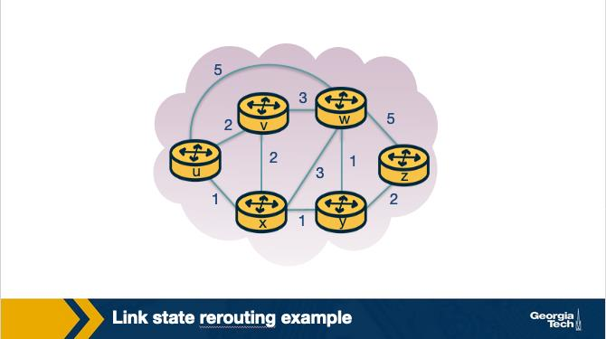
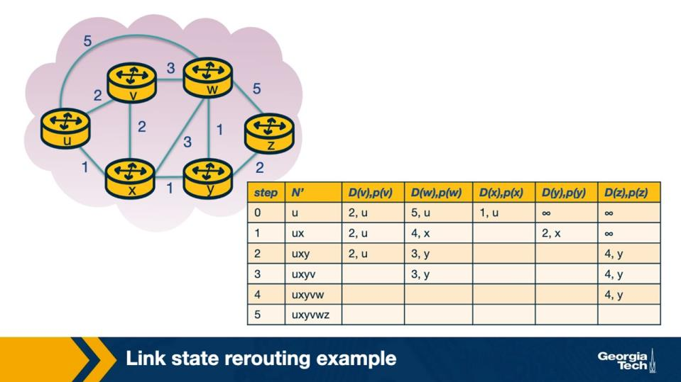
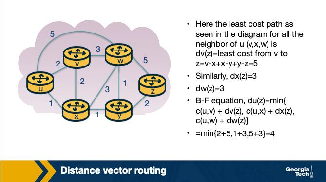
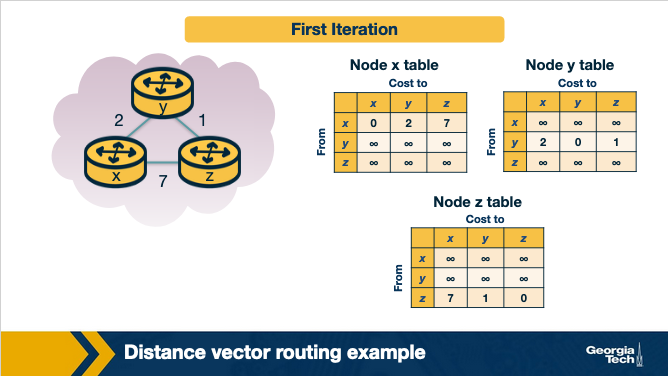
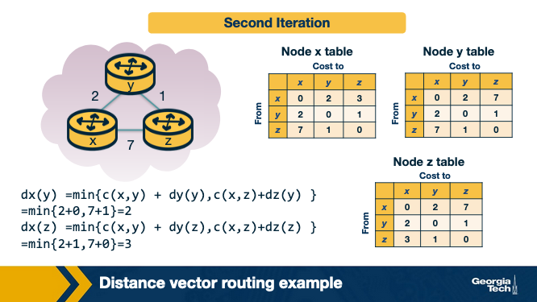
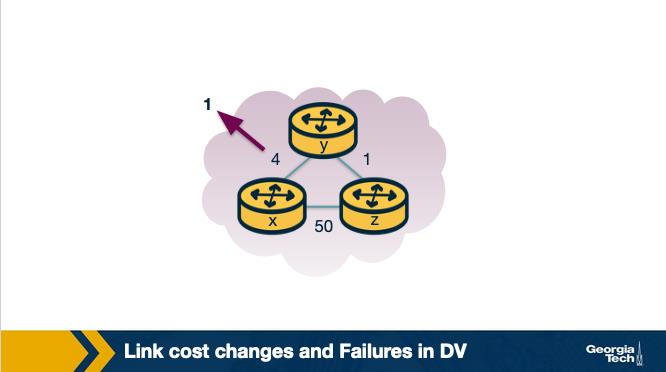
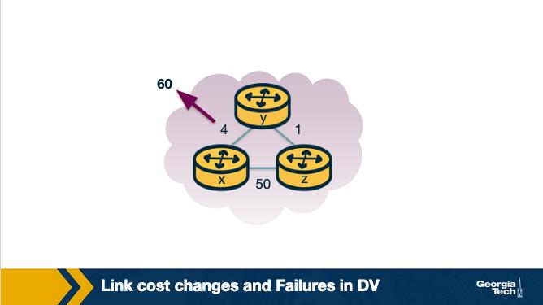
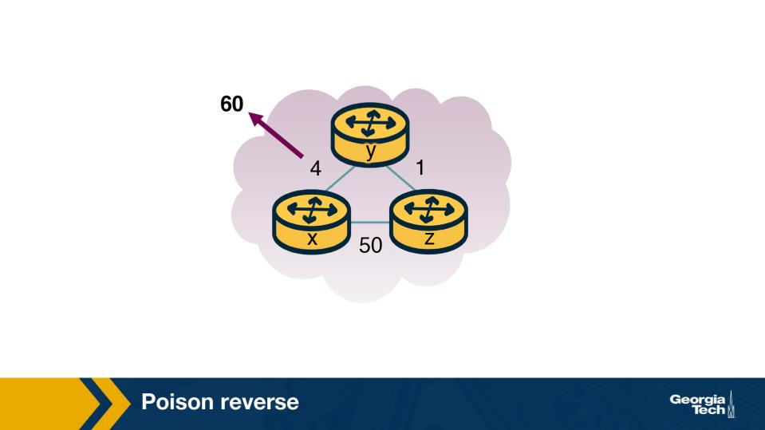
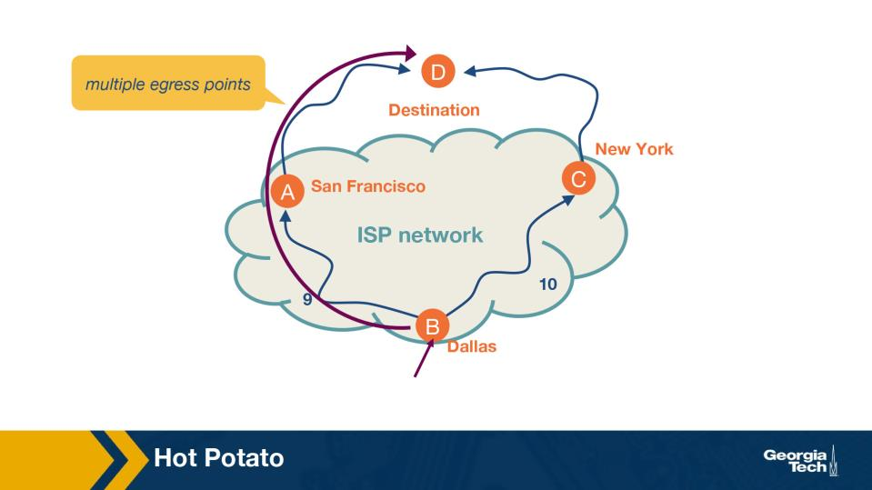

Module 3 — Question Pool 

OMSCS 6250 Computer Networks 
Lesson 3: Intradomain Routing 

Routing Algorithms 
Q1.  [MCQ] 

A router has two jobs commonly distinguished as 'forwarding' and 'routing'. Which best characterizes the 
difference? 

• 
A.  Forwarding is the per-packet act of moving a packet from an input port to the right output port; 
routing is the cooperative process that builds the forwarding table in the first place. 
• 
B.  Forwarding runs in the control plane and routing runs in the data plane, on a different CPU — this 
is the canonical convention documented in the standard reference for production routers. 
• 
C.  Forwarding picks the destination AS; routing only picks the next-hop physical port on a router 
across the connected subnet. 
• 
D.  Forwarding and routing are the same operation, viewed from different timescales by the operator 
running the network. 

  Correct answer: A 

  Why: Forwarding = per-packet table lookup; routing = the protocol that BUILDS that table. Forwarding happens millions of times 
per second on the data plane; routing runs in the background on the control plane to keep the table correct. 

Q2.  [MCQ] 

An Interior Gateway Protocol (IGP) is run inside an AS. Which is the most important reason an AS does 
NOT use BGP for its internal routing? 

• 
A.  BGP cannot run inside one AS at all; the protocol specification forbids same-AS sessions outright in 
every common implementation. 
• 
B.  IGPs converge faster on link cost changes inside the AS and let the operator optimize internal paths 
by metric, whereas BGP is policy-driven and slow to converge. 
• 
C.  IGPs use UDP instead of TCP so they save header bytes on every routing update propagated 
through the network. 
• 
D.  BGP requires hardware TCAMs in every internal router, which most enterprise switches do not 
have, as is widely deployed across modern Tier-1 networks for predictable inter-domain behaviour. 

  Correct answer: B 

  Why: IGPs converge fast on link cost; BGP is slow + policy. IGPs (OSPF, IS-IS) optimize the operator's own metric and re-converge in 
seconds; BGP is designed for inter-AS policy, not for fast internal failover or shortest-path optimization. 

<!-- page break -->

Q3.  [TF] 

In the graph abstraction used by routing algorithms, nodes are routers and edges are direct router-to-
router links with associated costs. 

• 
True 
• 
False 

  Correct answer: True 

  Why: Routers = nodes, links = edges with cost. The graph abstraction lets routing algorithms ignore physical details (fiber type, link 
speed) and focus only on topology and link metrics — the inputs Dijkstra and Bellman-Ford actually need. 

Link-state Routing Algorithm 
Q4.  [MCQ] 

What does a link-state algorithm require every router to know BEFORE it runs Dijkstra? 

• 
A.  A complete copy of every other router's forwarding table, refreshed continuously over the routing 
protocol session in the same domain. 
• 
B.  Only its directly attached neighbors and the costs to them; no other state is needed for Dijkstra to 
terminate correctly. 
• 
C.  The cost of every link in the network — typically discovered by flooding link-state advertisements 
(LSAs) to all other routers. 
• 
D.  The MAC address of every host in the AS, refreshed from ARP caches every 30 seconds and 
propagated to all routers. 

  Correct answer: C 

  Why: LS = global knowledge: every router needs every link's cost. Each router floods its own neighbor costs as LSAs; once the LSDB is 
synchronized, every router runs Dijkstra on the same graph to build its own shortest-path tree. 

Q5.  [MCQ] 

After Dijkstra terminates at source u, what does u know about destinations across the AS? 

• 
A.  u knows the topology but cannot use it for forwarding decisions; the topology is purely 
informational. 
• 
B.  u knows shortest paths only to its direct neighbors; longer paths are computed lazily on each 
packet's arrival. 
• 
C.  Every other node in the AS knows its own shortest paths to u, but u itself only knows its neighbors. 
• 
D.  u knows shortest paths to every other node in the AS — the minimum-cost path and the next hop 
along it. 

<!-- page break -->

  Correct answer: D 

  Why: Dijkstra from u => shortest path + next hop to every node. The algorithm doesn't just compute distances — it also yields the 
next hop along each shortest path, which is what populates the forwarding table. 

Q6.  [TF] 

In the initialization step of Dijkstra at source u, the label D(v) for a node v that is NOT a direct neighbor of 
u is set to infinity. 

• 
True 
• 
False 

  Correct answer: True 

  Why: Init: D(v) = c(u,v) for neighbors, infinity otherwise. Dijkstra starts pessimistic for unknown nodes and only updates D(v) 
downward when a shorter path through a newly-finalized node is found. 

Linkstate Routing Algorithm - Example 
Q7.  [MCQ] 

Figure: Link-state example topology (source = u) (Module 3) 

In the link-state example figure, source u has direct neighbors v, x, w. After initialization, x is added to N' 
first in iteration 1. Why x and not v or w? 

• 
A.  Because x has the lowest initial D value among the nodes not yet in N'. 
• 
B.  Because x is alphabetically last among the three candidate neighbors. 
• 
C.  Because x has the largest fan-out (most neighbors outside N') and Dijkstra prioritizes high-degree 
nodes early in convergence. 
• 
D.  Because v and w are not direct neighbors of u; only x is connected at all in the initialization stage. 

<!-- page break -->

  Correct answer: A 

  Why: Lowest-D candidate is added next. Dijkstra's greedy choice: pick the unsettled node with smallest current D, because (with 
non-negative weights) no shorter path to it can exist via any other unsettled node. 

Q8.  [MCQ] 

Figure: Iteration table — D(w) updated after x joins N' (Module 3) 

In the iteration table, after x is added to N', D(w) drops from 5 to 4. Which Dijkstra update produces 4? 

• 
A.  max( D(w), c(u,x) + c(x,w) ) = max(5, 1 + 3) = 5, then minus 1 by tiebreaker. 
• 
B.  min( D(w), c(u,x) + c(x,w) ) = min(5, 1 + 3) = 4. 
• 
C.  c(u,w) was simply re-measured by the link layer during the algorithm and found to be 4 rather 
than the originally-reported 5. 
• 
D.  The algorithm divided D(w) by the count of x's neighbors after x joined N', producing 4 as a side 
effect of the iteration. 

  Correct answer: B 

  Why: Relaxation: D(w) = min(D(w), D(x) + c(x,w)) = min(5, 1+3) = 4. Once x joins N' with D(x)=1, Dijkstra checks each neighbor of x 
for a shorter path; the path u -> x -> w (cost 4) beats the previous direct path u -> w (cost 5). 

<!-- page break -->

Q9.  [MCQ] 

Figure: Dijkstra iteration table (Module 3) 

Scenario: in iteration 2 of the same example, two nodes outside N' tie on their D value. Dijkstra needs to 
add ONE more node to N'. How is the tie broken? 

• 
A.  By geographic proximity to source u — the closer router on the figure is added first — operators 
rely on this property when designing their routing policies for global reachability. 
• 
B.  By the highest-ID node — Dijkstra always prefers the larger numeric router-ID when D values tie 
among candidate routers in the network. 
• 
C.  Arbitrarily — the algorithm picks one of the tied nodes; lecture treats this choice as not affecting 
the final shortest-path tree from u. 
• 
D.  Neither node is added; Dijkstra pauses and waits for an updated LSA to break the tie among the 
candidates. 

  Correct answer: C 

  Why: Tie-break is arbitrary; final tree weight is unchanged. Equal D values mean multiple shortest paths exist; Dijkstra is free to 
pick either — the resulting tree has the same total cost regardless of choice. 

<!-- page break -->

Q10.  [TF] 

Figure: Link-state example topology (Module 3) 

In the figure, all routers in the topology eventually arrive at IDENTICAL shortest-path-tree results for 
each given source, because they each run the same Dijkstra computation on the same flooded link-state 
database. 

• 
True 
• 
False 

  Correct answer: True 

  Why: Same LSDB => same Dijkstra result. Because every router in the area has the identical link-state database after flooding, each 
independently computes a consistent shortest-path tree from itself — no coordination needed beyond LSA flooding. 

Linkstate Routing Algorithm - Computational Complexity 
Q11.  [MCQ] 

For a network of n routers, Dijkstra's standard implementation has what worst-case computational 
complexity per source? 

• 
A.  O(log n) — Dijkstra is logarithmic in the number of routers in the network for any heap-based 
implementation. 
• 
B.  O(1) — Dijkstra's running time does not depend on the size of the routing graph in any realistic 
deployment scenario. 
• 
C.  O(n!) — every permutation of routers is enumerated to find the minimum-cost path between 
source and destination over all n nodes. 
• 
D.  O(n^2) — each iteration scans the candidate set linearly, and there are n−1 iterations. 

  Correct answer: D 

<!-- page break -->

  Why: O(n^2) for simple-array Dijkstra (heap version is O((n+m) log n)). The classic implementation scans the unsettled set linearly 
each iteration; n iterations x O(n) scan = O(n^2). 

Distance Vector Routing 
Q12.  [MCQ] 

Figure: Distance Vector algorithm — Bellman-Ford updates (Module 3) 

In the Distance Vector figure, each node x updates its DV using a Bellman-Ford-style equation. Which 
equation does DV use to update Dx(y), x's estimated cost to destination y? 

• 
A.  Dx(y) = min over neighbors v of { c(x,v) + Dv(y) }. 
• 
B.  Dx(y) = max over neighbors v of { c(x,v) + Dv(y) }, to bound the worst-case path through y. 
• 
C.  Dx(y) = c(x,y) only, ignoring all neighbor advertisements — DV considers only direct links. 
• 
D.  Dx(y) = sum over neighbors of { c(x,v) + Dv(y) }, normalized by the count of neighbors that have 
advertised. 

  Correct answer: A 

  Why: Dx(y) = min over neighbors v of {c(x,v) + Dv(y)}. Bellman-Ford relaxation: x estimates its cost to y as the minimum over each 
neighbor's advertised cost plus the link cost to that neighbor. 

<!-- page break -->

Q13.  [MCQ] 

Consider the DV routing algorithm, each node sends its distance vector to whom? 

• 
A.  To every router in the AS, by flooding the DV throughout the network on every update. 
• 
B.  Only to its direct neighbors over the link they share. 
• 
C.  Only to the AS border router, which collects all DVs and recomputes the shortest paths centrally. 
• 
D.  Only to its providers — DV is suppressed on customer-facing links to control export. 

  Correct answer: B 

  Why: DV sends only to direct neighbors (not flood). Each node passes its current vector to the routers it shares a link with; over 
many iterations the information propagates everywhere without anyone needing the global topology. 

Q14.  [TF] 

Distance Vector is iterative, asynchronous, and distributed: each node updates whenever it gets a new DV 
from a neighbor. 

• 
True 
• 
False 

  Correct answer: True 

  Why: DV is iterative, asynchronous, distributed — updates triggered by new neighbor DVs or link changes. Each router runs 
independently, processes incoming DVs as they arrive, and re-advertises when its own vector changes — no global clock or 
coordinator. 

Distance Vector Routing Example 
Q15.  [MCQ] 

<!-- page break -->

Figure: DV example — three-node topology x, y, z (Module 3) 

In the three-node DV example, x has direct neighbors y (cost 2) and z (cost 7). Initially y and z know only 
their direct costs. After receiving y's and z's first DVs, x computes Dx(z) using Bellman-Ford. What is 
Dx(z), and via which next hop? 

• 
A.  Dx(z) = 9, via the sum c(x,y) + c(x,z) = 2 + 7, since DV always combines both neighbor 
advertisements when picking a cost estimate. 
• 
B.  Dx(z) = 7, via direct link to z (because direct links always win during the first DV iteration 
regardless of any other update along the path). 
• 
C.  Dx(z) = 3, via next hop y (because 2 + Dy(z)=1 yields 3, beating the direct 7). 
• 
D.  Dx(z) = ∞, because x's initial DV does not yet contain z and DV cannot compute a cost across two 
hops in the first iteration. 

  Correct answer: C 

  Why: Dx(z) = min(c(x,z), c(x,y)+Dy(z)) = min(7, 2+1) = 3. The two-hop path via y (cost 3) beats the direct link (cost 7), so x adopts y 
as next-hop for destination z. 

Q16.  [MCQ] 

Figure: DV example — iteration showing x recomputing Dx(z) (Module 3) 

In the second iteration of the DV example, node x recomputes Dx(z). Which expression yields the correct 
converged value of 3? 

• 
A.  c(x,y) + Dy(y) = 2 + 0 = 2 — DV uses the destination's own self-cost as part of the update, which is 
zero. 
• 
B.  max{ c(x,y) + Dy(z), c(x,z) + Dz(z) } = max(3, 7) = 7, because DV picks the longer of any two 
candidates. 
• 
C.  c(x,z) + Dz(z) = 7 + 0 = 7 — DV never considers indirect paths during the second iteration of the 
example. 
• 
D.  min{ c(x,y) + Dy(z), c(x,z) + Dz(z) } = min(2+1, 7+0) = 3. 

<!-- page break -->

  Correct answer: D 

  Why: min{c(x,y)+Dy(z), c(x,z)+Dz(z)} = min(3, 7) = 3. Bellman-Ford picks the minimum across neighbors of (link cost + that 
neighbor's distance to dest), with the destination's distance to itself being 0. 

Q17.  [TF] 

Figure: DV example — converged DV tables (Module 3) 

In the converged DV tables, once no further updates are produced the nodes stop sending new DV 
messages until a link cost changes. 

• 
True 
• 
False 

  Correct answer: True 

  Why: Converged => silence until topology changes. DV stops re-advertising when no node's vector changed; a triggered update fires 
only when a link cost or neighbor DV produces a new value. 

<!-- page break -->

Q18.  [MCQ] 

Figure: DV example — second iteration (Module 3) 

Suppose during the example, x's link to z (cost 7) becomes unreachable while the y↔z link is still up. After 
convergence, what does Dx(z) become and through which next hop? 

• 
A.  Dx(z) = 3, via y (using y's DV entry Dy(z) = 1 plus c(x,y) = 2). 
• 
B.  Dx(z) = ∞ — once x's direct link to z fails, x can never reach z, regardless of what its other 
neighbors advertise about z across the same routing domain. 
• 
C.  Dx(z) = 7, because x continues to use the old direct-link cost it had cached until manually purged by 
an operator command. 
• 
D.  Dx(z) = 1, the cost y already advertises to z, copied directly into x's table without any addition of 
c(x,y) along the path. 

  Correct answer: A 

  Why: x falls back to y as next hop (cost 2+1=3). When x's direct link to z dies, its remaining option is via neighbor y — which still has 
a working path to z — yielding Dx(z) = 3 via next-hop y. 

Link Cost Changes and Failures in DV - Count to Infinity Problem 
Q19.  [MCQ] 

<!-- page break -->

Figure: Count-to-infinity setup — three-node loop (Module 3) 

In the count-to-infinity figure, link y↔x rises sharply in cost (from 4 to 60). Just AFTER y notices the 
change, y computes a new cost to x of only 6, not 60. Where does the '5' in '1 + 5 = 6' come from? 

• 
A.  From the new direct c(y,x) = 5 measured fresh after the link change settled at the lower value 
across every router participating in the same routing domain at the same moment. 
• 
B.  From z's previously-advertised Dz(x) = 5 (which z computed via y), combined with c(y,z) = 1 — y 
is unaware that z's path to x goes through y itself. 
• 
C.  From the cost c(y,z) = 5 alone, which DV stores in y's table as the cost to z and reuses for x by 
mistake during the iteration. 
• 
D.  From an arbitrary cost cap of 5 that DV applies whenever a route is suspected to be looping 
through a recently-changed link. 

  Correct answer: B 

  Why: '5' is z's stale Dz(x) advertised earlier via y. The classic count-to-infinity setup: y doesn't realise z's path to x went through y 
itself, so y treats z's old advertisement as a valid alternate route and computes 1 + 5 = 6. 

<!-- page break -->

Q20.  [MCQ] 

Figure: Count-to-infinity iterative slow climb (Module 3) 

Why does the count-to-infinity scenario take MANY iterations to converge instead of jumping straight to 
the correct 51? 

• 
A.  Because Poison Reverse runs in the background and slows down every advertisement to avoid 
spurious convergence in DV. 
• 
B.  Because DV deliberately throttles updates to one cost increment per second, regardless of the 
actual change in cost across the network. 
• 
C.  Each iteration each node only knows neighbors' last advertised cost plus the direct link cost — 
neither knows that the cost flowing through the other node now passes through itself, so each round 
adds only 1 hop to the inflated cost. 
• 
D.  Because RIP caps cost increases at 1 per epoch globally, by RFC, because the protocol enforces 
strict isolation between routing tables in the global system., which the IETF documents as the 
standard behaviour across all compliant implementations today. 

  Correct answer: C 

  Why: Each iteration each node only sees the OTHER's last advertised cost. Neither y nor z knows the other's path runs through itself, 
so each round just adds the direct-link cost — the inflated estimate creeps up by 1 hop per iteration until reaching 'infinity'. 

Q21.  [TF] 

DV propagates 'good news' (a decrease in link cost) quickly but propagates 'bad news' (a large increase) 
very slowly — the count-to-infinity problem. 

• 
True 
• 
False 

  Correct answer: True 

<!-- page break -->

  Why: Good news = decrease propagates in one round; bad news = increase loops slowly. A drop in cost beats every existing 
alternative immediately; an increase has to wait for every loop-path estimate to also climb past it before convergence. 

Q22.  [MCQ] 

Scenario: in a count-to-infinity situation, RIP uses an artificial maximum hop count of 16 to declare 
'infinity'. What does this cap actually achieve? 

• 
A.  It signals routers to fail over to BGP when a hop count above 16 is encountered. 
• 
B.  It eliminates count-to-infinity entirely for every possible loop topology in any RIP-based network. 
• 
C.  It makes RIP converge to the OSPF-best-path on the same topology automatically — multiple RFCs 
and BCPs prescribe this behaviour for production inter-domain routing systems. 
• 
D.  It bounds the worst-case duration of count-to-infinity by capping how many iterations the climb 
can take before the path is declared unreachable. 

  Correct answer: D 

  Why: RIP infinity = 16 => bounded count-to-infinity duration. By declaring any path with hop count >= 16 unreachable, RIP 
guarantees count-to-infinity terminates in finite time — at the cost of disallowing legitimate paths longer than 15 hops. 

Poison Reverse 
Q23.  [MCQ] 

Figure: Poison reverse — z lies to y (Module 3) 

In the poison-reverse figure, z's current path to x goes THROUGH y. What does z advertise to y about z's 
cost to x, and why? 

• 
A.  z advertises Dz(x) = ∞ to y; this prevents y from ever choosing to reach x through z, which would 
create a loop. 
• 
B.  z advertises its true Dz(x) to y for fairness across all neighbors. 

<!-- page break -->

• 
C.  z stops sending any distance vector to y until the route to x changes — z effectively goes silent on 
that destination. 
• 
D.  z advertises Dz(x) = 0 to y, so y always prefers z for any destination on the network. 

  Correct answer: A 

  Why: Poison reverse: z lies infinity to its next-hop y. Since z's path to x goes through y, z tells y 'I can't reach x' to prevent y from ever 
choosing z as a back-up route — which would create a routing loop. 

Q24.  [MCQ] 

Figure: Poison reverse semantics (Module 3) 

Scenario: in the poison-reverse figure, suppose z's path to x changes so that z no longer routes via y. What 
does z's advertisement to y about x look like now? 

• 
A.  z keeps advertising Dz(x) = ∞ to y forever, because once poisoning is declared it is permanent for 
the lifetime of the session. 
• 
B.  z advertises its real Dz(x) to y; the poisoning was conditional on z routing through y, so it lifts once 
z no longer does. 
• 
C.  z's advertisement to y is unchanged because poison reverse never reacts to changes in the 
underlying topology of the AS. 
• 
D.  z advertises Dz(x) = 0 to y as a 'cleared' signal, distinct from infinity and from the true cost in the 
advertisement itself. 

  Correct answer: B 

  Why: Conditional poisoning: lifts when z no longer routes via y. Poison reverse is per-neighbor and per-destination; once z's path to 
x stops going through y, the reason to lie disappears and z advertises its true cost again. 

<!-- page break -->

Q25.  [TF] 

Poison reverse fully eliminates the count-to-infinity problem in all topologies, including loops involving 
three or more nodes that are not all directly connected. 

• 
True 
• 
False 

  Correct answer: False 

  Why: PR fixes 2-node loops but NOT longer cycles. Three or more nodes with mutually-reinforcing advertisements can still produce 
count-to-infinity; poison reverse only protects against the simplest direct-loop case. 

Linkstate Routing Protocol Example: OSPF 
Q26.  [MCQ] 

Which statement about OSPF most accurately captures how it differs from RIP? 

• 
A.  OSPF disables Dijkstra and uses Bellman-Ford for the inner loop, but routes only between border 
routers in each subnet, reflecting how the routing decision flows through a typical commercial-grade 
daemon at scale. 
• 
B.  OSPF is a distance-vector protocol like RIP, but with longer hop-count limits to support modern 
networks across multiple administrative domains. 
• 
C.  OSPF and RIP are equivalent; the names are vendor-specific labels for the same underlying 
algorithm in different implementations. 
• 
D.  OSPF is a link-state protocol — every router floods link-state advertisements (LSAs) to all routers 
in its area and then independently runs Dijkstra on the shared topology. 

  Correct answer: D 

  Why: OSPF is link-state: flood LSAs, run Dijkstra locally. Each router publishes its own neighbor info; once every router has the same 
LSDB, each independently computes its shortest-path tree — no neighbor-to-neighbor DV iterations needed. 

Hot Potato Routing 
Q27.  [MCQ] 

<!-- page break -->

Figure: Hot-potato routing — Dallas chooses between SF and NY egress (Module 3) 

In the hot-potato figure, a router in Dallas has two equally good BGP routes leaving the AS — via San 
Francisco (IGP cost 9) and New York (IGP cost 10). Which egress does the router pick, and why? 

• 
A.  Either at random — hot-potato breaks ties uniformly across equally-good BGP routes when AS-
PATH attributes match across the routes. 
• 
B.  New York — hot-potato prefers the egress with the HIGHEST IGP cost as a load-balancing 
mechanism to spread egress traffic. 
• 
C.  San Francisco — among equally good BGP routes, hot-potato selects the egress with the lowest IGP 
cost to push traffic out of the AS sooner. 
• 
D.  Neither — hot-potato applies only when BGP costs differ across the candidate egress points — this 
is the canonical convention documented in the standard reference for production routers. 

  Correct answer: C 

  Why: Hot-potato: lowest IGP cost wins among equal BGP routes. Push the packet out of the AS as fast as possible (SF, cost 9, vs NY, 
cost 10) to minimize the carrying cost inside one's own network. 

<!-- page break -->

Q28.  [MCQ] 

Figure: Hot-potato routing scenario (Module 3) 

Scenario: in the figure, what is the consequence of every router in the AS independently making the hot-
potato choice for inter-AS traffic? 

• 
A.  Routers send all traffic on the longest-IGP-cost path to ensure backup links are exercised regularly 
for failure detection across the AS. 
• 
B.  Every packet exits the AS at the same single egress chosen by the BGP best-path selection at the AS 
border, regardless of internal topology. 
• 
C.  All routers send traffic to one central exit chosen by the route reflector — this is the same as a cold-
potato policy by definition, as is widely deployed across modern Tier-1 networks for predictable 
inter-domain behaviour. 
• 
D.  Each router minimizes its own AS's internal carrying cost — traffic exits the AS at the closest 
available egress, which can produce different egress points for different source routers. 

  Correct answer: D 

  Why: Different sources -> different egress points. Because each router independently picks its closest exit, traffic to the same 
external destination can leave the AS through different egresses depending on where it originated. 

Q29.  [MCQ] 

Hot-potato routing externalizes traffic-carrying cost. From whose perspective is this advantageous, and 
why might it be controversial? 

• 
A.  Advantageous to the AS that hands traffic off early (low internal cost); controversial because the 
receiving AS bears the carrying cost across the rest of the path. 
• 
B.  Advantageous to the receiving AS because it gets richer traffic data; controversial because the 
originating AS pays more in transit. 

<!-- page break -->

• 
C.  Equally advantageous to both ASes — hot-potato is fully symmetric and well-known to be fair 
across providers — operators rely on this property when designing their routing policies for global 
reachability. 
• 
D.  Advantageous neither party, but mandated by the IETF for inter-AS traffic of all kinds, leaving 
operators no choice on the policy. 

  Correct answer: A 

  Why: Originator dumps cost early; receiver pays it. Hot-potato is advantageous to the AS handing traffic off (low internal carrying 
cost) but burdens the receiving AS, which must carry the traffic the rest of the way — fair only if both ASes do the same in both 
directions.
