Module 4 — Question Pool 

OMSCS 6250 Computer Networks 
Lesson 4: AS Relationships and Interdomain Routing 

Autonomous Systems and Internet Interconnection 
Q1.  [MCQ] 

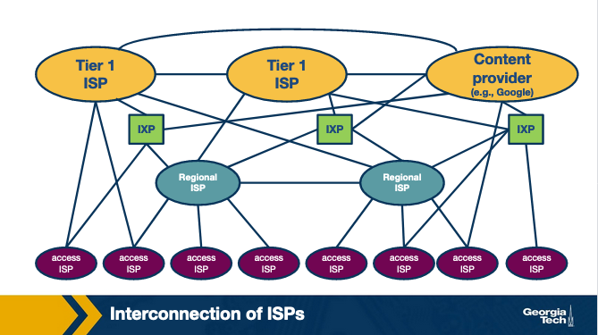

Figure: AS interconnection hierarchy — Tier-1, regional, and access ISPs (Module 4) 

Looking at the AS-hierarchy figure: a small access ISP that wants to deliver traffic to a distant network 
outside its providers' tables must rely on which other entity in the picture? 

• 
A.  A regional or Tier-1 isp it is a customer of, which forwards the traffic onward. 
• 
B.  An IXP route server alone, with no involvement from any provider. 
• 
C.  Another access ISP at the same tier as itself, using a settlement-free peering session. 
• 
D.  The destination network must connect directly to the access ISP for traffic to be deliverable. 

  Correct answer: A 

  Why: Small access ISPs reach far destinations via their transit providers. The small ISP doesn't have its own routes to the whole 
Internet — its provider's BGP table covers everywhere else, and traffic for unknown prefixes is sent upstream. 

Q2.  [MCQ] 

<!-- page break -->

Figure: AS interconnection hierarchy (Module 4) 

In the same hierarchy figure, suppose two Tier-1 ISPs lose their direct peering link. What is the likely 
effect on a customer of one Tier-1 trying to reach a customer of the other? 

• 
A.  No effect; Tier-1 ISPs always have multiple direct peerings with every other Tier-1 ISP. 
• 
B.  The two halves of the Internet may become partially unreachable between those Tier-1 customer 
cones until the peering is restored or rerouted. 
• 
C.  Traffic gets dropped at the IXP because IXPs cannot connect Tier-1 networks — this is the 
canonical convention documented in the BGP specification for production routers. 
• 
D.  Tier-1 ISPs automatically fall back to using IPv6 in this scenario, restoring connectivity via the v6 
plane. 

  Correct answer: B 

  Why: Direct peering loss between Tier-1s => partial partition. Tier-1s have no transit provider above them, so if direct peers don't 
reach each other, their customer cones can become mutually unreachable until peering is restored. 

<!-- page break -->

Q3.  [MCQ] 

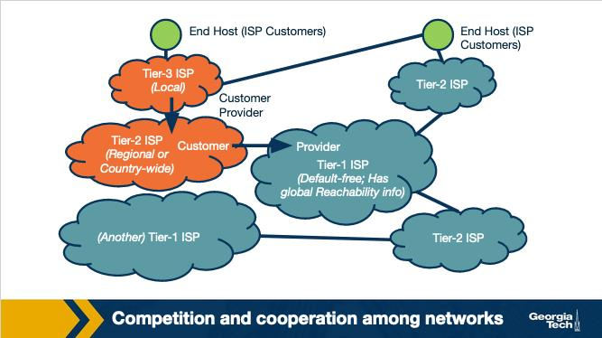

Figure: Flattening of the Internet topology (Module 4) 

This figure depicts the Internet topology shifting from strictly hierarchical to flatter. What development 
drove most of this flattening? 

• 
A.  The Internet now has fewer total ASes than it had a decade ago. 
• 
B.  Tier-1 ISPs absorbed all Tier-2 networks via mergers, removing the middle tier. 
• 
C.  Large content providers and CDNs deployed at IXPs let networks bypass higher tiers for popular 
content. 
• 
D.  BGP was redesigned to forbid customer-provider relationships and require flat peering. 

  Correct answer: C 

  Why: CDNs/content providers colocate at IXPs => bypass higher tiers. Popular content (Netflix, YouTube, Akamai) lives close to 
eyeballs at IXPs, so traffic no longer needs to climb the hierarchy through Tier-1 transit links. 

AS Business Relationships 
Q4.  [MCQ] 

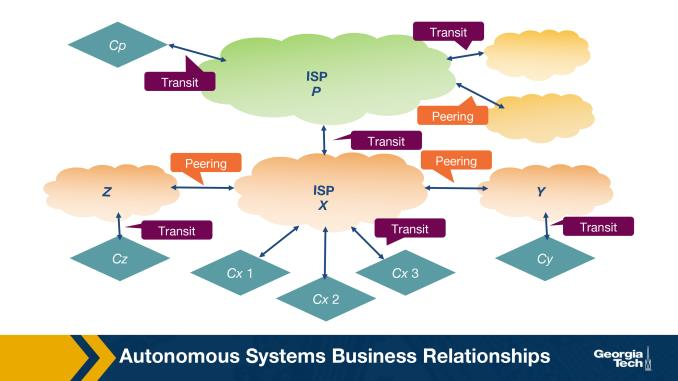

Figure: Customer / Provider / Peer relationships (Module 4) 

<!-- page break -->

Looking at the AS business-relationship figure: AS X is a customer of AS Y. In this relationship, who pays 
whom, and what does X receive? 

• 
A.  Y pays X; in return X agrees to forward traffic destined for Y's customers along its links. 
• 
B.  X and Y both pay the IXP that hosts their interconnection fabric for the duration of the relationship. 
• 
C.  Neither pays; the link is settlement-free and serves both parties equally on traffic volume. 
• 
D.  X pays Y; in return X receives reachability to every destination Y can reach. 

  Correct answer: D 

  Why: Customer pays provider for reachability to everywhere. The transit contract: customer pays for upstream access; in return 
provider announces every route it can reach (default route or full table) to the customer. 

Q5.  [MCQ] 

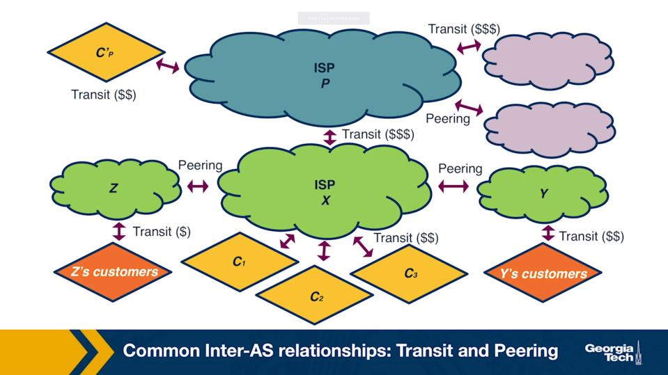

Figure: Customer / Provider / Peer relationships (Module 4) 

In the figure, two ISPs of similar size establish a settlement-free peering link rather than buying transit. 
Which is the BEST motivation? 

• 
A.  To avoid paying their upstream providers for traffic going directly between each other's 
customers. 
• 
B.  To take over the AS-PATH attribute and shorten everyone's routes uniformly across the Internet. 
• 
C.  To merge their two ASes into one for administrative simplicity in a single global table. 
• 
D.  To allow both ASes to begin charging Tier-1 ISPs for transit service over time. 

  Correct answer: A 

  Why: Peering avoids paying transit on traffic to each other's customers. Two similar-size ISPs save money by exchanging customer-
bound traffic directly; previously they each paid upstream providers to carry it. 

Q6.  [MCQ] 

<!-- page break -->

Figure: Customer / Provider / Peer relationships (Module 4) 

Scenario: AS X learns the SAME prefix from a customer AS, a peer AS, and a provider AS at the same 
moment. Which path will X most likely install for forwarding, and why? 

• 
A.  The peer-learned route, because peers are usually closer in the topology and have lower AS-PATH 
lengths than providers. 
• 
B.  The customer-learned route, because forwarding via customer earns X revenue while the other 
two cost X money or provide no revenue. 
• 
C.  The provider-learned route, because providers always advertise the most stable and well-vetted 
paths to a destination. 
• 
D.  Whichever has the shortest AS-PATH; relationship type plays no role in this decision, as is widely 
deployed across modern Tier-1 networks for predictable inter-domain behaviour. 

  Correct answer: B 

  Why: Customer route is preferred => revenue. Among same-prefix routes, exporting via a customer earns money; via a provider 
costs money; via a peer is settlement-free — BGP best-path is overridden by relationship preference (via LocalPref). 

Q7.  [TF] 

In a customer-provider relationship, the customer can use the provider's link to reach every destination 
the provider knows about. 

• 
True 
• 
False 

  Correct answer: True 

  Why: Customer = full transit reachability. The customer-provider contract grants the customer access to everything the provider 
can reach, which is typically the full Internet or a default route. 

<!-- page break -->

BGP Routing Policies: Importing and Exporting Routes 
Q8.  [MCQ] 

Figure: Import/export policy decisions by relationship (Module 4) 

From the import/export policy figure: AS X learns a route to prefix p from one of its CUSTOMERS. To 
which neighbors will X export p, in the standard Gao–Rexford convention? 

• 
A.  Only to its customers; X does not announce customer routes to peers or providers. 
• 
B.  Only to its providers; customer routes are intended to climb the hierarchy. 
• 
C.  To all neighbors — customers, peers, and providers — to maximize reachability for p across the 
Internet. 
• 
D.  Only to its peers, never to its customers, since peers reciprocate the announcement. 

  Correct answer: C 

  Why: Customer routes are exported to EVERYONE. The customer pays for transit, so the provider announces the customer's prefixes 
everywhere (other customers, peers, providers) to maximize traffic earned for that customer. 

Q9.  [MCQ] 

Figure: Import/export policy decisions by relationship (Module 4) 

<!-- page break -->

From the same figure: AS X learns a route to prefix p from one of its PROVIDERS. Whom does X announce 
p to, under standard policy? 

• 
A.  All neighbors of X — providers, peers, and customers alike — to maximize reachability. 
• 
B.  Providers and peers only — never customers, since customers are paying for transit. 
• 
C.  Peers only — peering reciprocity demands re-announcement to peers but not customers. 
• 
D.  Customers only. 

  Correct answer: D 

  Why: Provider routes are exported only to customers. Re-announcing a provider's route to peers or other providers would cost 
money to carry that traffic without any incoming revenue — so Gao-Rexford restricts to customer-only. 

Q10.  [MCQ] 

Why does an AS typically WITHHOLD a route learned from a provider when re-announcing to its peers 
and other providers? 

• 
A.  Because the AS would carry traffic for other networks while paying its own provider for that 
traffic, with no incoming revenue to offset it. 
• 
B.  Because BGP forbids re-advertising any route ever learned over eBGP — operators rely on this 
property when designing their routing policies for global reachability. 
• 
C.  Because peer and provider routers refuse to accept routes longer than 3 AS hops along the path. 
• 
D.  Because MED attributes from providers cannot be re-exported by routing software. 

  Correct answer: A 

  Why: Re-announcing provider route would cost money without revenue. The AS would be carrying transit traffic for non-customers 
— paying its own provider to receive it and earning nothing — a clear losing position. 

BGP and Design Goals 
Q11.  [MCQ] 

BGP is a path-vector protocol rather than a link-state protocol like OSPF. Which characteristic best 
explains why path-vector was preferred at AS scale? 

• 
A.  Path-vector protocols converge faster than link-state in every topology, regardless of size. 
• 
B.  Path-vector lets each AS apply its own policy decisions and hide internal topology from other ASes, 
while still carrying enough information to avoid loops. 
• 
C.  Path-vector consumes less memory than link-state databases by storing only destination 
addresses, without any path information. 
• 
D.  Path-vector is the only design that supports IPv6 in the wider Internet today across every router 
participating in the same routing domain at the same moment. 

  Correct answer: B 

<!-- page break -->

  Why: Path-vector hides topology + supports policy. BGP carries an AS-PATH (loop detection, prefix length, route preference) without 
revealing internal links; each AS independently applies its own export/import policies. 

BGP Protocol Basics 
Q12.  [MCQ] 

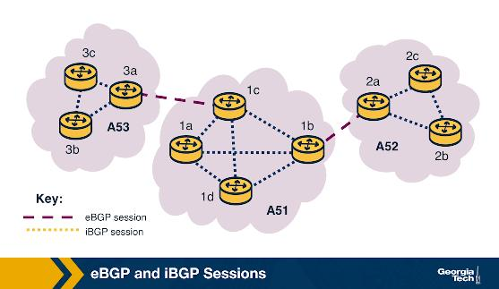

Figure: BGP topology — AS1, AS2, AS3 with border routers (Module 4) 

In the BGP-basics figure, the session between border router 3a (in AS3) and border router 1c (in AS1) is 
best classified as which? 

• 
A.  iBGP, because both endpoints are border routers and BGP between border routers is internal. 
• 
B.  An IGP adjacency such as OSPF; only inside-AS sessions use BGP. 
• 
C.  eBGP, because the two routers belong to different ASes. 
• 
D.  A route-server multilateral session, since they are at different ASes. 

  Correct answer: C 

  Why: eBGP = between ASes; iBGP = same AS. Border routers 3a and 1c are in different ASes (3 and 1), so the session between them is 
external BGP by definition, regardless of router role. 

<!-- page break -->

Q13.  [MCQ] 

Figure: BGP topology — AS1, AS2, AS3 (Module 4) 

Looking at the figure, an eBGP session between 3a and 1c suddenly goes down. What is the immediate 
effect on the BGP routes those two routers had been exchanging? 

• 
A.  Nothing; routes persist in the RIB until manually deleted by an operator on each side. 
• 
B.  The IXP automatically takes over the session and continues forwarding announcements on behalf 
of both sides. 
• 
C.  Only AS1 withdraws routes; AS3 holds onto its learned entries until it receives a new explicit 
withdraw. 
• 
D.  Both routers withdraw the routes learned from each other and propagate the withdrawal to their 
iBGP and eBGP neighbors. 

  Correct answer: D 

  Why: Both sides withdraw and propagate. When an eBGP session drops, both routers invalidate everything they learned from each 
other; that triggers iBGP withdrawals internally and eBGP withdrawals to other peers. 

Q14.  [MCQ] 

A BGP UPDATE message can contain which of the following content categories? 

• 
A.  Both announcements (newly available routes) and withdrawals (no-longer-valid routes) in the 
same message. 
• 
B.  Only withdrawals; announcements use a different message type, because BGP enforces strict 
isolation between AS routing tables in the global routing system. 
• 
C.  Only announcements of newly available routes; withdrawals require a separate WITHDRAW 
message type. 
• 
D.  Neither announcements nor withdrawals; UPDATE messages carry only KEEPALIVE counters 
between peers. 

<!-- page break -->

  Correct answer: A 

  Why: UPDATE = announcements + withdrawals in one message. A BGP UPDATE encodes both new reachability and routes that 
should be removed in a single packet — there's no separate WITHDRAW message type. 

iBGP and eBGP 
Q15.  [MCQ] 

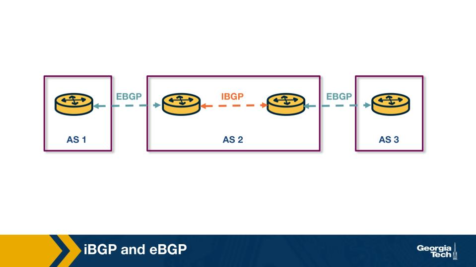

Figure: iBGP/eBGP topology — border routers and internal routers within one AS (Module 4) 

In the iBGP/eBGP figure: border router the left router in AS2 learns a route to prefix p via eBGP from AS1. 
How does the right internal router in AS2 learn about p? 

• 
A.  It learns p directly over eBGP from AS1's border router. 
• 
B.  It receives p inside AS2 via an iBGP session from the left router. 
• 
C.  It learns p via an IGP such as OSPF that carries external BGP routes alongside internal ones. 
• 
D.  It cannot learn about this prefix at all.  

  Correct answer: B 

  Why: Internal routers learn external prefixes via iBGP. Border router  receives p over eBGP from outside; it then redistributes p via 
iBGP to internal routers so they know how to forward toward that prefix. 

<!-- page break -->

Q16.  [MCQ] 

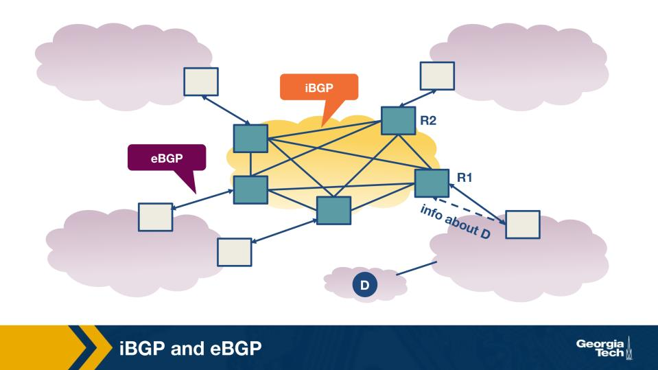

Figure: iBGP full-mesh requirement (Module 4) 

From the iBGP full-mesh figure: an AS currently has 5 BGP-speaking routers connected in a full mesh of 
iBGP sessions. The operator adds a 6th BGP router. How many NEW iBGP sessions are required? 

• 
A.  1 new session — just one connection to the nearest existing router suffices. 
• 
B.  No new sessions — iBGP scales automatically because each router gossips to its IGP-discovered 
neighbors. 
• 
C.  6 new sessions — one extra for redundancy with each existing router. 
• 
D.  5 new sessions — one to each of the existing routers, to preserve the full mesh. 

  Correct answer: D 

  Why: n -> n+1 routers => +n new iBGP sessions. Full mesh on n routers has n(n-1)/2 sessions; adding one more requires a session to 
each of the existing n routers — for n=5, that's 5 new sessions. 

BGP Decision Process: Selecting Routes at a Router 
Q17.  [MCQ] 

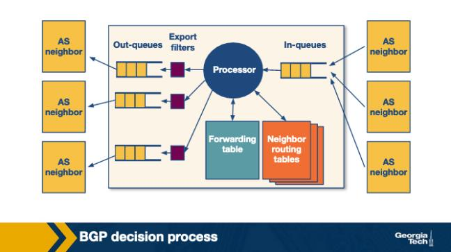

Figure: BGP route-handling pipeline (Module 4) 

<!-- page break -->

Looking at the BGP decision-pipeline figure, which order describes how an incoming route progresses 
through a BGP router? 

• 
A.  Export policy → decision process → install in FIB → import policy. 
• 
B.  Import policy → decision process → install in forwarding table → export policy. 
• 
C.  Install in FIB → decision process → import policy → export policy. 
• 
D.  Decision process → import policy → export policy → install in FIB. 

  Correct answer: B 

  Why: Import -> decision process -> install in FIB -> export. Incoming routes are first filtered by import policy, then the BGP decision 
process picks the best path, then it's installed in the forwarding table, and finally export policy decides what to re-advertise. 

Q18.  [MCQ] 

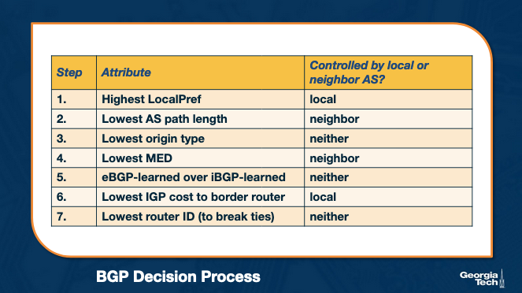

Figure: BGP decision attributes — LocalPref, AS-PATH, MED (Module 4) 

Scenario: AS X learns the same prefix p via three eBGP neighbors. The three routes have LocalPref values 
100, 200, 100 respectively. Which route does BGP install, and why? 

• 
A.  Whichever route arrived first in time, since LocalPref is only a tiebreaker for the rare equal-AS-
PATH case. 
• 
B.  The route with LocalPref 100 that has the shortest AS-PATH, because LocalPref ties go to AS-PATH. 
• 
C.  The route with LocalPref 200, because BGP's first decision step (after policy) prefers the highest 
LocalPref value. 
• 
D.  The route with LocalPref 100 from the LEFT-most neighbor, because BGP always prefers the 
lowest router-ID. 

  Correct answer: C 

  Why: Highest LocalPref wins (step 1 of decision). LocalPref is the first tie-breaker after import policy: 200 beats 100, and AS-PATH 
length is only consulted if LocalPref is tied. 

<!-- page break -->

Q19.  [MCQ] 

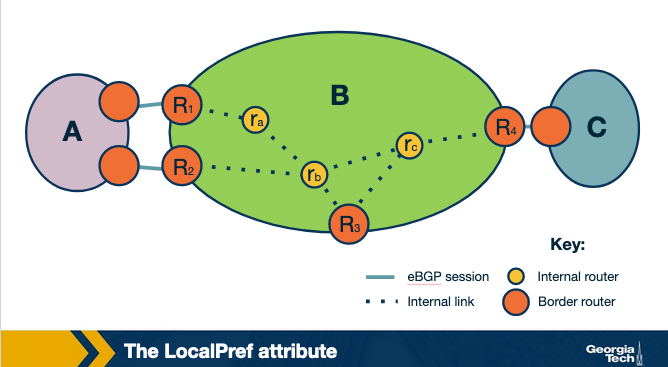

Figure: Using LocalPref to control outbound exit choice (Module 4) 

Scenario from the LocalPref figure: AS B learns the same prefix via neighbor A AND via neighbor C. B 
wants traffic to leave through A. What is the simplest policy knob B configures? 

• 
A.  B advertises a longer AS-PATH out to neighbor C by AS-path prepending its own ASN multiple 
times. 
• 
B.  B disables its iBGP sessions to internal routers so they all default to using A. 
• 
C.  B lowers the MED it advertises TO A, hoping A will prefer that route in its own decision process. 
• 
D.  B sets a higher LocalPref on the route received from A than on the route received from C. 

  Correct answer: D 

  Why: Higher LocalPref on A's route = prefer A as exit. LocalPref is the standard knob for outbound traffic engineering: set it higher 
on the route from A and BGP will pick A's route over C's regardless of AS-PATH length. 

Q20.  [MCQ] 

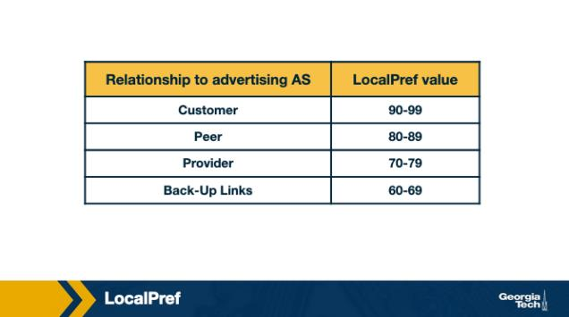

Figure: MED influences inbound traffic entry point (Module 4) 

<!-- page break -->

Scenario from the MED figure: AS B has two parallel links to AS A, through routers R1 and R2. B advertises 
the same prefix on both links and tags the R1 advertisement with a LOWER MED. Where does A's traffic 
for that prefix ENTER AS B? 

• 
A.  Through R1, because A's BGP decision process prefers the lower MED among routes equal in 
earlier steps. 
• 
B.  Through R2, because higher MED is preferred at the receiver side of BGP best-path selection. 
• 
C.  Equally split across R1 and R2, since MED is only a hint and not used for hard routing decisions. 
• 
D.  Through neither; A discards both routes because conflicting MED values are treated as a 
misconfiguration. 

  Correct answer: A 

  Why: Lower MED at R1 => A enters via R1. MED is compared at the receiver among routes from the SAME AS; lower MED wins, so 
A's BGP decision process picks R1 as the entry into AS B. 

Q21.  [MCQ] 

MED is named 'Multi-Exit Discriminator', yet operators use it to influence INBOUND traffic. What does the 
'exit' in the name actually refer to? 

• 
A.  The exit interface on a downstream IXP route-server, not on any AS, reflecting how the routing 
decision flows through a typical commercial-grade BGP daemon at scale. 
• 
B.  The exit point of the receiving AS — i.e., MED helps the neighbor decide which of its own exit links 
to use when sending traffic toward you. 
• 
C.  The exit code of the BGP daemon when it crashes due to malformed MED values from peers. 
• 
D.  The exit from slow-start mode in the underlying TCP connection that carries the BGP session. 

  Correct answer: B 

  Why: 'Exit' = exit of the RECEIVING AS. MED tells your neighbor which of THEIR exits toward you to prefer — you're influencing 
inbound traffic by hinting which of your neighbor's egress links should carry it. 

Q22.  [MCQ] 

BGP includes a tie-breaker preferring 'eBGP-learned over iBGP-learned'. What is the intuition behind 
preferring eBGP routes when other attributes are equal? 

• 
A.  eBGP routes are signed cryptographically and iBGP routes are not — this is the canonical 
convention documented in the BGP specification for production routers. 
• 
B.  eBGP routes always have shorter AS-PATH attributes than iBGP routes by construction. 
• 
C.  eBGP routes typically reach the destination through fewer internal hops, sending traffic out of the 
AS sooner ('hot-potato' routing). 
• 
D.  eBGP routes consume less memory in the RIB than iBGP routes, conserving router resources. 

  Correct answer: C 

<!-- page break -->

  Why: eBGP > iBGP => hot-potato. Among otherwise-equal routes, prefer the one learned via eBGP because that exits the AS sooner, 
minimizing the carrying cost inside your own network. 

Q23.  [TF] 

In the BGP decision process, LocalPref is evaluated AFTER AS-PATH length. 

• 
True 
• 
False 

  Correct answer: False 

  Why: LocalPref is evaluated FIRST, before AS-PATH. The decision order: LocalPref -> AS-PATH length -> origin -> MED -> 
eBGP/iBGP -> IGP cost -> router-ID. LocalPref dominates by design so policy beats path length. 

Challenges with BGP: Scalability and Misconfigurations 
Q24.  [MCQ] 

BGP convergence after a route withdrawal can take many seconds or longer. What is the primary REASON 
convergence is slow at this scale? 

• 
A.  BGP UPDATEs are sent over UDP, which often loses messages and triggers retransmission storms. 
• 
B.  BGP uses Spanning Tree Protocol internally, which has long stabilization timers, as is widely 
deployed across modern Tier-1 networks for predictable inter-domain behaviour. — operators rely 
on this property when designing their routing policies for global reachability. 
• 
C.  The AS-PATH attribute is cryptographically signed, and verification takes seconds per hop. 
• 
D.  Each affected AS must process the withdrawal, re-run its decision process, possibly explore 
alternative AS-PATHs, and propagate updates onward — and many ASes do this in series. 

  Correct answer: D 

  Why: Convergence is serial across ASes + alternative path exploration. Each AS must process the withdrawal, potentially try every 
alternative AS-PATH (path exploration), then propagate onward — so wall-clock time scales with the diameter of the affected 
portion. 

Q25.  [MCQ] 

Scenario: a small AS misconfigures its export policy and accidentally re-announces ALL routes from one 
provider out to another. What is the typical worst-case effect on the wider Internet? 

• 
A.  A route leak in which the misconfigured AS attracts large amounts of transit traffic, overloads its 
links, and may cause global reachability outages until upstreams filter the leak. 
• 
B.  Nothing visible beyond the misconfiguring AS, since BGP filters prevent route propagation to non-
customers automatically by default in modern implementations. 

<!-- page break -->

• 
C.  The misconfigured routes are silently dropped by every other AS because BGP requires 
cryptographic origin authentication for every announcement. 
• 
D.  The misconfigured AS automatically loses its IP allocation from its RIR within minutes of the leak 
being detected by RPKI infrastructure across every router participating in the same routing domain at 
the same moment. 

  Correct answer: A 

  Why: Route leak: AS becomes unintended transit => attracts traffic. When provider-learned routes are re-exported to other 
providers/peers, traffic floods toward the leaking AS, overloading its links until upstreams filter the bogus announcements. 

Q26.  [TF] 

BGP has built-in cryptographic authentication that prevents any AS from forging the origin of a prefix. 

• 
True 
• 
False 

  Correct answer: False 

  Why: BGP has no built-in origin authentication. Any AS can announce any prefix; preventing forgery requires layering RPKI/BGPsec 
on top — neither is universally deployed. 

Peering at IXPs 
Q27.  [MCQ] 

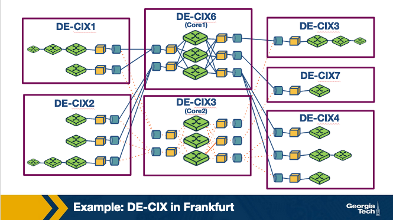

Figure: IXP topology — multiple ASes interconnected via shared switching fabric (Module 4) 

From the IXP figure: an IXP is best described as which of the following? 

• 
A.  A protocol layered on top of BGP that replaces BGP for inter-AS routing. 

<!-- page break -->

• 
B.  A physical (often switched-Ethernet) infrastructure where many networks interconnect to 
exchange traffic locally rather than via transit. 
• 
C.  A Tier-1 ISP that resells transit to all other tiers, because BGP enforces strict isolation between AS 
routing tables in the global routing system. 
• 
D.  An authoritative registry that allocates ASNs and IP prefixes to networks. 

  Correct answer: B 

  Why: IXP = shared Layer-2 fabric for many ASes. Physically it's a switch (or set of switches) at one location where many networks 
plug in and run BGP sessions across that fabric to exchange traffic without using a transit provider. 

Q28.  [MCQ] 

Scenario: a small ISP joins an IXP that has 100 other members. Without a route server, the ISP must set up 
how many BGP sessions to peer with all the others? 

• 
A.  1 session in total, into the shared IXP fabric, which broadcasts routes to everyone. 
• 
B.  Exactly 10 sessions, because IXPs cap bilateral peerings at 10 per member for fairness. 
• 
C.  Up to 100 separate bilateral BGP sessions — one with each member it wants to peer with. 
• 
D.  Zero sessions — the IXP relays all routes automatically without BGP. 

  Correct answer: C 

  Why: 100 peers without route server => up to 100 bilateral sessions. Each pair-wise peering needs its own BGP session; full bilateral 
peering at a 100-member IXP means up to 100 sessions per member. 

Q29.  [MCQ] 

Why does IXP-based peering tend to FLATTEN the Internet hierarchy? 

• 
A.  IXPs are forbidden from connecting to Tier-1 networks, so all peering must happen below the top 
of the hierarchy and the hierarchy collapses. 
• 
B.  IXPs internally use a different routing protocol than BGP, which is incompatible with hierarchical 
AS relationships. 
• 
C.  IXPs use UDP rather than TCP, which avoids the layering required by Tier-1 ISPs, which the IETF 
documents as the standard behaviour across all compliant BGP implementations today. — multiple 
RFCs and BCPs prescribe this behaviour for production inter-domain routing systems. 
• 
D.  Many networks exchange large volumes of traffic directly through the IXP without paying a higher-
tier provider to carry that traffic, eroding the strict customer/provider hierarchy. 

  Correct answer: D 

  Why: Direct exchange at IXPs => no upstream needed for that traffic. Networks bypass climbing to Tier-1s for the volumes they 
exchange at the IXP, eroding the strict customer/provider hierarchy. 

<!-- page break -->

Q30.  [TF] 

Two ISPs of similar size that peer at an IXP typically do so to AVOID paying a common upstream provider 
for the traffic between them. 

• 
True 
• 
False 

  Correct answer: True 

  Why: Peering at IXP avoids paying upstream for that traffic. Same logic as private peering, just done at shared infrastructure — 
both ASes save the per-bit transit cost they would otherwise pay providers. 

Peering at IXPs: How Does a Route Server Work? 
Q31.  [MCQ] 

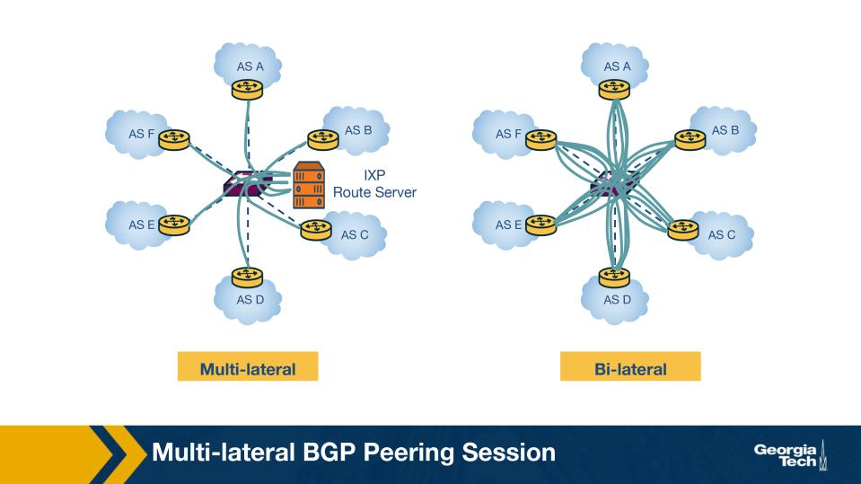

Figure: IXP with a route server (multilateral peering) (Module 4) 

A participant AS uses the route server for MULTILATERAL peering at an IXP. How many BGP sessions 
does that AS open? 

• 
A.  One BGP session — to the route server itself — which exchanges routes with many other 
participants on its behalf. 
• 
B.  One BGP session per other participant, just as in bilateral peering, except the sessions are tunneled 
through the route server. 
• 
C.  Zero sessions; the route server installs forwarding rules directly into each member router via 
OpenFlow. 
• 
D.  One session per IPv4 prefix the AS announces, for granular policy control. 

  Correct answer: A 

  Why: Route server = ONE session multiplexed to many peers. Instead of N bilateral sessions, a member opens a single BGP session to 
the route server, which relays routes to/from all other participants per per-pair filters. 

<!-- page break -->

Q32.  [MCQ] 

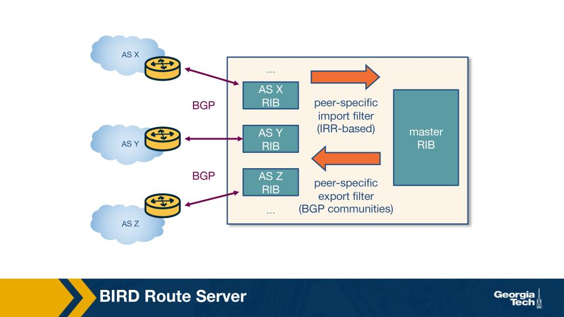

Figure: Route server processing — per-participant RIBs and master RIB (Module 4) 

AS X announces prefix p to the route server. Walk through what the route server does next. 

• 
A.  Stores p in its master RIB, applies a single global filter, and re-announces p to every member 
immediately. 
• 
B.  Stores p in X's per-participant RIB, applies X's import filter, adds it to the master RIB, then for each 
potential recipient applies X's export filter (does X want Z to see p?) before announcing to Z. 
• 
C.  Drops p because route servers only forward established session traffic, not new advertisements, 
reflecting how the routing decision flows through a typical commercial-grade BGP daemon at scale. — 
this is the canonical convention documented in the BGP specification for production routers. 
• 
D.  Installs p as a hardware flow rule in every member's switch via the IXP's SDN controller and 
bypasses BGP entirely. 

  Correct answer: B 

  Why: RIB-In -> import filter -> master RIB -> per-recipient export filter -> RIB-Out. Each member's announcements are stored 
separately and per-recipient export filters decide who actually sees what — preserving bilateral policy on top of multilateral session. 

<!-- page break -->

Q33.  [MCQ] 

Figure: Route server export filters per participant pair (Module 4) 

AS X announces p to the route server, but X has configured an export filter blocking AS Z. What does AS Z 
see? 

• 
A.  Z sees p with the route server as the next hop, since route servers always re-announce regardless 
of filters. 
• 
B.  Z sees p but with the AS-PATH replaced by 'AS-RouteServer', allowing routing but logging the 
suppressed origin. 
• 
C.  Z receives nothing for p; the route server respects X's per-recipient export filter and withholds p 
from Z. 
• 
D.  Z sees p only after manually downloading the IXP's policy table via an out-of-band API. 

  Correct answer: C 

  Why: Export filter respects per-recipient policy => Z gets nothing. Even though the route server has p in its RIB, X's filter blocks 
announcement to Z; route servers honor each member's policy as if it were direct bilateral peering. 

Q34.  [MCQ] 

A route server, by design, is 'transparent' in the AS-PATH — i.e., the route server's ASN does NOT appear 
in any AS-PATH it relays. Why? 

• 
A.  Because route servers run a custom transport protocol that strips the AS-PATH attribute during 
relay, as is widely deployed across modern Tier-1 networks for predictable inter-domain behaviour. 
— operators rely on this property when designing their routing policies for global reachability. 
• 
B.  Because route servers operate at Layer 2 and have no Layer-3 visibility into the BGP messages they 
relay. 
• 
C.  Because IANA has never allocated an ASN to any IXP route server, and BGP requires a real ASN to 
be inserted. 

<!-- page break -->

• 
D.  Because if the route server's ASN were inserted, every multilateral session would falsely lengthen 
AS-PATHs by 1, biasing best-path selection against route-server routes — so the route server simply 
passes through the original AS-path unchanged. 

  Correct answer: D 

  Why: Inserting RS ASN would inflate AS-PATH by 1 => bias best-path. Best-path selection prefers shorter AS-PATH; if the RS added 
itself, multilateral routes would always look longer than bilateral and lose comparisons unfairly.
