Module 5 — Question Pool 

OMSCS 6250 Computer Networks 
Lesson 5: Router Design and Algorithms (Part 1) 

What's Inside a Router? 
Q1.  [MCQ] 

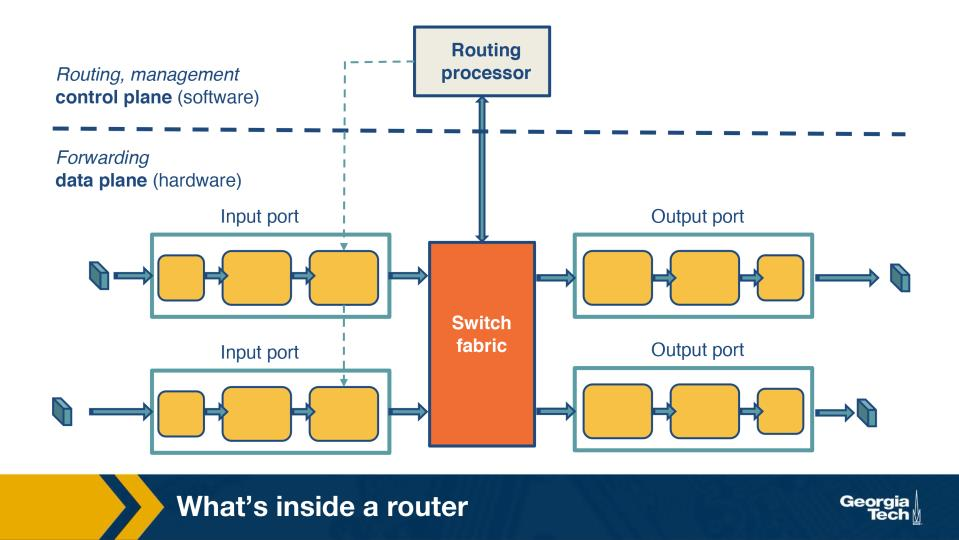

Figure: Router components — input ports, switching fabric, output ports, routing processor (Module 5) 

Looking at the router-components figure, where does a router's CONTROL plane functionality (running 
routing protocols, computing the forwarding table) live, and where does the DATA plane live? 

• 
A.  Control plane runs in software on the routing processor; data plane runs in hardware at the 
input/output ports and switching fabric. 
• 
B.  Both control and data planes run on dedicated ASICs at the line cards, with no software 
involvement at the routing processor. 
• 
C.  Control plane runs at output ports; data plane runs at input ports — they are physically separate 
but co-located. 
• 
D.  Both planes run in the central CPU; modern routers have no specialized hardware for either 
function. 

  Correct answer: A 

  Why: Control = SW on route processor; data = HW on line cards/fabric. The control plane computes the FIB (slowly, in software); 
the data plane uses that FIB to forward packets at line rate in custom ASICs. 

<!-- page break -->

Q2.  [MCQ] 

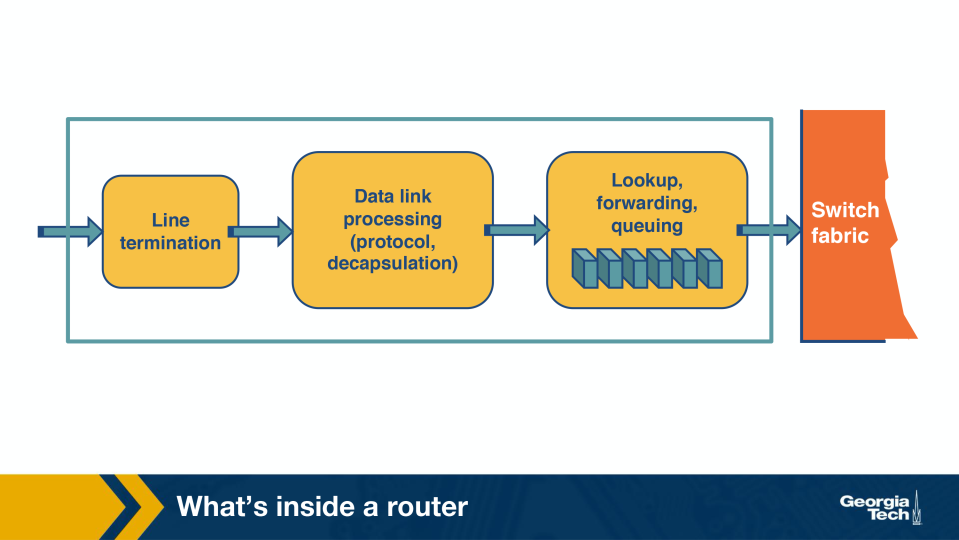

Figure: Router input-port pipeline (Module 5) 

In the input-port pipeline figure, after physical termination and data-link decapsulation, what is the most 
important function performed before the packet crosses the switching fabric? 

• 
A.  Recomputing every TCP checksum carried in segments transiting the router. 
• 
B.  Looking up the destination prefix in the forwarding table to choose an outgoing port. 
• 
C.  Running an OSPF update on every received packet to update link-state advertisements. 
• 
D.  Buffering all packets at the input port until a scheduling round picks them up later. 

  Correct answer: B 

  Why: Input-port pipeline: physical -> link-decap -> FIB lookup. The forwarding decision (which output port?) is the input port's 
main job; everything else is preparation or follow-through. 

Q3.  [MCQ] 

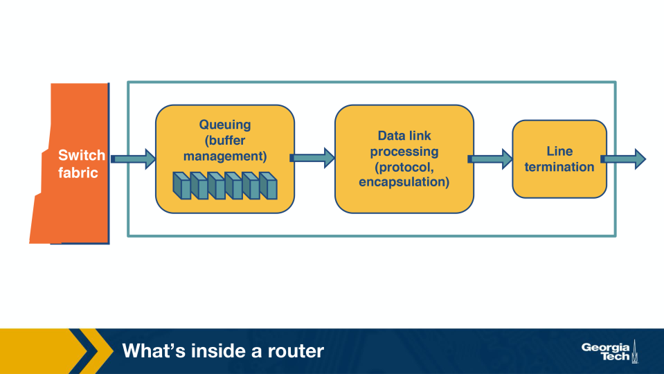

<!-- page break -->

Figure: Output-port pipeline (Module 5) 

Looking at the output-port pipeline figure: which task is performed at the OUTPUT port that is NOT also 
performed at the input port? 

• 
A.  Decrementing the TTL field in the IP header — TTL decrement is an output-port-only task. 
• 
B.  Looking up the destination prefix in the forwarding table — this is repeated at output for 
verification. 
• 
C.  Queueing packets for transmission and scheduling which queued packet to send next. 
• 
D.  Decoding the application-layer URL from HTTP payloads for content-aware forwarding. 

  Correct answer: C 

  Why: Output port adds queueing + scheduling. The output port buffers packets contending for the same outgoing link and chooses 
which to send next (FIFO, WFQ, DRR,...) — the input port has no scheduling role. 

Q4.  [TF] 

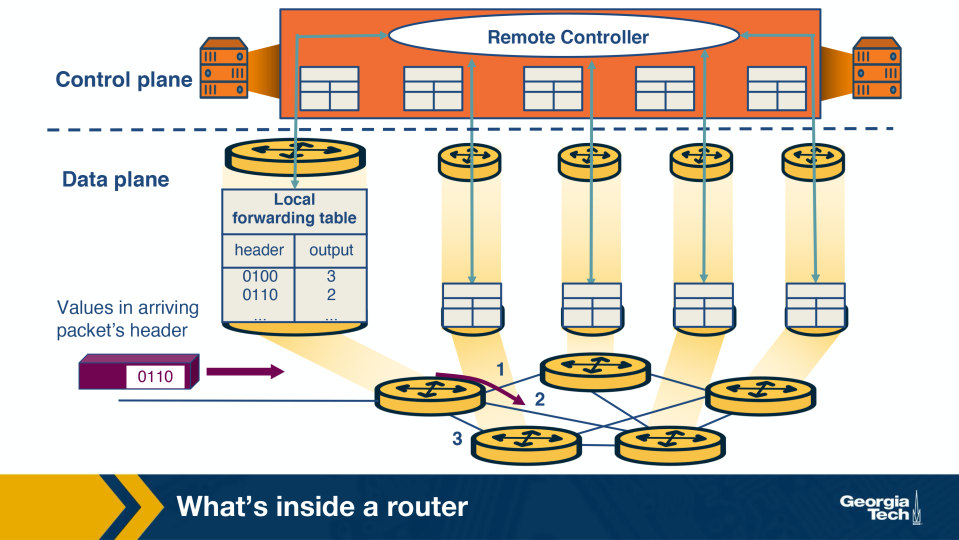

Figure: Routing processor and control-plane interaction (Module 5) 

In the figure, the routing processor's job is to run routing protocols and program the FIB (Forwarding 
Information Base) used by the data plane; it does not normally see every packet. 

• 
True 
• 
False 

  Correct answer: True 

  Why: Route processor programs the FIB; it doesn't touch every packet. Routing protocols (OSPF, BGP) and FIB updates run in 
software on the route processor; the per-packet data plane runs on the line cards. 

<!-- page break -->

Router Architecture 
Q5.  [MCQ] 

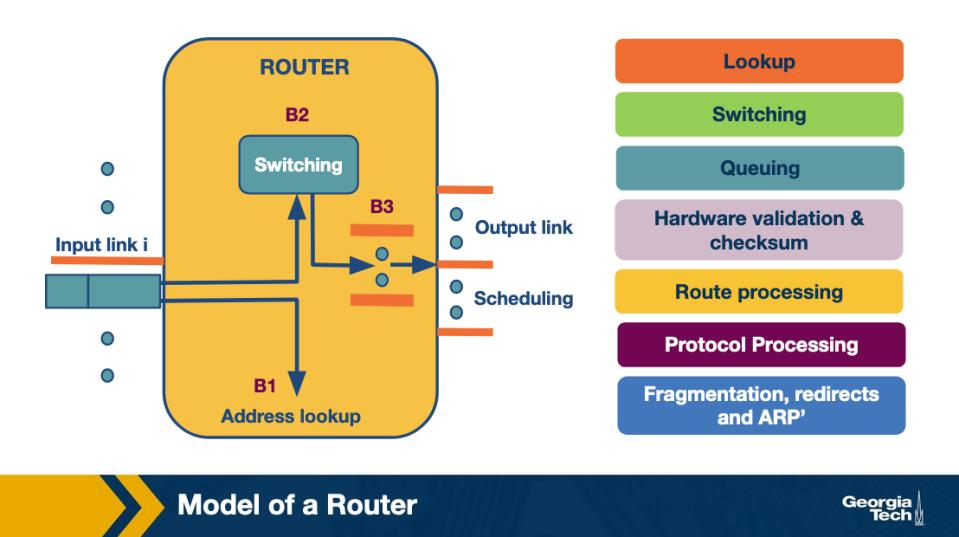

Figure: Router architecture — separation of header validation, lookup, switching, scheduling (Module 5) 

The router-architecture figure separates 'fast-path' (per-packet hardware) tasks from 'slow-path' or 'less 
time-sensitive' tasks. Which task belongs to the SLOW path? 

• 
A.  Scheduling of queued packets for transmission on the outgoing link. 
• 
B.  Longest-prefix match in the FIB on every incoming packet. 
• 
C.  Movement of the packet across the switching fabric to the chosen output port. 
• 
D.  TTL decrement and header checksum recomputation as part of header validation. 

  Correct answer: D 

  Why: Header validation = less time-sensitive path. TTL decrement, checksum, options — these are 'slow-path' compared to the per-
packet fast path of fabric switching and LPM lookup; they can be handled with more time per packet. 

Q6.  [TF] 

In a modern router, the data plane operates at nanosecond timescales in hardware, while the control 
plane operates at second/millisecond timescales in software. 

• 
True 
• 
False 

  Correct answer: True 

  Why: Data plane = ns (HW); control plane = ms-to-s (SW). Per-packet decisions must complete in nanoseconds to sustain line rate; 
routing protocols and FIB recomputation have orders of magnitude more headroom. 

<!-- page break -->

Different Types of Switching 
Q7.  [MCQ] 

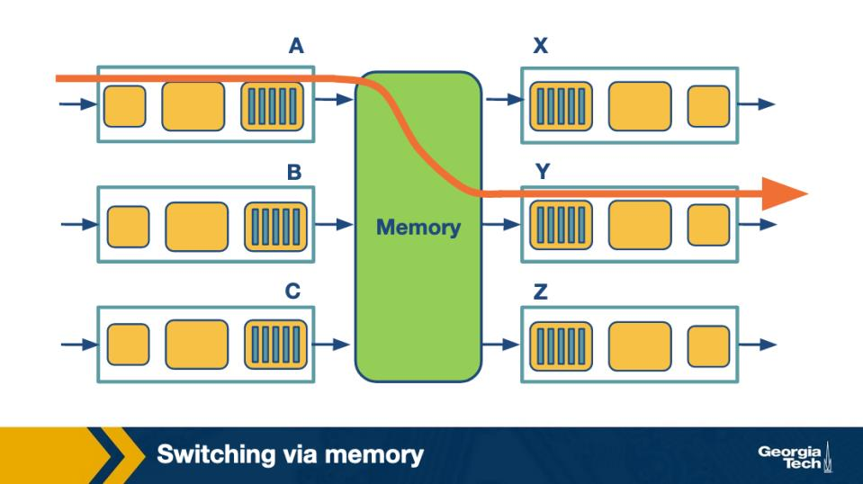

Figure: Switching via shared memory (Module 5) 

In the shared-memory switching figure, what limits the router's per-packet throughput? 

• 
A.  The memory's read/write bandwidth — every packet is read in then written out, so the memory 
cycles are the bottleneck. 
• 
B.  The number of input ports on the router — more ports automatically speed up memory access in 
shared-memory designs. 
• 
C.  The CPU clock rate alone, regardless of the memory subsystem in any conventional shared-
memory router. 
• 
D.  The TCP window size of each transiting flow during burst arrivals on the line cards. 

  Correct answer: A 

  Why: Shared memory: 2 mem cycles per packet => memory bandwidth caps. Every packet is written into shared memory then read 
out, so the memory's bandwidth and access latency directly limit throughput. 

<!-- page break -->

Q8.  [MCQ] 

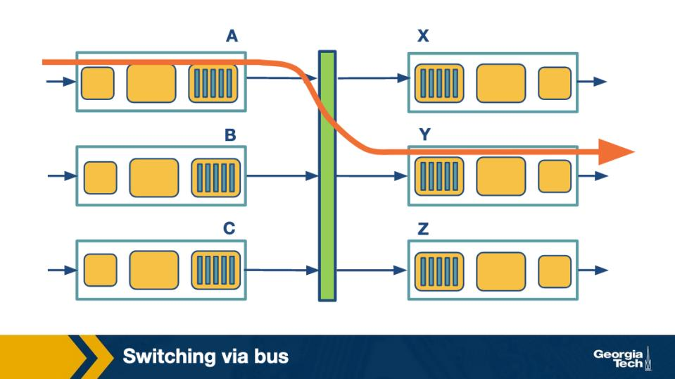

Figure: Switching via shared bus (Module 5) 

In the shared-bus switching figure, what limits the router's per-packet throughput? 

• 
A.  The forwarding-table size; bigger tables slow down the bus arbitration logic. 
• 
B.  The bus itself — only one packet can be on the bus at any moment, so the bus bandwidth caps the 
router. 
• 
C.  The number of output queues — the bus is unaffected by traffic intensity even at saturation. 
• 
D.  The clock skew between input and output ports across the bus — this is the canonical convention 
documented in the standard reference for production routers. 

  Correct answer: B 

  Why: Shared bus: only one packet at a time on the bus => bus bandwidth caps. The bus serializes all transfers; even with many ports, 
total throughput can't exceed bus bandwidth. 

<!-- page break -->

Q9.  [MCQ] 

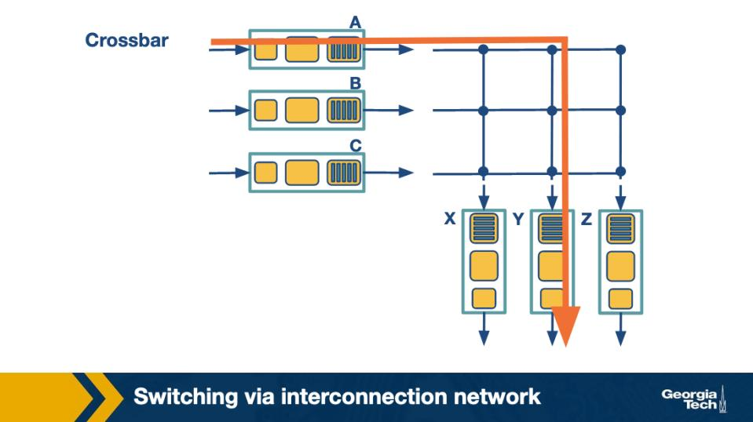

Figure: Crossbar switching fabric — 2N buses with crosspoints (Module 5) 

In the crossbar switching figure for an N×N fabric, how many buses (input + output) are needed? 

• 
A.  N^2 buses, one per crosspoint, to ensure non-blocking switching at any traffic load. 
• 
B.  N buses total — shared between input and output in a single direction. 
• 
C.  2N buses — N horizontal input buses and N vertical output buses connected at crosspoints. 
• 
D.  log2(N) buses — modern crossbars use a binary fan-out for scalability. 

  Correct answer: C 

  Why: Crossbar = 2N buses (N input + N output). Each input has a horizontal bus, each output has a vertical bus, and crosspoints 
connect them — enabling N independent simultaneous transfers if no two share an output. 

Q10.  [MCQ] 

<!-- page break -->

Figure: Crossbar fabric — parallel non-conflicting transfers (Module 5) 

Scenario in the crossbar figure: input A wants to send a packet to output Y at the same time as input B 
wants to send to output X. Can both transfers happen in the same cell time? 

• 
A.  No — crossbar fabrics serialize transfers when more than one input is active. 
• 
B.  No — a crossbar can only switch one packet per cell time, regardless of inputs and outputs. 
• 
C.  Yes, but only if A and B are physically adjacent input ports on the line card chassis. 
• 
D.  Yes — both transfers use disjoint input and output buses, so the crossbar can switch them in 
parallel. 

  Correct answer: D 

  Why: Disjoint input AND output => parallel transfers in one cell time. A crossbar's strength: NxN independent crosspoints let 
multiple non-conflicting transfers happen simultaneously, scaling well with port count. 

Q11.  [MCQ] 

Figure: Crossbar fabric — output contention (Module 5) 

Scenario in the same crossbar figure: TWO inputs (A and B) both want to send to the SAME output Y in 
the same cell time. What happens? 

• 
A.  Only one of the two transfers can proceed in that cell time; the other waits in its input queue, 
exposing the head-of-line blocking problem the next lesson addresses. 
• 
B.  Both packets are sent simultaneously through the same output bus by time-multiplexing the bits 
inside a single cell time. 
• 
C.  The crossbar merges the two packets into a combined frame and forwards the result to Y, as is 
widely deployed across modern Tier-1 networks for predictable inter-domain behaviour. 
• 
D.  The output port itself drops both packets and triggers an ICMP source-quench back to A and B. 

  Correct answer: A 

<!-- page break -->

  Why: Same output => one wins, other waits => head-of-line blocking. When two inputs target the same output, only one transfer 
proceeds; the loser is stuck at the head of its input queue, blocking even unrelated packets behind it (HoL). 

The Challenges Routers Face 
Q12.  [MCQ] 

The figure lists three challenges modern routers must solve at high speed. Which is NOT one of those 
challenges? 

• 
A.  Performing longest-prefix matching at line rate on every arriving packet. 
• 
B.  Cryptographically signing every BGP route the router advertises onward. 
• 
C.  Storing very large forwarding tables compactly so memory access stays cheap. 
• 
D.  Moving each packet from input to output port within nanoseconds at full link rate. 

  Correct answer: B 

  Why: BGP signing happens at the control plane (and is rare in practice). Cryptographic origin authentication (RPKI/BGPsec) is a 
control-plane task, not a per-packet data-plane challenge that routers must solve at line rate. 

Q13.  [TF] 

As link speeds grow (e.g., to 100+ Gbps), the per-packet time budget shrinks — making efficient lookup 
data structures more important, not less. 

• 
True 
• 
False 

  Correct answer: True 

  Why: Faster links => shorter per-packet time => harder lookups. At 100 Gbps with small packets, a router has nanoseconds per 
packet — making any inefficient lookup data structure a bottleneck. 

Prefix-Match Lookups 
Q14.  [MCQ] 

Why does the Internet's forwarding table use LONGEST-PREFIX match instead of exact match against a 
destination address? 

• 
A.  Longest-prefix match is faster than exact match because hardware tries always converge in O(1) 
regardless of input length. 
• 
B.  Exact match is patented by major router vendors and cannot be used in software-defined networks 
at scale. 
• 
C.  The number of hosts is far too large for per-destination entries, so destinations are grouped into 
prefixes; one address may match many prefixes, and the longest (most specific) wins. 

<!-- page break -->

• 
D.  Exact match is only used for IPv6, while longest-prefix match is reserved for IPv4 forwarding 
lookups — operators rely on this property when designing their routing policies for global 
reachability. 

  Correct answer: C 

  Why: LPM = group by prefix, most-specific wins. Storing per-host entries is infeasible; CIDR aggregates addresses into prefixes, and 
overlapping prefixes are resolved by picking the longest (most-specific) match. 

Q15.  [MCQ] 

Scenario in the LPM figure: a destination IP matches both prefix 10.0.0.0/8 and prefix 10.1.2.0/24. Which 
entry does the router use to forward, and why? 

• 
A.  Neither — overlapping prefixes are detected as a misconfiguration and packets are dropped at the 
input. 
• 
B.  10.0.0.0/8 — shorter prefixes are preferred because they aggregate more destinations. 
• 
C.  Both — the router duplicates the packet and sends one copy out of each next hop in parallel. 
• 
D.  10.1.2.0/24 — among matches, the longest (most-specific) prefix wins. 

  Correct answer: D 

  Why: Longest = most specific = chosen. Among matching prefixes 10.0/8 and 10.1.2/24, the /24 represents tighter routing 
information (a more specific destination) and takes precedence. 

Unibit Tries 
Q16.  [MCQ] 

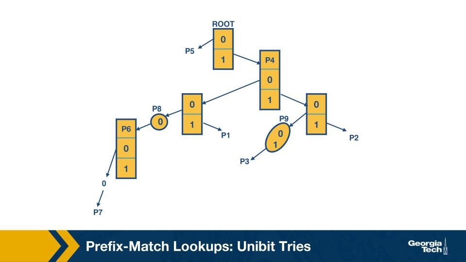

Figure: Unibit trie — binary branching per bit (Module 5) 

<!-- page break -->

In the unibit-trie figure, each node has at most how many children, and what determines which child is 
taken? 

• 
A.  Two children (a 0-pointer and a 1-pointer); each step inspects one more bit of the address from 
left to right. 
• 
B.  Four children — modern tries use a 2-bit stride per node even when labeled 'unibit'. 
• 
C.  One child — unibit tries are linear chains by definition in every implementation. 
• 
D.  Variable, depending on the number of prefixes in the database for that subtrie. 

  Correct answer: A 

  Why: Two children per node (0-pointer, 1-pointer); one bit consumed per step. The unibit trie binary-searches the prefix space one 
address bit at a time, descending until no further match exists. 

Q17.  [MCQ] 

Figure: Unibit trie — compressed branch P9 (Module 5) 

In the figure, node P9 represents a compressed one-way branch stored as a short string of bits. Why does 
the trie compress these chains rather than store one node per bit? 

• 
A.  Compressed nodes let the trie support IPv6 addresses without rebuilding the lookup engine. 
• 
B.  Long chains of single-child nodes waste memory — replacing them with a single labeled string 
saves space without changing lookup correctness. 
• 
C.  Compression is required by the IETF's CIDR specification for routers used in the global Internet. 
• 
D.  Without compression, the trie would have O(n!) memory at scale across every router participating 
in the same routing domain at the same moment. 

  Correct answer: B 

  Why: Chains of single-child nodes wasted memory => collapse into label. Compressed unibit tries store long chains as a single 
labeled string (e.g., '01101'), preserving correctness while cutting node count dramatically. 

<!-- page break -->

Q18.  [MCQ] 

Figure: Unibit trie — traversal of bits 101 (Module 5) 

Scenario from the unibit-trie figure: a packet's destination begins with the bits 101.... Starting from the 
root, what pointer sequence does the lookup follow? 

• 
A.  Both pointers at each level in parallel; the trie performs a hardware-level AND of the results. 
• 
B.  0-pointer (left), 1-pointer (right), 0-pointer (left) — bits read right-to-left. 
• 
C.  1-pointer (right), 0-pointer (left), 1-pointer (right) — one step per bit. 
• 
D.  Only the rightmost pointer at every level — unibit tries collapse all left subtrees at lookup time. 

  Correct answer: C 

  Why: Bits 101 => right-left-right pointers (one step per bit). Each bit picks 0-pointer or 1-pointer; trie walks left for 0, right for 1, 
consuming one bit per level. 

Multibit Tries 
Q19.  [MCQ] 

In a multibit trie with stride k, how many children does each non-leaf node have, and what does that buy 
you? 

• 
A.  k^2 children — each pair of bits gets its own subtree for variable-stride flexibility. 
• 
B.  2k children — strides are added linearly, doubling lookup throughput per stride increment. 
• 
C.  k children — one per bit examined, which is the same as a unibit trie with batch reads. 
• 
D.  2^k children per node, examining k bits per step — fewer total memory accesses per lookup at the 
cost of larger nodes. 

  Correct answer: D 

  Why: Stride k => 2^k children, k bits per step. A multibit trie examines k bits at a time (a 'stride'), so each node has 2^k children — 
fewer total memory accesses, larger nodes. 

<!-- page break -->

Prefix Expansion 
Q20.  [MCQ] 

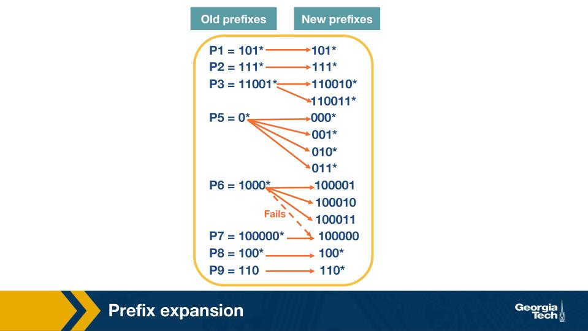

Figure: Prefix expansion — extending short prefixes to the next stride boundary (Module 5) 

In a fixed-stride trie with stride k, which prefix lengths fit DIRECTLY without expansion, and what is done 
about the rest? 

• 
A.  Only prefix lengths that are multiples of k fit directly. Shorter or non-multiple prefixes are 
expanded — replicated across all bit-patterns that extend them to the next multiple of k. 
• 
B.  All prefix lengths fit directly; expansion is purely an optional optimization not required by the trie. 
• 
C.  Only prefix lengths shorter than k fit directly; longer ones are split into k-bit chunks separately. 
• 
D.  Only prefix lengths equal to 32 fit directly in IPv4; everything else is rounded up to 32 bits, 
because the protocol enforces strict isolation between routing tables in the global system. 

  Correct answer: A 

  Why: Multiples of k fit; others expanded to next stride boundary. A length-5 prefix in a stride-3 trie spans 12/3 levels; expansion 
replicates it across all bit-patterns that extend it to the next stride boundary (length 6). 

<!-- page break -->

Q21.  [MCQ] 

Figure: Prefix expansion with collision (Module 5) 

Scenario: during prefix expansion with stride 3, prefix P3 = 11001* (length 5) expands to extend up to a 
6-bit pattern. What is the expanded set? 

• 
A.  11001* alone — no actual expansion needed because length 5 is already 'close enough' to a stride 
multiple in modern routers. 
• 
B.  110010* and 110011* — two entries that together cover all 1-bit extensions of P3 to the next 
multiple of 3. 
• 
C.  11001000* through 11001111* — 8 entries, expanding all 3 trailing bits to the next stride 
boundary. 
• 
D.  1100* and 1101* — expansion shrinks the prefix to the previous stride boundary, then re-splits it. 

  Correct answer: B 

  Why: P3=11001* expanded => {110010*, 110011*}. Stride 3 means we descend in 3-bit chunks (lengths 0/3/6/9/...); a length-5 
prefix needs one more bit, so it becomes both 110010* and 110011*. 

<!-- page break -->

Q22.  [MCQ] 

Figure: Prefix expansion — collision with longer prefix (Module 5) 

Scenario: an expanded prefix entry happens to collide with a more-specific (longer) prefix already in the 
database. What does the algorithm do? 

• 
A.  It overwrites the more-specific prefix with the expanded one (most-recent-wins). 
• 
B.  It keeps both, and lookup picks one at random at runtime, which the IETF documents as the 
standard behaviour across all compliant implementations today. 
• 
C.  It drops the expanded (less-specific) entry, keeping the more-specific one — longest-prefix match 
wins. 
• 
D.  It rebuilds the trie with a larger stride to avoid the collision in the future. 

  Correct answer: C 

  Why: Longest-prefix wins => drop expanded duplicate. If expansion would overwrite a more-specific prefix already present, the 
more-specific entry is preserved (LPM rule); the expanded entry is dropped at that bit pattern. 

Q23.  [TF] 

Prefix expansion lets fixed-stride multibit tries support prefixes that are NOT exact multiples of the stride 
length. 

• 
True 
• 
False 

  Correct answer: True 

  Why: Expansion fits non-multiple lengths into fixed-stride tries. Without expansion, only prefix lengths that are exact multiples of k 
could be stored; expansion makes any prefix length representable at the cost of replication. 

<!-- page break -->

Multibit tries: Fixed-Stride 
Q24.  [MCQ] 

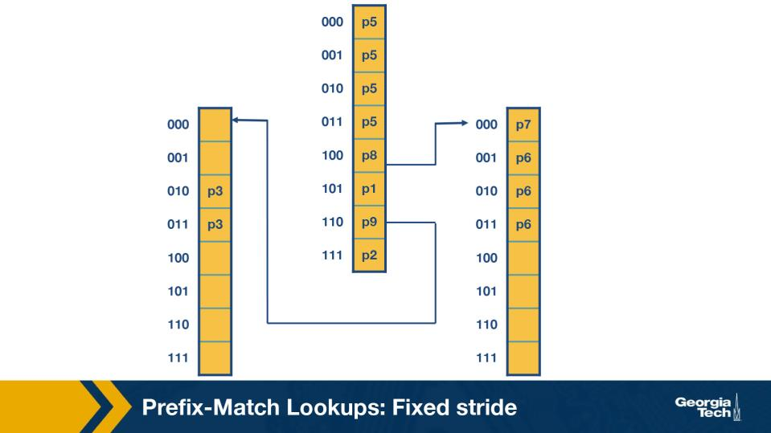

Figure: Fixed-stride multibit trie (stride 3) — Practice-Quiz 5-5 setup (Module 5) 

In the fixed-stride trie figure (the famous Practice-Quiz 5-5 setup), some interior nodes are labeled with 
prefix values and OTHERS are labeled 'none'. What does a 'none' label mean? 

• 
A.  The node is reserved for future RFC extensions and is never visited at runtime in any production 
implementation. 
• 
B.  The node is forbidden and any packet whose trie path reaches it is dropped at the input port 
immediately. 
• 
C.  The node points back to the root for retry, in case of forwarding-table corruption — multiple RFCs 
and BCPs prescribe this behaviour for production inter-domain routing systems. 
• 
D.  The node has no prefix entry of its own (the database has no exact prefix terminating at this node) 
— though the node may still have a pointer to a subtrie below. 

  Correct answer: D 

  Why: 'none' = no prefix terminates here, but subtrie may exist. The label indicates the node has no associated next-hop entry; 
lookups still descend into the subtrie below if a pointer exists. 

<!-- page break -->

Q25.  [MCQ] 

Figure: Fixed-stride trie — lookup with no exact match at the leaf (Module 5) 

Scenario in the fixed-stride trie figure: a lookup traverses to a node labeled 'none'. What value does the 
LOOKUP itself return? 

• 
A.  The last prefix value remembered along the path before reaching the 'none' node — even though 
the node itself is 'none', the lookup uses the longest matched prefix it has seen so far. 
• 
B.  'none' — if the leaf label is 'none', the lookup returns no match and the packet is dropped, 
reflecting how the routing decision flows through a typical commercial-grade daemon at scale. 
• 
C.  The shortest prefix along the path is returned, mirroring the conservative LPM rule for fixed-stride 
tries in production environments. 
• 
D.  Whatever prefix is stored at the root — fixed-stride lookups always return the default entry when 
no leaf matches exactly. 

  Correct answer: A 

  Why: Lookup remembers the longest-matched prefix along the path. As the lookup descends, every non-'none' node it passes updates 
the 'best match so far'; if it ends at 'none', it returns whatever was last remembered. 

<!-- page break -->

Q26.  [MCQ] 

Figure: Fixed-stride trie — looking up address 001 (Module 5) 

In the fixed-stride trie figure, what does the lookup return for an address starting with bits 001? 

• 
A.  P1 — the shortest prefix in the database is always returned when no specific subtrie matches the 
address. 
• 
B.  P5 — the lookup terminates at the root with no outgoing pointer for 001 and returns P5 as the 
remembered match. 
• 
C.  No match — 001 has no matching prefix in this database and the packet is dropped. 
• 
D.  P7 — fixed-stride tries always return the most-specific prefix value in the leftmost subtrie for 
unknown patterns. 

  Correct answer: B 

  Why: 001 has no child of the root in this trie => return remembered match (P5). The root's pointer for bit-pattern 001 is absent, so 
the lookup terminates and returns whatever prefix the root itself represented (P5). 

<!-- page break -->

Q27.  [MCQ] 

Figure: Fixed-stride trie — element contents (Module 5) 

In the fixed-stride trie figure, what does each trie element actually store? 

• 
A.  Only a prefix value — pointers between trie levels are computed implicitly from the address bits. 
• 
B.  Only a pointer — prefix values are stored centrally in a separate table outside the trie itself. 
• 
C.  A pointer (to the next subtrie, if any) and a prefix value (if the node corresponds to a stored prefix). 
• 
D.  A pointer and a TTL counter — the prefix value lives elsewhere in the router. 

  Correct answer: C 

  Why: Each trie element = pointer + prefix value. A node carries both a pointer to the next-stride subtrie (if any) and the prefix value 
associated with the path leading to it (if a prefix terminates there). 

Multibit Tries: Variable Stride 
Q28.  [MCQ] 

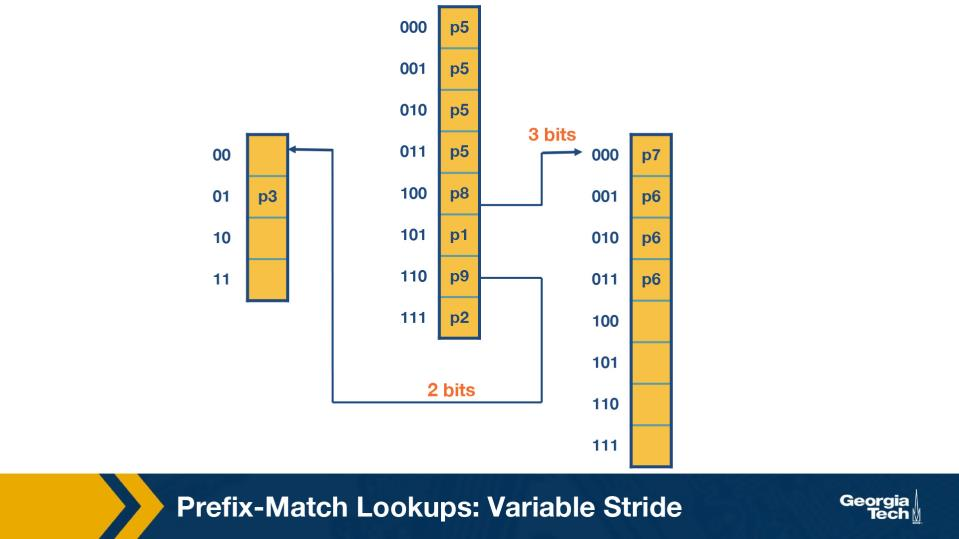

Figure: Variable-stride trie — different strides per subtrie (Module 5) 

How does a VARIABLE-stride multibit trie differ from a fixed-stride one, and what does it gain? 

<!-- page break -->

• 
A.  Variable-stride tries are used only for IPv6; IPv4 uses fixed-stride exclusively — this is the 
canonical convention documented in the standard reference for production routers. 
• 
B.  Variable-stride tries always use exactly twice the memory of fixed-stride tries; the trade-off is 
faster lookup. 
• 
C.  Variable-stride tries forbid prefix expansion, so they are always smaller than fixed-stride tries. 
• 
D.  Each node can pick its stride independently — the optimum stride per subtrie is chosen via 
dynamic programming, reducing wasted entries. 

  Correct answer: D 

  Why: Variable stride: per-node stride picked via DP. Each subtrie's stride is chosen independently to minimize memory; sparse 
subtries get small strides, dense ones get larger strides — better than one global stride. 

Q29.  [MCQ] 

Figure: Variable-stride trie — example sizing (Module 5) 

In the variable-stride trie figure, the rightmost node uses 3 bits while the leftmost uses 2. Why the 
asymmetry? 

• 
A.  The rightmost subtrie contains a prefix P7 that requires 3 bits to disambiguate, while the leftmost 
subtrie's longest prefix P3 fits in 2 bits. 
• 
B.  Hardware constraints force odd-indexed nodes to use stride 3 across every variable-stride router. 
• 
C.  Variable-stride strictly alternates 2-bit and 3-bit nodes, regardless of the underlying prefix 
database stored at the router. 
• 
D.  The router's clock rate doubles on the right side of the trie, requiring fewer bits per step, as is 
widely deployed across modern Tier-1 networks for predictable inter-domain behaviour. 

  Correct answer: A 

  Why: Different strides because different subtries need different prefix lengths. The rightmost subtrie holds prefixes that require 3 
bits to disambiguate (P7); the leftmost only needs 2 bits (P3). 

<!-- page break -->

Q30.  [TF] 

In a variable-stride multibit trie, the choice of stride at each node is fixed at compile time via dynamic 
programming to minimize total memory. 

• 
True 
• 
False 

  Correct answer: True 

  Why: Strides chosen at compile-time via DP over the prefix database. Dynamic programming computes the optimal stride choice per 
node before deployment; lookup itself is then deterministic for each subtrie.
