Module 6 — Question Pool 

OMSCS 6250 Computer Networks 
Lesson 6: Router Design and Algorithms (Part 2) 

Why We Need Packet Classification? 
Q1.  [MCQ] 

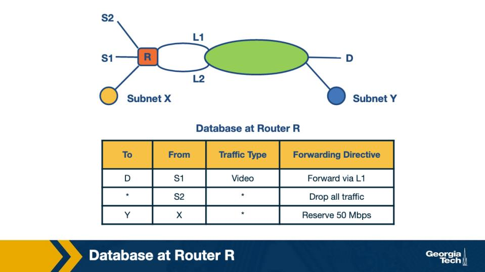

Figure: Why packet classification — beyond longest-prefix match (Module 6) 

In the figure, why do modern routers need PACKET CLASSIFICATION on top of longest-prefix match? 

• 
A.  Operators apply rules using multiple header fields at once (src IP, dst IP, port, protocol) for 
firewall, QoS and accounting decisions; LPM by itself can only match on one field. 
• 
B.  Longest-prefix match has been deprecated by the IETF and is no longer in production 
deployments. 
• 
C.  Modern hardware cannot perform longest-prefix match at line rate any more — this is the 
canonical convention documented in the standard reference for production routers., as is widely 
deployed across modern Tier-1 networks for predictable inter-domain behaviour. 
• 
D.  Packet classification replaces routing entirely; once classification is enabled, the FIB is unused. 

  Correct answer: A 

  Why: Classification matches MULTI-field rules (firewall/QoS/accounting); LPM matches one. Operators need decisions on (src IP, 
dst IP, port, protocol) tuples — denying a service, queueing premium customer traffic, billing — which a single-field LPM lookup 
can't express. 

Q2.  [TF] 

<!-- page break -->

Packet classification typically matches against multiple header fields simultaneously, while plain 
forwarding usually matches the destination prefix only. 

• 
True 
• 
False 

  Correct answer: True 

  Why: Classification = multi-field; forwarding LPM = dst-prefix only. The two lookups live side by side: forwarding picks the output 
port, classification applies filtering/QoS/policy rules on additional header fields. 

Packet Classification: Simple Solutions 
Q3.  [MCQ] 

A naïve linear scan of every classifier rule against every packet works correctly but does not scale. What is 
the FUNDAMENTAL bottleneck of the naïve approach? 

• 
A.  Linear scans require atomic locks on every rule, which serializes all classification across the router. 
• 
B.  With R rules, the worst-case lookup cost is O(R) per packet — at high R and line rate, this exhausts 
the per-packet time budget at every router. 
• 
C.  Linear scans cannot be parallelized across multiple input ports, only across multiple cores. 
• 
D.  Linear scans do not support IPv6 because of address length — operators rely on this property 
when designing their routing policies for global reachability. 

  Correct answer: B 

  Why: Naive scan = O(R) per packet => blows time budget. At line rate with thousands of rules, scanning every rule per packet 
exhausts the few-nanosecond per-packet budget — fast classification needs better data structures. 

Fast Searching Using Set-Pruning Tries 
Q4.  [MCQ] 

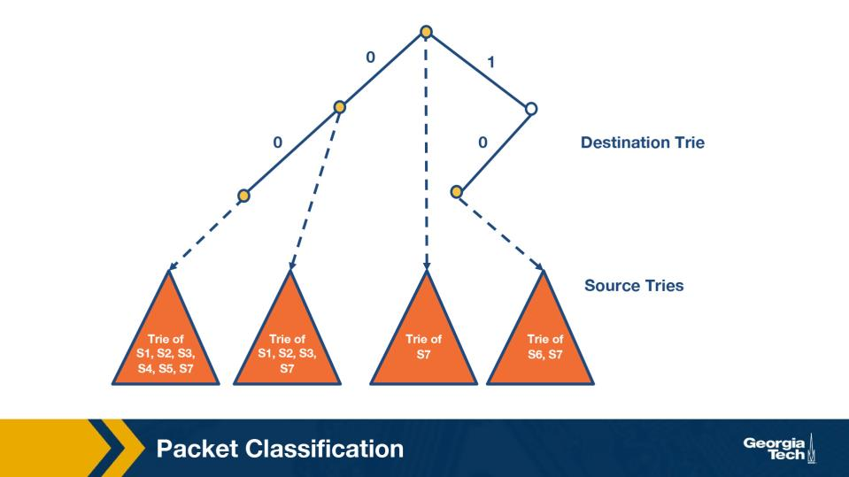

Figure: Set-pruning trie — rules replicated across multiple source tries (Module 6) 

In the set-pruning-trie figure, what is the data-structure idea behind 'set pruning'? 

<!-- page break -->

• 
A.  Set pruning uses a hash table per prefix length to skip subtries that have no rules across every 
router participating in the same routing domain at the same moment. 
• 
B.  Set pruning removes rules that overlap with broader prefixes, reducing the total rule count 
exposed to the router. 
• 
C.  Set pruning builds a destination trie and attaches a source trie at each node holding every rule 
whose destination prefix matches there — each rule is replicated into every destination-subtrie it 
could match, so once the destination lookup ends, that node's source trie already lists every 
applicable rule. 
• 
D.  Set pruning re-orders rules by priority so the highest-priority rule is checked first. 

  Correct answer: C 

  Why: Set-pruning = destination trie + per-node source tries; each rule is replicated into every destination-subtrie its destination 
prefix could match. So when the destination lookup terminates at a node, the source trie attached there already lists every candidate 
rule — no further searching, at the cost of duplicating rules across many source tries. 

Q5.  [MCQ] 

Figure: Set-pruning — memory cost vs lookup speed (Module 6) 

What is the main DOWNSIDE of set-pruning tries, as illustrated in the figure? 

• 
A.  Set-pruning tries lose the ability to perform longest-prefix match correctly. 
• 
B.  Slow lookup compared to a linear scan, because trie traversal adds overhead. 
• 
C.  Set-pruning tries cannot support overlapping prefixes at all, because the protocol enforces strict 
isolation between routing tables in the global system. 
• 
D.  Memory blow-up — replicating rules into every relevant subtrie can multiply memory 
consumption far beyond the unique rule count. 

  Correct answer: D 

  Why: Memory blow-up: replicated rules multiply storage. Each rule may be stored in many subtries; for dense rule sets the memory 
cost can be orders of magnitude greater than the unique rule count. 

<!-- page break -->

Reducing Memory Using Backtracking 
Q6.  [MCQ] 

BACKTRACKING reduces memory compared to set-pruning. What does backtracking trade away to 
achieve this memory saving? 

• 
A.  Lookup speed — instead of finding all matches at the leaf, backtracking walks back up the trie at 
lookup time to find missed matches. 
• 
B.  Correctness — backtracking may miss some matching rules in pathological inputs at line rate. 
• 
C.  IPv4 support — backtracking only works for IPv6 address layouts, which the IETF documents as 
the standard behaviour across all compliant implementations today. 
• 
D.  Multi-field matching — backtracking restricts classification to a single field at most. 

  Correct answer: A 

  Why: Backtracking trades lookup speed for memory. Instead of replicating rules at compile time, lookup walks back up the trie to 
find missed matches — saves memory but adds variable lookup latency per packet. 

Grid of Tries 
Q7.  [MCQ] 

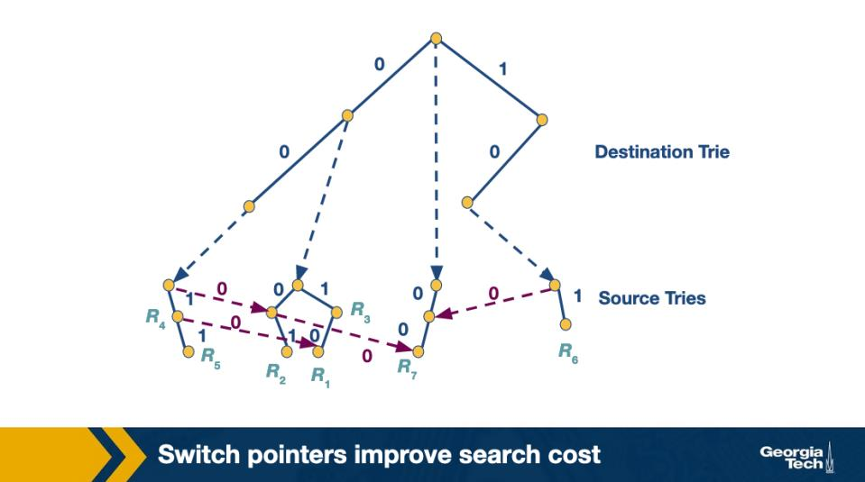

Figure: Grid of tries — destination + source tries linked by switch pointers (Module 6) 

In the grid-of-tries figure, what does the GRID structure model? 

• 
A.  A grid of redundant routers connected by Ethernet links for fault tolerance at scale. 
• 
B.  A 2-D lookup over two prefix fields (e.g., src IP prefix and dst IP prefix) — one axis per field — with 
precomputed pointers between tries to avoid expensive backtracking. 

<!-- page break -->

• 
C.  A purely visual aid; the actual data structure is a flat hash table internally — multiple RFCs and 
BCPs prescribe this behaviour for production inter-domain routing systems. 
• 
D.  A grid of TCAMs — every cell in the grid is a single TCAM entry indexed by the lookup engine. 

  Correct answer: B 

  Why: Grid of tries = 2-D lookup with precomputed cross-trie pointers. One axis per field (e.g., src prefix x dst prefix); precomputed 
'switch pointers' link tries so lookup can jump between subtries without backtracking. 

Q8.  [MCQ] 

Figure: Grid of tries — switch pointers across rows (Module 6) 

In the grid-of-tries figure, the 'switch pointers' connecting rows let lookup avoid which expensive 
operation? 

• 
A.  Re-allocating memory at lookup time — switch pointers are reserved memory regions used only 
by hardware. 
• 
B.  Re-running longest-prefix match on every packet — switch pointers cache the result of LPM across 
lookups. 
• 
C.  Full backtracking up the source-prefix trie — the precomputed switch pointer jumps directly to the 
next subtrie that could still match. 
• 
D.  Re-running OSPF after every link-state change in the AS — switch pointers maintain the IGP 
database too. 

  Correct answer: C 

  Why: Switch pointers avoid full backtracking. Once a search runs out of matches in the inner trie, the pointer directly points to the 
next outer-trie subtrie that could match — turning O(W^2) backtracking into O(W) per lookup. 

<!-- page break -->

Scheduling and Head of Line Blocking 
Q9.  [MCQ] 

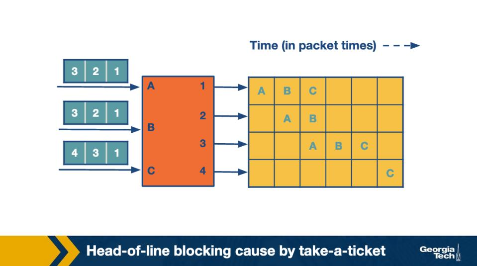

Figure: Head-of-line blocking pattern over packet-times — take-a-ticket (Module 6) 

From the HOL-blocking figure, what is head-of-line blocking in an input-queued switch? 

• 
A.  Packets get reordered as they cross the switching fabric during congestion, reflecting how the 
routing decision flows through a typical commercial-grade daemon at scale. 
• 
B.  An output queue drops packets when its buffer overflows during a microburst. 
• 
C.  The control plane stalls while waiting for a forwarding-table update at the input port. 
• 
D.  A packet at the front of an input queue blocks packets behind it that could otherwise be forwarded 
to currently-free outputs. 

  Correct answer: D 

  Why: HOL blocking: head packet pins the queue. When the first packet in an input queue can't be served (its output is busy), packets 
behind it cannot advance even if their outputs are idle — the input is structurally blocked. 

<!-- page break -->

Q10.  [MCQ] 

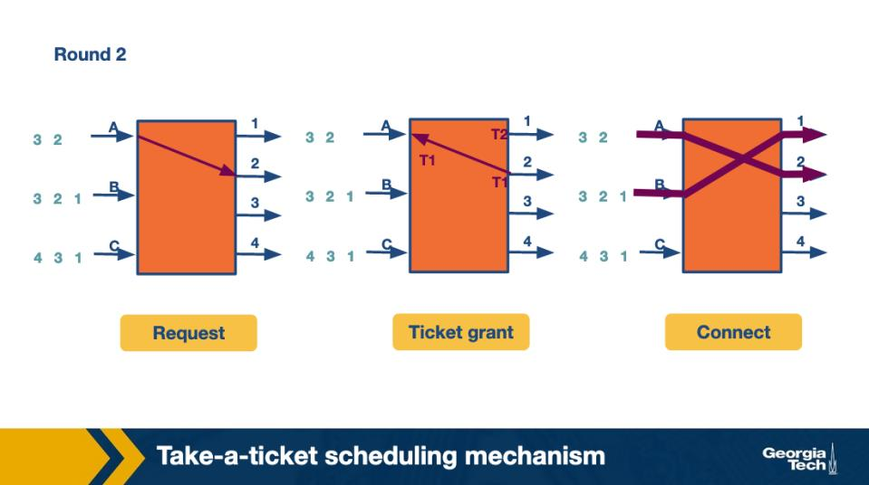

Figure: Take-a-ticket scheduler with HOL contention (Module 6) 

Scenario in the take-a-ticket figure: inputs A and B both want output 1, and input C wants output 2. 
Output 1 grants A for this round. What happens to B's packet at the head of B's input queue this round? 

• 
A.  B's packet stays at the head, blocking all other packets behind it in B's queue — even those that 
want output 2 — until B's head finally gets output 1 in a future round. 
• 
B.  B's packet is dropped to avoid contention, and the input port sends an ICMP source-quench to the 
upstream link. 
• 
C.  B's packet is automatically moved to output 2 because output 1 is busy this round — this is the 
canonical convention documented in the standard reference for production routers. 
• 
D.  B's input queue is suspended for one cell time and resumes service the next round. 

  Correct answer: A 

  Why: B's head stays; everything behind it is stuck. With a single FIFO input queue, B's packet for output 1 must wait its turn; 
meanwhile any later packet in B's queue (even one bound for an idle output) can't be served. 

<!-- page break -->

Q11.  [MCQ] 

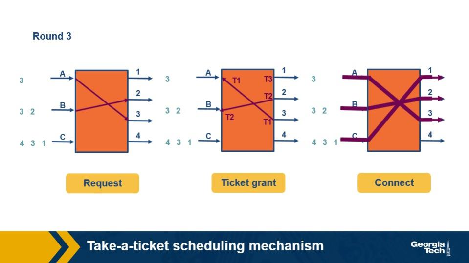

Figure: HOL blocking — throughput impact (Module 6) 

Why is HOL blocking BAD for throughput, even though only one packet is 'stuck' at a time? 

• 
A.  HOL blocking only affects the OUTPUT queue, leaving input queues free to drain, as is widely 
deployed across modern Tier-1 networks for predictable inter-domain behaviour. 
• 
B.  The head packet pins the entire input queue, preventing other packets in that same queue from 
advancing toward currently-idle outputs — utilization drops. 
• 
C.  HOL blocking just slightly increases latency but never affects throughput in any input-queued 
switch. 
• 
D.  HOL blocking is unrelated to throughput; it only causes minor reordering of packets across queues. 

  Correct answer: B 

  Why: HOL pins the WHOLE input queue => utilization drops below 100%. Even though only one packet is 'blocked,' it blocks every 
packet behind it that could otherwise be flowing to idle outputs — leading to the famous ~58.6% throughput limit (Karol 1987). 

<!-- page break -->

Q12.  [TF] 

Figure: Take-a-ticket head-of-line cascade (Module 6) 

With the take-a-ticket algorithm, HOL blocking can cascade: even though many outputs may be idle, only 
the inputs whose head packet maps to a free output can make progress in a round. 

• 
True 
• 
False 

  Correct answer: True 

  Why: Cascading HOL => many idle outputs starve. Take-a-ticket schedules one round at a time; when many inputs' heads target 
busy outputs, idle outputs see no traffic even though packets exist that want them. 

Avoiding Head of Line Blocking 
Q13.  [MCQ] 

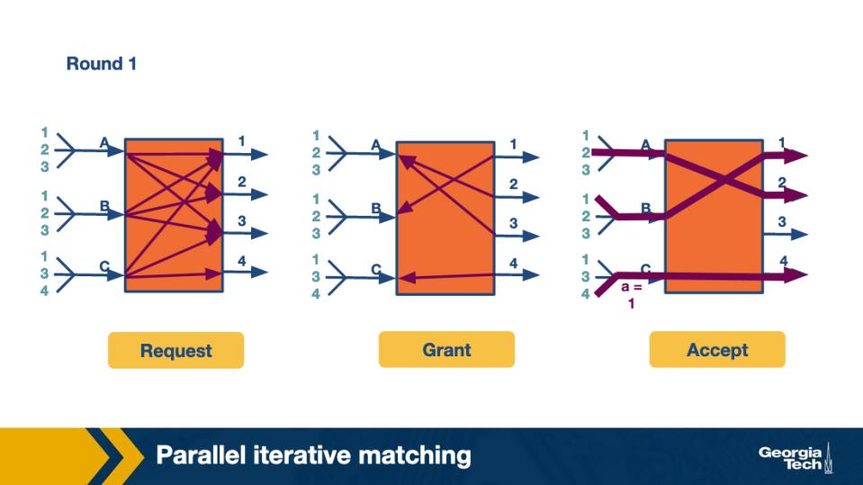

<!-- page break -->

Figure: Virtual output queues (VOQs) — one queue per output per input (Module 6) 

How do VIRTUAL OUTPUT QUEUES (VOQs) eliminate HOL blocking? 

• 
A.  Inputs share a single bus to outputs in round-robin order; HOL blocking is structurally impossible 
on a shared bus. 
• 
B.  Each output port runs N times faster than each input link, so traffic never queues at the input at all. 
• 
C.  Each input maintains a separate queue per output — a packet bound for a busy output cannot 
block packets in its input bound for free outputs, since they sit in different queues. 
• 
D.  Inputs maintain a single queue but dropped packets are absorbed by an in-network proxy — 
operators rely on this property when designing their routing policies for global reachability. 

  Correct answer: C 

  Why: VOQ = N input queues per port, one per output. A packet for a busy output sits in its own queue; other queues at the same input 
(for free outputs) keep advancing — no cross-output blocking. 

Q14.  [MCQ] 

Figure: Parallel iterative matching (PIM) — request, grant, accept phases (Module 6) 

Scenario in the PIM figure: in the GRANT phase, an output receives requests from multiple inputs. What 
does the output do? 

• 
A.  The output rejects all the requesting inputs to avoid contention and reverts to take-a-ticket 
scheduling for one round. 
• 
B.  The output sends a grant to every requesting input; the inputs decide who actually transmits. 
• 
C.  The output queues all requests and processes them strictly in arrival order over the next several 
rounds. 
• 
D.  The output picks one of the requesting inputs at random and sends a grant only to that input. 

  Correct answer: D 

<!-- page break -->

  Why: Grant: each output randomly picks ONE requester. Multiple inputs may request the same output; the output randomly selects 
one, breaking contention probabilistically while keeping the algorithm simple. 

Q15.  [MCQ] 

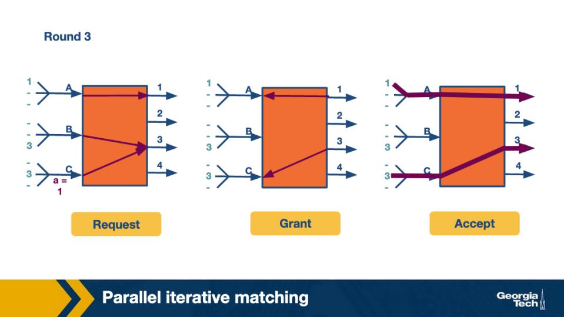

Figure: PIM accept phase — input receives multiple grants (Module 6) 

In the ACCEPT phase, assume that input A receives grants from outputs 2 AND 3. What does A do? 

• 
A.  A picks one of the granting outputs (e.g., output 2) at random and sends to that output this round. 
• 
B.  A sends copies of the packet to BOTH outputs 2 and 3 in parallel via the crossbar fabric. 
• 
C.  A returns both grants to the scheduler and waits another round to retry. 
• 
D.  A drops the packet because conflicting grants indicate a misconfiguration. 

  Correct answer: A 

  Why: Accept: input picks ONE granting output (random). When multiple outputs grant the same input, the input has to choose one 
this round — randomized selection avoids systematic bias and keeps the algorithm distributed. 

<!-- page break -->

Q16.  [MCQ] 

Figure: PIM with conflicting requests (Module 6) 

Assume that inputs A and B both request output 1. Output 1 picks B in the grant phase. What does A do 
next? 

• 
A.  A is permanently blocked from output 1 by the scheduler. 
• 
B.  A may still be granted by a different output it also requested this round; if not, A retries output 1 in 
a future iteration. 
• 
C.  A and B share output 1 at half rate via time-slicing across every router participating in the same 
routing domain at the same moment. 
• 
D.  A is granted output 1 anyway, since both inputs requested it. 

  Correct answer: B 

  Why: A loses output 1 this iteration but may win another. PIM iterates: if A doesn't win in this round's matching, it can be matched 
to a different requested output or retry output 1 in a future iteration. 

Q17.  [TF] 

With VOQs and Parallel Iterative Matching, an input port can have one packet bound for a busy output 
without delaying packets in the same input port bound for free outputs. 

• 
True 
• 
False 

  Correct answer: True 

  Why: VOQ+PIM => no cross-output blocking. Per-output queues at each input plus iterative request-grant-accept matching can 
achieve near-100% throughput on uniform traffic — no HOL bottleneck. 

<!-- page break -->

Scheduling Introduction 
Q18.  [MCQ] 

FIFO with tail-drop is the simplest output scheduler. Why isn't it 'good enough' for modern routers? 

• 
A.  FIFO+tail-drop is patented and cannot be deployed without licensing, because the protocol 
enforces strict isolation between routing tables in the global system. 
• 
B.  FIFO+tail-drop is too slow at modern line rates; hardware cannot execute it at 100 Gbps. 
• 
C.  A single greedy flow can fill the queue, drop other flows' packets and harm fairness; FIFO+tail-drop 
also makes no QoS or congestion guarantees. 
• 
D.  FIFO+tail-drop violates the end-to-end principle and is forbidden by RFC. 

  Correct answer: C 

  Why: FIFO+tail-drop = no fairness, no QoS. A greedy/aggressive flow can fill the queue and crowd out well-behaved flows; tail drop 
punishes whoever arrives during overflow regardless of priority or class. 

Q19.  [TF] 

A 'flow' is identified using header fields (e.g., 5-tuple) and consists of packets sharing the same 
forwarding path and required service. 

• 
True 
• 
False 

  Correct answer: True 

  Why: Flow = packets matching same 5-tuple (or service class). Identifying flows by (src/dst IP, src/dst port, protocol) lets the 
scheduler give each flow its own treatment — critical for per-flow fairness and QoS. 

Deficit Round Robin 
Q20.  [MCQ] 

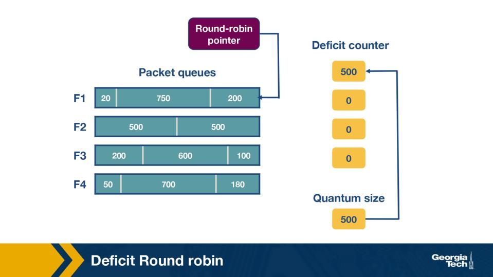

Figure: Deficit Round Robin — packet queues, deficit counter, quantum size (Module 6) 

<!-- page break -->

In DRR, each flow has a QUANTUM Q (bytes added to its credit per round) and a DEFICIT counter. What 
problem does the deficit counter solve compared to plain round robin? 

• 
A.  The deficit counter detects HOL blocking and signals the scheduler to skip blocked flows. 
• 
B.  The deficit counter handles TCP retransmissions; plain round-robin cannot detect them. 
• 
C.  The deficit counter doubles throughput by allowing two packets per round per flow, which the 
IETF documents as the standard behaviour across all compliant implementations today. — multiple 
RFCs and BCPs prescribe this behaviour for production inter-domain routing systems. 
• 
D.  Plain round-robin gives each flow one packet per turn regardless of packet size; the deficit counter 
tracks unused credit so flows with larger packets don't unfairly out-serve flows with smaller ones. 

  Correct answer: D 

  Why: DRR's deficit tracks unused credit => size-aware fairness. With pure round-robin, a flow with large packets wins more bytes 
per round than one with small packets; DRR carries unused quantum forward so each flow's long-run BYTE share equals its share of 
total quanta. 

Q21.  [MCQ] 

Figure: DRR setup — F1's queue [20|750|200] with quantum 500 and deficit 0 (Module 6) 

From the DRR figure: flow F1 has quantum Q1 = 500 bytes and current deficit D1 = 0. F1's queue holds 
three packets — sizes 20, 750, and 200 bytes — with the 200-byte packet at the head. F1 receives its turn. 
What happens this turn? 

• 
A.  F1's deficit becomes Q1 + D1 = 500; the 200-byte head packet is sent (deficit drops to 300); the 
750-byte packet does not fit in 300; F1 ends the round with D1 = 300 carried forward, queue holding 
the 20- and 750-byte packets. 
• 
B.  All three packets are sent because 200 + 750 + 20 = 970 ≤ 2×Q1; D1 ends at 30, reflecting how the 
routing decision flows through a typical commercial-grade daemon at scale. 
• 
C.  Nothing is sent because 750 > 500; F1's deficit ends at 500 and is carried forward. 
• 
D.  The 750-byte packet is sent first (largest fits the credit pool); D1 becomes -250. 

<!-- page break -->

  Correct answer: A 

  Why: 200 fits in 500, 750 doesn't => D1 = 500-200 = 300 carried forward; queue becomes [20, 750]. DRR adds Q1 to the existing 
deficit, then sends head packets while they fit in the current deficit; when the next packet exceeds the remaining credit, the turn ends 
and the leftover deficit carries to F1's next visit — matching the transition fig05 -> fig06. 

Q22.  [MCQ] 

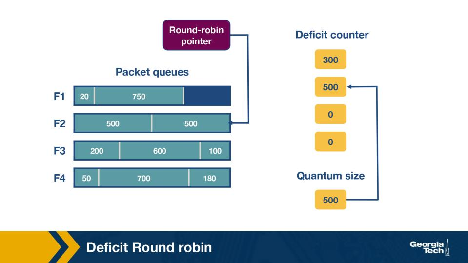

Figure: DRR — F1 after its first turn: queue [20|750], deficit 300 carried (Module 6) 

After F1's first turn, the 200-byte packet was sent and the carried deficit is D1 = 300. F1's remaining 
queue is [20, 750] with the 750-byte packet at the head. When F1 receives its SECOND turn, its deficit 
becomes Q1 + D1 = 500 + 300 = 800. What happens this turn? 

• 
A.  F1 sends only the 750-byte packet; the 20-byte packet does not fit in the remaining 50 — D1 = 50 
is carried forward indefinitely — this is the canonical convention documented in the standard 
reference for production routers. 
• 
B.  F1 sends the 750-byte packet (deficit → 50), then the 20-byte packet (deficit → 30); the queue is 
now empty, so D1 resets to 0 because an empty queue does not carry credit forward. 
• 
C.  F1 cannot send because 750 < Q1 alone; D1 must accumulate more quantum in the THIRD round 
before any packet clears. 
• 
D.  F1 sends the 20-byte packet first (smaller fits the credit pool); D1 becomes 780 and the 750-byte 
packet waits another round. 

  Correct answer: B 

  Why: 750 fits in 800 (D1 -> 50), then 20 fits in 50 (D1 -> 30); queue empty => deficit RESETS to 0. DRR keeps draining head packets 
while they fit the current deficit; once the flow's queue empties on its turn, the standard rule discards any leftover credit so an idle 
flow can't burst later. 

<!-- page break -->

Q23.  [MCQ] 

Figure: DRR — round-robin pointer advancing across heterogeneous flows (Module 6) 

Why does DRR provide BANDWIDTH fairness across flows with different packet sizes, while plain round-
robin does NOT? 

• 
A.  DRR uses RED queues per flow, dropping large packets early, as is widely deployed across modern 
Tier-1 networks for predictable inter-domain behaviour. — operators rely on this property when 
designing their routing policies for global reachability. 
• 
B.  DRR randomizes flow order each round, smoothing out any size bias over time. 
• 
C.  DRR allocates Q bytes per round (not 1 packet); flows with larger packets carry deficit forward and 
end up sending the same long-run byte share, while plain RR over-serves large-packet flows. 
• 
D.  DRR caps every packet to the smallest packet in the system. 

  Correct answer: C 

  Why: DRR allocates BYTES per round (Q), not packets. Large-packet flows carry deficit when they can't fit; small-packet flows send 
several packets per round; long-run byte share converges to the quantum ratio, achieving bandwidth fairness. 

<!-- page break -->

Q24.  [TF] 

Figure: DRR — empty-queue deficit reset (Module 6) 

In DRR, when a flow's queue becomes empty during its turn, its deficit counter is RESET to zero rather 
than carried forward. 

• 
True 
• 
False 

  Correct answer: True 

  Why: Idle => no accumulated credit. The empty-queue reset prevents idle flows from hoarding quanta and then bursting; it's the 
rule that makes DRR resistant to greedy idle-then-burst behaviour. 

Traffic Scheduling: Token Bucket 
Q25.  [MCQ] 

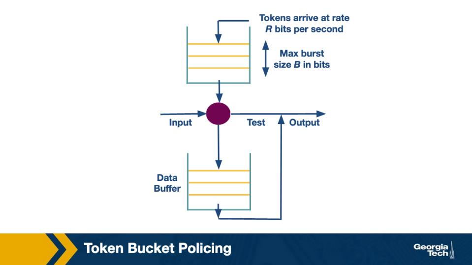

<!-- page break -->

Figure: Token bucket — rate R, capacity B (Module 6) 

A token bucket with FILL RATE R and CAPACITY B limits a flow to what behavior over time? 

• 
A.  Long-run average rate ≤ R, with bursts up to B tokens' worth of bytes allowed at a moment. 
• 
B.  Strict constant output rate of R, with no bursts allowed at all. 
• 
C.  Peak rate of B with average rate proportional to current queue length. 
• 
D.  A maximum of R packets per second, regardless of any packet's individual size. 

  Correct answer: A 

  Why: Token bucket: long-run rate <= R, instantaneous burst <= B. Tokens accumulate at rate R up to capacity B; sending a packet 
consumes its byte count in tokens, so an idle bucket can absorb a burst of up to B bytes immediately. 

Q26.  [MCQ] 

What is the difference between token-bucket SHAPING and token-bucket POLICING? 

• 
A.  Shaping drops non-conforming packets and policing queues them — the opposite of what the 
names suggest in modern routers. 
• 
B.  Shaping uses one queue per flow and delays non-conforming packets (smoothing); policing uses a 
shared queue/counter and drops non-conforming packets (filtering). 
• 
C.  Shaping and policing are identical mechanisms; the names are vendor-specific labels. 
• 
D.  Shaping uses tokens; policing uses a leaky bucket with no tokens across every router participating 
in the same routing domain at the same moment., because the protocol enforces strict isolation 
between routing tables in the global system. 

  Correct answer: B 

  Why: Shaping delays (queues); policing drops. Both enforce the same rate envelope, but shaping smooths traffic by buffering non-
conforming packets, while policing simply discards them — choose by whether latency or bandwidth matters more. 

<!-- page break -->

Q27.  [MCQ] 

Figure: Token bucket — burst behavior (Module 6) 

Assume that a flow has been idle for some time, so its bucket is FULL (B tokens). A burst of traffic arrives. 
What happens? 

• 
A.  The bucket capacity B automatically grows during the burst to absorb every byte, which the IETF 
documents as the standard behaviour across all compliant implementations today. 
• 
B.  Every byte of the burst is dropped because token buckets enforce a strict per-packet rate of R. 
• 
C.  The router can immediately forward up to B tokens' worth of bytes in the burst; further excess is 
dropped or queued, depending on policing vs shaping configuration. 
• 
D.  The bucket switches to leaky-bucket mode and outputs at constant rate B per second for the 
duration of the burst. 

  Correct answer: C 

  Why: Idle bucket = full => up to B bytes pass immediately, excess dropped/queued. Bursts are allowed up to the bucket capacity B; 
once tokens are exhausted the policy reverts to enforcing rate R, dropping or shaping the rest. 

Traffic Scheduling: Leaky Bucket 
Q28.  [MCQ] 

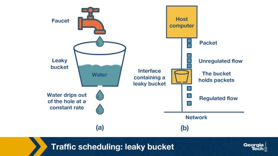

Figure: Leaky bucket — water/packet analogy with constant-rate output (Module 6) 

<!-- page break -->

In the leaky-bucket figure, the OUTPUT rate of a leaky bucket is constant at r regardless of input pattern. 
What does the bucket do when arriving packets would overflow capacity? 

• 
A.  The output rate r drops to zero until the bucket empties manually. 
• 
B.  The output rate r temporarily rises to drain the overflow before re-stabilizing. 
• 
C.  The bucket capacity b automatically grows to absorb the burst. 
• 
D.  The arriving (overflowing) packets are dropped; the output continues at constant rate r. 

  Correct answer: D 

  Why: Overflow => packets DROPPED; output stays at rate r. The leaky bucket is a strict shaper: it admits arrivals only while there's 
room and pours out at constant rate r — any arrival to a full bucket is dropped. 

Q29.  [MCQ] 

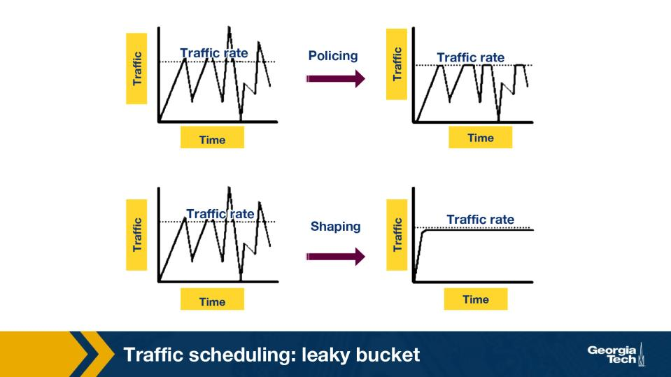

Figure: Policing vs shaping outputs over time — leaky bucket smooths to constant rate (Module 6) 

From the leaky/token bucket comparison: how does the LEAKY bucket output differ from the TOKEN 
bucket output? 

• 
A.  Leaky outputs at constant rate r regardless of input pattern; token bucket outputs in bursts up to B 
tokens' worth, then trickles at R. 
• 
B.  Leaky outputs in larger bursts than token bucket because tokens slow down the input — multiple 
RFCs and BCPs prescribe this behaviour for production inter-domain routing systems. 
• 
C.  Leaky and token buckets produce identical outputs; their difference is purely conceptual. 
• 
D.  Leaky outputs only on receipt of explicit ICMP source-quench messages from downstream routers. 

  Correct answer: A 

  Why: Leaky = constant output r; token = bursts up to B then trickles at R. Leaky bucket guarantees smooth output (no bursts at all); 
token bucket permits short bursts up to capacity, then settles to long-run rate R. 

<!-- page break -->

Q30.  [TF] 

A leaky bucket smooths bursty inputs into a constant-rate output stream, but discards packets that arrive 
while the bucket is full. 

• 
True 
• 
False 

  Correct answer: True 

  Why: Leaky bucket: smooths to rate r AND drops on overflow. The shaping property removes burstiness on egress; the bounded 
capacity means there's a definite ceiling on buffered bytes, so overflow yields drops, not unbounded queueing.
